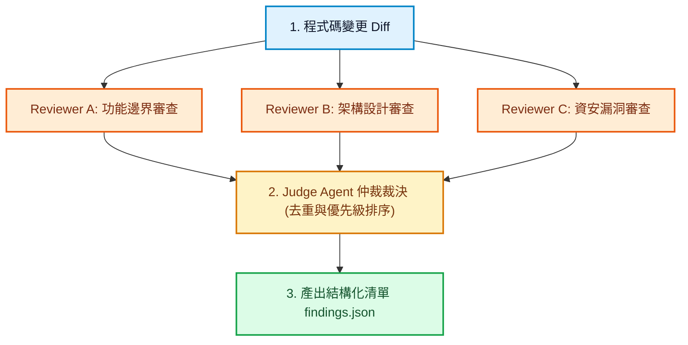

```mermaid
flowchart TD
    classDef plan fill:#e0f2fe,stroke:#0284c7,stroke-width:2px,color:#0f172a;
    classDef gate fill:#fef3c7,stroke:#d97706,stroke-width:2px,color:#78350f;
    classDef dev fill:#ede9fe,stroke:#7c3aed,stroke-width:2px,color:#3b0764;
    classDef test fill:#dcfce7,stroke:#16a34a,stroke-width:2px,color:#14532d;
    classDef patch fill:#fee2e2,stroke:#dc2626,stroke-width:2px,color:#7f1d1d;
    classDef done fill:#059669,stroke:#047857,stroke-width:2px,color:#ffffff;

    Start([1. 啟動任務]):::plan
    S1["2. 意圖解析與規格定義"]:::plan
    G1["PLAN GATE (規劃閘門)"]:::gate
    S2["3. 沙盒環境實作"]:::dev
    S3["4. 確定性自動化測試"]:::test
    P_Fix["5. 修復補丁循環"]:::patch
    G2["CLOSURE GATE (結案閘門)"]:::gate
    EndNode([6. 結案交付]):::done

    Start --> S1
    S1 --> G1
    G1 -->|審查通過| S2
    G1 -.->|需修正| S1
    S2 --> S3
    S3 -->|測試通過| G2
    S3 -.->|測試失敗| P_Fix
    P_Fix --> S2
    G2 -->|驗收完成| EndNode
```

# Mermaid 流程圖設計與排版手冊 (Mermaid Skill)

本站已全面導入 **Mermaid.js** 與 **`@panzoom/panzoom`** 手勢縮放檢視器。為確保所有文章內的圖表在**手機直式螢幕**與**電腦端**皆具備極致的可讀性、流暢度與專業美感，撰寫流程圖時必須嚴格遵循以下規範。

---

## 核心渲染機制與互動架構

1. **Markdown 原生語法支援**：
   * 在文章中使用標準的 ```` ```mermaid ```` 代碼區塊即可。
   * 系統已透過 `scripts/mermaid-support.js` 自動轉換為安全標籤，跳過 Hexo 默認代碼高亮。
2. **純按鈕精準縮放 (零手勢干擾)**：
   * 每個流程圖卡片右上角配備：**`＋ 放大`**、**`－ 縮小`**、**`↺ 重置`** 與比例百分比顯示。
   * **零手勢干擾原則**：嚴禁任何會攔截網頁上下滾動的拖曳平移（Pan）或雙指手勢，讀者在手機或桌機正常閱讀滑動頁面時 100% 平滑順暢。
   * **自適應滾動**：當點擊放大時，容器自然展開橫向滑動軸（`overflow-x: auto`），不影響全頁垂直流暢滾動。

---

## ⚠️ 流程圖三大絕對禁忌 (Critical Anti-patterns)

為了避免在手機與不同螢幕上發生嚴重的破版與疊字，嚴禁以下三種寫法：

| 禁忌類型 | 破版原因 | 正確做法 |
| :--- | :--- | :--- |
| ❌ **嚴禁使用 `subgraph` 容器** | Mermaid 的 dagre 佈局引擎在處理跨 subgraph 連線時，會強行將群組左右亂甩並擠壓寬度，導致**子圖標題與內部節點嚴重重疊疊字**。 | ✅ **一律採用純單一主軸垂直流（Single-Spine Flow）**，透過節點顏色 (`classDef`) 或編號來區分階段，絕不使用 `subgraph`。 |
| ❌ **嚴禁使用 `{...}` 巨大菱形節點** | 菱形語法會強制拉大幾何形狀，在手機窄螢幕上會被橫向擠扁變形，破壞整體平衡。 | ✅ **使用圓角矩形或膠囊節點**：如 `G1["PLAN GATE (規格閘門)"]`，搭配黃色/橙色 class 標示。 |
| ❌ **嚴禁使用橫向流向 (`flowchart LR`)** | 橫向流程圖在手機直式螢幕 (360px~430px) 上會被強制壓縮至極小，文字難以閱讀。 | ✅ **一律採用由上至下垂直流向 (`flowchart TD`)**。 |

---

## 🎨 現代科技視覺色彩規範 (Color Palette)

所有流程圖一律統一定義以下 `classDef`，讓視覺層次分明、專業現代：

```mermaid
flowchart TD
    classDef intake fill:#e0f2fe,stroke:#0284c7,stroke-width:2px,color:#0f172a;
    classDef plan fill:#e0f2fe,stroke:#0284c7,stroke-width:2px,color:#0f172a;
    classDef gate fill:#fef3c7,stroke:#d97706,stroke-width:2px,color:#78350f;
    classDef dev fill:#ede9fe,stroke:#7c3aed,stroke-width:2px,color:#3b0764;
    classDef test fill:#dcfce7,stroke:#16a34a,stroke-width:2px,color:#14532d;
    classDef patch fill:#fee2e2,stroke:#dc2626,stroke-width:2px,color:#7f1d1d;
    classDef review fill:#ffedd5,stroke:#ea580c,stroke-width:2px,color:#7c2d12;
    classDef mem fill:#f1f5f9,stroke:#64748b,stroke-width:2px,color:#0f172a;
    classDef done fill:#059669,stroke:#047857,stroke-width:2px,color:#ffffff;
```

* **天藍色 (`:::intake` / `:::plan`)**：需求接收、意圖正規化、架構規劃。
* **金黃色 (`:::gate`)**：規格閘門、結案驗收閘門、條件決策節點。
* **靛紫色 (`:::dev`)**：沙盒編碼、業務邏輯實作。
* **翡翠綠 (`:::test`)**：TDD 測試規格、確定性驗證 (Build/Lint/Test)。
* **珊瑚紅 (`:::patch`)**：修復補丁循環 (Patch Loop)、錯誤重試。
* **夕陽橙 (`:::review`)**：平行審查 (Reviewers)、仲裁去重 (Triage)。
* **霧灰色 (`:::mem`)**：工作記憶、情節記憶、知識庫晉升。
* **深綠色 (`:::done`)**：結案交付 (Delivery)。

---

## 📋 標準流程圖撰寫範本

### 範本一：多階段端到端狀態機 (垂直單主軸)

```markdown

```

### 範本二：角色專門化平行分流與仲裁

```markdown

```

---

## 檢查清單 (Checklist)

新文章若包含 Mermaid 流程圖，發布前務必自檢：

- [ ] 是否完全使用 `flowchart TD`（由上至下），無任何 `flowchart LR`？
- [ ] 是否完全避免了 `subgraph` 容器（防止 dagre 疊字與左右錯位）？
- [ ] 是否完全避免了 `{...}` 巨大菱形，改用帶顏色的方塊/膠囊標示 Gate？
- [ ] 節點文字是否緊湊、適度加入 `<br>` 換行？
- [ ] 是否套用了標準的 `classDef` 色彩系統？
- [ ] 本地執行 `npm run build` 確認編譯成功且無報錯。
