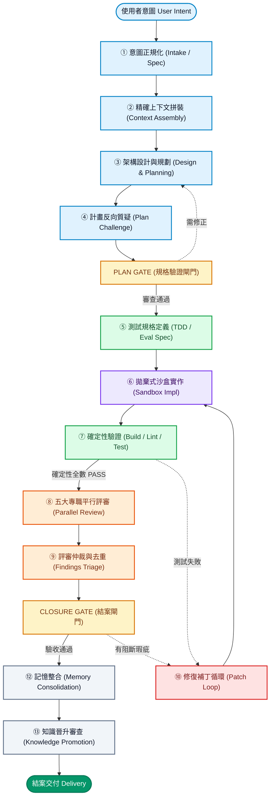
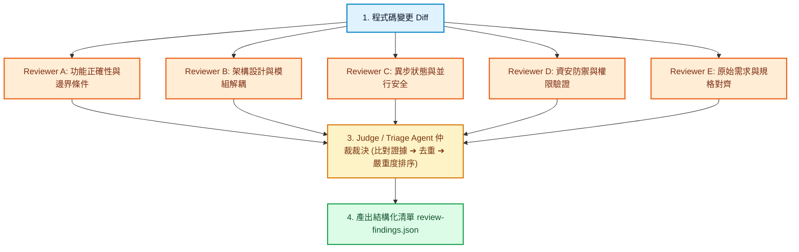
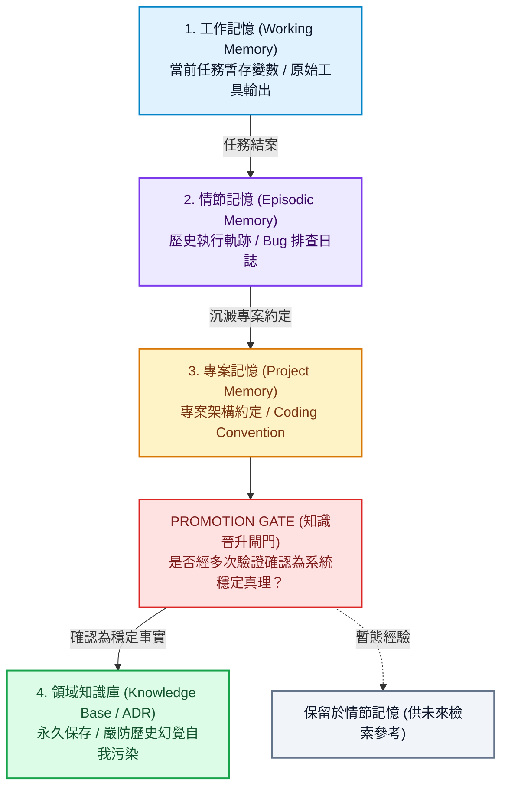

過去一年，AI 寫程式經歷了從 Copilot 代碼補全到 **Vibe Coding** 的狂歡。許多人習慣了「下 Prompt → AI 生成代碼 → 跑測試」的直覺模式。在幾十行的玩具專案裡，這種模式看起來無所不能；但一旦進入數萬行、模組高度耦合的正式專案，這套憑感覺的模式就會迅速崩潰。

你一定遇過這種絕望場景：AI 信心滿滿地宣稱修好了 Bug，結果改了 A 模組卻炸了 B 模組；叫五個最強模型做 Code Review，大家都說程式碼看起來很漂亮，一上線卻立刻遇到 Race Condition；甚至讓 AI 自動記錄「經驗」，跑了一個月後，整個系統被它自己過去產生的歷史幻覺徹底污染。

在軟體工程中，瓶頸從來不是「程式碼生成的速度」，而是**「驗證與交付的信心」**。要跨越生成速度遠大於驗證能力的鴻溝（GenAI Divide），唯一的出路是建立一套工業級的 **Agentic SDLC（Agent 軟體開發生命週期）**。

<!--more-->

## 四句核心真理：釐清 Hook、Skill、MCP 與 Orchestrator 的邊界

許多團隊在嘗試自動化時，最常犯的錯誤就是把所有責任塞給單一對話或單一 System Prompt。在設計健壯的 Agentic 架構前，必須先牢記這四個元件真正負責的核心問題：

| 元件類型 | 它真正負責的核心問題 | 本質定位與系統角色 |
| :--- | :--- | :--- |
| **Hook** | **什麼時候一定要發生？** | 生命週期的確定性守衛（Deterministic Control / Guard） |
| **Skill** | **遇到這類問題應該怎麼做？** | 按需載入的標準程序與決策手冊（Procedures / Instructions Bundle） |
| **MCP** | **需要存取什麼外部能力／資料？** | Agent 的 I/O 匯流排與能力協議層（Capability Layer / I/O Bus） |
| **Orchestrator** | **現在在哪個階段，下一步去哪？** | 全局狀態機與流程調度中樞（State Machine / Workflow Engine） |

這個劃分非常關鍵。例如在 Claude Code 官方的設計哲學中，Hook 就是在生命週期的特定節點（如 **SessionStart**、**PreToolUse**、**PostToolUse**、**TaskCompleted**、**Stop**、**SessionEnd**）自動執行，用來提供剛性的確定性檢查與操作攔截；而 MCP（Model Context Protocol）本質上是 Agent 的 I/O Bus，負責提供標準化的 Tools、Resources 與 Prompts 介面，它絕對不該被誤當成工作流本身。

真正掌控全局走向的，是底層的 **狀態機（Orchestrator）**。

---

## 13 階段生命週期全景與常用落地解決方案

一個完整的 Agentic SDLC 不再是單純的線性生成，而是包含了前置意圖收斂、剛性驗證閘門、角色化平行評審與記憶閉環的 13 階段標準狀態機：

以下針對這 13 個生命週期階段，深入剖析各階段的核心職責、Hook/Skill/MCP 對應機制，以及業界最常用的主流落地方案：

---

### 第一階段：需求接收與意圖正規化 (Intake & Intent Normalization)

* **核心任務**：將人類口語化、模糊的需求（例如「幫我做一個點數扣除 API」），轉化為具備邊界條件、輸入輸出契約的結構化需求。
* **對應機制**：
  * **Hook**：在 `PromptSubmit` 節點自動注入專案全局規範。
  * **Skill**：調用 `intent-classification` 與 `spec-normalization` 技能。
  * **MCP**：透過 Issue Tracker MCP 讀取 GitHub Issue 或 Jira Ticket。
* **業界常用方案**：
  * **`Pydantic` / `Instructor`**：利用 Python 結構化輸出框架，強制 LLM 將需求解析為 100% 符合 JSON Schema 的 `requirements.json`。
  * **GitHub Issues / Linear API**：自動提取 Issue Description、Labels 與驗收標準，作為輸入源。

---

### 第二階段：精確上下文拼裝 (Context Assembly)

* **核心任務**：從龐大的程式碼庫、多層記憶與領域知識庫中，撈出當前任務真正需要的資訊，避免無效檔案塞爆 Context Window。
* **對應機制**：
  * **Hook**：在 `SessionStart` 與 `PreCompact` 自動載入專案約定與工作記憶。
  * **Skill**：調用 `context-builder` 與 `code-retrieval` 技能。
  * **MCP**：使用 Memory MCP、Database MCP 與 Documentation MCP。
* **業界常用方案**：
  * **`Repomix` (yamadashy/repomix)**：將整個代碼庫壓縮打包為結構化、帶有目錄樹的 AI 友善格式。
  * **`ast-grep` / `Tree-sitter`**：利用抽象語法樹（AST）精確檢索函數定義、呼叫鏈與型別聲明，取代粗糙的字串搜尋。
  * **`Mem0` (mem0ai/mem0) / `agentmemory`**：混合向量與圖資料庫，檢索該模組過去的踩坑紀錄與架構決策。

---

### 第三與第四階段：架構設計、規劃與反向質疑 (Design, Planning & Plan Challenge)

* **核心任務**：撰寫實作計畫 `plan.md`，並由專門的 Critic Agent 擔任「魔鬼代言人（Devil's Advocate）」對計畫進行質疑，通過 **PLAN GATE** 驗證閘門。
* **對應機制**：
  * **Skill**：調用 `planning-skill` 與 `plan-review-skill`。
  * **Gate 機制**：未通過審查的計畫強制回退至第三階段重新設計，禁止直接動工。
* **業界常用方案**：
  * **`LangGraph` 狀態機**：使用 LangGraph 構建 Planning ➔ Challenge 循環節點，並可掛載 Human-in-the-loop 節點供人類工程師一鍵 Approve。
  * **Mermaid 流程圖自動生成**：讓 Agent 在 `plan.md` 中以 Mermaid 圖表呈現架構變更，便於人類與 Reviewer 快速驗證。

---

### 第五階段：測試與評測規格定義 (Test & Eval Specification)

* **核心任務**：嚴格落實 TDD（測試驅動開發），在寫任何業務程式碼之前，先定義好可執行的測試與驗收標準（Done-when Criteria）。
* **對應機制**：
  * **Skill**：調用 `tdd-design` 與 `eval-spec-skill`。
* **業界常用方案**：
  * **`Vitest` / `Jest` / `Pytest`**：先建立失敗的測試案例（Red 階段）。
  * **`SWE-bench` 模式**：定義 Fail-to-Pass 測試清單，將驗收標準轉化為可自動化執行的測試腳本。

---

### 第六階段：拋棄式沙盒實作 (Implementation in Ephemeral Sandbox)

* **核心任務**：在安全的隔離環境中編寫程式碼與除錯，禁止直接污染本機宿主或共用環境。
* **對應機制**：
  * **Hook**：在 `PreToolUse` 節點攔截危險指令（如修改 `.env` 或執行高危刪除操作）。
  * **Skill**：調用 `implementation-skill`。
* **業界常用方案**：
  * **`E2B` (e2b-dev/E2B)**：專為 AI Agent 設計的毫秒級 MicroVM 沙盒，提供完全隔離的 Linux 執行環境，支援狀態快照與秒級重置。
  * **`All-Hands-AI/OpenHands`**：沙盒化自主 Coding 平台，具備多代理人委派與安全終端執行能力。
  * **`paul-gauthier/aider`**：終端配對編程工具，具備極強的 Git 自動 Commit 與本地迭代效率。

---

### 第七階段：確定性驗證防線 (Deterministic Verification)

* **核心任務**：**【第一道防線】** 執行 Build、Lint、Typecheck、Unit Test 與 E2E 測試，以零幻覺、非黑即白的確定性工具殺掉所有低級錯誤。
* **對應機制**：
  * **Hook**：在 `PostToolUse` 或 `TaskCompleted` 自動觸發編譯與測試腳本。
  * **Skill**：調用 `deterministic-verification-skill`。
* **業界常用方案**：
  * **編譯與型別檢查**：`TypeScript (tsc)`、`Ruff`、`Mypy`、`Biome`。
  * **自動化測試**：`Vitest`、`Pytest`、`Playwright`（端到端 UI 測試）。
  * **CI 本地執行器**：透過 `act` 在本地直接運行 GitHub Actions 工作流。

---

### 第八與第九階段：角色專門化平行評審與仲裁 (Parallel Review & Triage)

* **核心任務**：**【第二道防線】** 確定性驗證全部 PASS 後，啟動五大專門視角模型進行平行審查，再由 Judge Agent 仲裁去重。
* **對應機制**：
  * **Orchestrator**：平行觸發 Reviewer 子進程。
  * **Skill**：調用專職 Reviewer 提示詞手冊。
* **業界常用方案**：
  * **`qodo-ai/pr-agent`**：自動分析 PR Diff，專門尋找安全漏洞、架構壞味道與測試缺失。
  * **`Open Policy Agent (OPA)`**：以宣告式策略即代碼（Policy-as-Code）自動檢查變更是否符合企業合規要求。
  * **`LLM-as-a-Judge` 仲裁架構**：比對五份評審報告，產出結構化的 `review-findings.json`。

---

### 第十與第十一階段：修復補丁循環與結案閘門 (Patch Loop & Closure Gate)

* **核心任務**：若評審發現阻斷性問題，自動進入修復循環並重新跑確定性驗證；全數無誤後通過 **CLOSURE GATE**。
* **對應機制**：
  * **Hook**：在 `Stop` 節點強制檢查測試結果，未通過則拒絕任務結束。
* **業界常用方案**：
  * **`Temporal` (temporalio/temporal)**：工業級分散式持久化狀態機，提供重試預算（Retry Budget）與狀態回滾保護。
  * **GitHub PR 狀態檢查閘門**：與 Branch Protection Rules 聯動，強制所有 Check 綠燈方可 Merge。

---

### 第十二與第十三階段：記憶整合與知識晉升 (Memory Consolidation & Knowledge Promotion)

* **核心任務**：任務完成後，將短期工作記憶清理，將有價值的踩坑日誌寫入情節記憶；唯有經過重複驗證的穩定事實，才通過 **PROMOTION GATE** 寫入長期知識庫。
* **對應機制**：
  * **Hook**：在 `SessionEnd` 節點觸發記憶整合與晉升審查。
* **業界常用方案**：
  * **`Mem0` / `agentmemory`**：分層記憶儲存與動態更新機制。
  * **Git ADR (Architecture Decision Records)**：將重大架構決定以 Markdown 格式沉澱於 `docs/adr/`，供所有 Agent 隨後查閱。

---

## 兩大不可妥協的工程鐵律

在整套 Agentic SDLC 中，有兩個至關重要的架構原則，直接決定了系統的可靠度：

### 鐵律一：順序決定生死，先「確定性驗證」再「模型評審」

**千萬不要先叫五個 AI 模型看 Code，最後才發現專案根本連編譯或型別檢查（Typecheck）都過不了。**

* **步驟 ⑦ 確定性驗證**：Build、Lint、Typecheck、Unit Test 是零幻覺、低成本的第一防線。
* **步驟 ⑧ 角色化模型評審**：只有在確定性驗證全部通過後，才花費昂貴 Token 進行高層次邏輯審查。

### 鐵律二：模型共識絕對不能當作真相來源（Ground Truth）

在系統內部，**模型之間的投票共識絕不等於程式碼的正確性**。信任權重必須嚴格恪守：

> **客觀信任階層**：**可執行測試證據** ＞ **靜態分析證據** ＞ **原始規格對齊** ＞ **模型單點推理** ＞ **多模型投票共識**

**測試實際跑通的客觀結果，永遠高於 AI 在文字上所聲稱的信心。**

---

## 結構化產物層（Evidence / Artifact Layer）

在各個 Agent 與階段之間，**嚴禁依賴模糊的自然語言耳語**（例如「上一隻 AI 跟我說它已經完成了」）。

跨階段傳遞的必須是標準化的檔案產物（Artifacts）：

* **requirements.json**：經過 Intake 階段正規化後的邊界條件與驗收標準。
* **plan.md**：架構設計方案、技術選型論證與潛在風險評估。
* **test-report.json**：包含真實 Exit Code、測試耗時與覆蓋率的確定性驗證結果。
* **review-findings.json**：角色化評審員產出的結構化問題清單與嚴重度標籤。
* **git-diff** / **commit-sha**：具體的程式碼變更與版本節點。

下一階段的 Agent 永遠是拿著上一階段的 **結構化 Artifact** 工作，這能徹底解決長上下文衰減與口傳失真的問題。

---

## 結語：將 Token 轉化為「工程可靠性」

從 Vibe Coding 邁向 Agentic SDLC，本質上是軟體工程嚴謹度的回歸。

我們不再追求「同一隻超強模型在黑箱中獨自想 40 分鐘、寫 40 分鐘、然後自己 Review 自己 20 分鐘」；而是將充裕的 Token 資源配置在：

> **端到端流程**：**Architect** ➔ **Plan Critics** ➔ **Implementation (Sandbox)** ➔ **Deterministic Tests** ➔ **Parallel Reviewers** ➔ **Judge Triage** ➔ **Acceptance Gate**

當**狀態機（State Machine）**確立了前進方向、**驗證閘門（Gate）**守住了工程底線、**結構化產物（Evidence）**建立了無損傳遞鏈，AI 才能真正從隨機性極高的程式碼生成器，昇華為值得託付核心業務的軟體工程產線。
