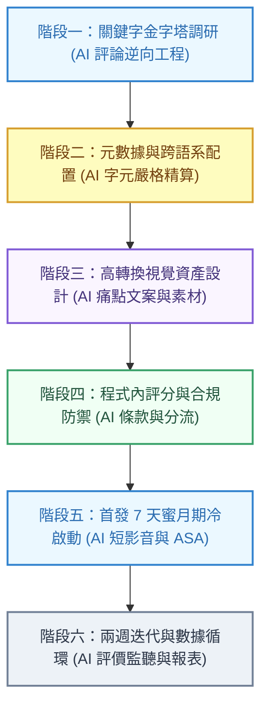
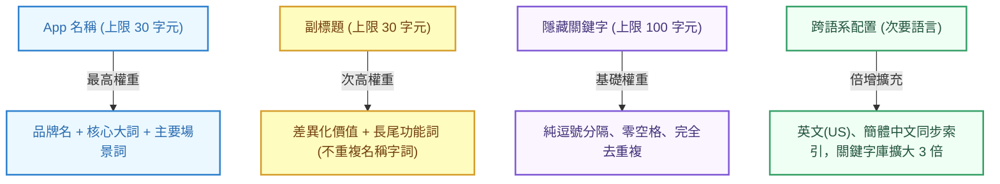
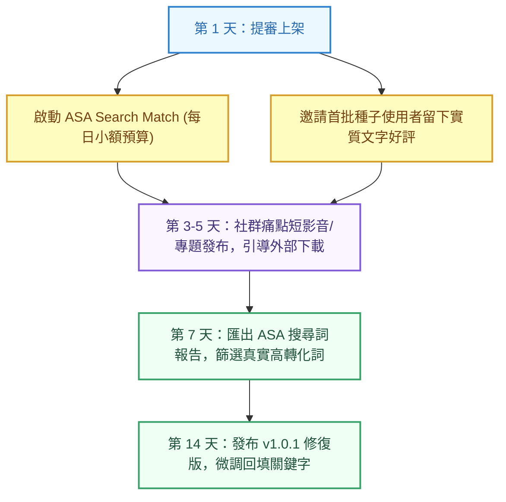

在 AI 輔助編程讓產品開發速度提升數倍的時代，寫出一個流暢穩定的 App 已經不再是最大的護城河。「如何讓目標使用者在茫茫應用海中找到你、下載你，甚至願意持續付費」，才是決定獨立開發者能否持續生存的核心關鍵。

許多初次上架 App 的開發者往往把所有心力放在功能實作上，直到提審通過當天才匆忙填寫商店資料，結果上架後每天只有零星的個位數下載，甚至連身邊朋友搜尋 App 名稱都找不到。這篇文章整理了從產品開發完成、商店元數據佈局、視覺資產設計到上架後冷啟動的完整 ASO（App Store Optimization）實戰流程，並在每個階段具體導入 AI 工具與自動化工作流，協助你以最高效率避開常見地雷，打造可持續獲客的增長飛輪。

<!--more-->

## 階段一：關鍵字調研與詞庫金字塔

不要憑空猜測使用者會搜尋什麼詞彙。在填寫任何商店資料前，先建立一份包含 40 至 60 個詞彙的關鍵字池。

### 1. 關鍵字四象限分類法
建議使用試算表將搜尋詞彙分為四種類型：
* **核心大詞（高搜尋量、極高競爭）**：例如**記帳**、**番茄鐘**、**習慣追蹤**。這類詞彙通常被巨頭佔據，新 App 剛上架時極難排進前三名，但仍需適度納入作為語意定位。
* **精準場景詞（中搜尋量、中競爭）**：例如**情侶記帳**、**無廣告專注計時器**、**學生讀書鬧鐘**。這類詞彙意圖明確，是新產品最容易突破的主戰場。
* **長尾痛點詞（低搜尋量、低競爭、極高轉換）**：例如**ADHD 視覺化待辦**、**無痛存錢法**、**時間塊工作法**。搜尋這些詞的使用者痛點極深，下載意願最高。
* **競品衍生詞**：觀察競爭對手的品牌名稱與功能特色，分析其使用者的常見搜尋路徑。

### 2. 免費且可靠的挖詞管道
* **App Store 搜尋建議（Search Suggestions）**：在 App Store 搜尋框輸入核心字根（例如輸入「專注」），下拉選單列出的前五個詞，即為目前蘋果演算法統計出的真實高頻詞彙。
* **競品評價區挖掘**：仔細閱讀同類別排名前十名 App 的三星與四星評論，留意使用者反覆提及的抱怨或功能期盼（例如「希望能匯出 CSV」、「想要自訂標籤」），將這些功能詞納入關鍵字池。

### 3. AI 在關鍵字調研中的實戰落地（競品評論逆向工程）
不需要人工一則一則閱讀評論，直接將競品 App Store 頁面上的 30 至 50 則中低星評論複製並餵給大語言模型，讓 AI 逆向提煉出真實搜尋詞彙：

> **AI 實戰 Prompt 範例**：
> 「以下是同類別排名前三名 App 的 40 則使用者評論。請扮演專業 ASO 分析師：
> 1. 歸納使用者抱怨最多的 3 大核心痛點。
> 2. 提煉使用者最渴望新增的 5 個具體功能。
> 3. 將這些痛點與功能轉化為 20 個符合一般大眾日常搜尋口語習慣的『長尾關鍵字』，按核心詞、場景詞、痛點詞整理成表格。」

## 階段二：元數據黃金配置與跨語系索引密技

元數據（Metadata）是應用商店搜尋引擎認識你這款產品的唯一依據。在 Apple App Store 中，搜尋權重由高至低依序為：**App 名稱 > 副標題 > 隱藏關鍵字欄位**。

### 1. 各欄位精準填寫規範

#### (1) App 名稱（Title，上限 30 字元）
* **推薦結構**：**品牌名 - 核心大詞 精準功能詞**
* **範例**：**FocusPanda - 番茄鐘專注計時器與習慣打卡**
* **重點原則**：除非你的品牌已經家喻戶曉，否則切勿只放品牌名稱。名稱中的每一個字都帶有最高的搜尋加權。

#### (2) 副標題（Subtitle，上限 30 字元）
* **推薦結構**：**差異化價值 ✕ 次要場景詞**
* **範例**：**極簡無廣告學習鬧鐘，專為學生與上班族打造**
* **重點原則**：副標題會與名稱中的字詞進行交叉索引組合，因此**絕對不要重複名稱中已經出現過的字**。

#### (3) 隱藏關鍵字欄位（Keywords，上限 100 字元）
* **語法格式**：使用英文半形逗號分隔，**全文字串中不要包含任何空格**。
* **精簡去重複**：凡是在名稱、副標題、開發者名稱中出現過的字詞，一律不要寫入此欄位。
* **避坑細節**：不需要填寫「免費」、「App」、「iOS」等系統自動過濾詞；數字一律使用阿拉伯數字以節省字元。
* **範例**：`倒數,日歷,待辦事項,工作法,專心,睡眠,時間管理,筆記,小組`

### 2. 實戰密技：跨語系索引倍增法（Cross-Localization）
App Store 在特定國家或地區會同時爬取並索引多個語言的元數據。利用此機制，可以大幅突破單一語系 100 字元的關鍵字限制：

* **目標市場為台灣與香港**：
  * 在 App Store Connect 中，除了填寫**繁體中文（台灣）**之外，務必同時填寫**英文（美國）**與**簡體中文**。
  * 台灣與香港的使用者在搜尋時，系統會同時比對這三個語系的名稱、副標題與關鍵字。
  * **操作策略**：繁體中文填寫最核心的在地詞彙；英文（美國）填寫英文對應詞與次要場景；簡體中文填寫補充長尾詞，讓關鍵字空間直接放大至近 300 字元。
* **目標市場為美國**：
  * 除了 **English (US)**，同時配置 **Spanish (Mexico)** 語系，並在西語欄位中填入更多尚未涵蓋到的英文關鍵字，同樣能被美國當地的搜尋引擎檢索。

### 3. AI 在元數據配置中的實戰落地（字元精算與集合去重複）
ASO 最繁瑣的是數中文字元數與人工檢查是否重複。交給 AI 執行嚴格集合去重複運算：

> **AI 實戰 Prompt 範例**：
> 「我的 App 核心功能是［填入功能，如：極簡離線番茄鐘］，目標市場是台灣與美國。請嚴格根據 App Store 演算法規則產出元數據：
> 1. **App 名稱**：繁體中文，嚴格在 26 至 30 個字元內，格式為『品牌名 - 核心詞 功能詞』。
> 2. **副標題**：繁體中文，嚴格在 26 至 30 個字元內，說明差異化價值，且**字詞完全不得與名稱重複**。
> 3. **關鍵字欄位**：英文逗號分隔、零空格、嚴格在 90 至 100 字元內，且**完全不包含名稱與副標題中已出現過的字**。
> 4. **跨語系版本**：同時為我產出對應的 English (US)、簡體中文、Spanish (Mexico) 的名稱、副標題與關鍵字初稿。」

## 階段三：高轉換率視覺資產設計（CVR 引擎）

搜尋排名解決的是「曝光（Impressions）」，但「點擊率（CTR）」與「安裝轉換率（CVR）」完全取決於視覺資產。

### 1. App 圖示（Icon）設計原則
* **極簡高對比**：確保圖示在手機主畫面上縮小到 60×60 像素時，依然具備清晰的識別度。
* **單一焦點**：採用純色或柔和漸層背景，搭配單一鮮明的代表性圖案，避免細小繁複的插圖。
* **避免文字干擾**：圖示內不要放置任何文字或版本號，以免在縮圖下顯得雜亂廉價。

### 2. 截圖優化的三秒定律
在搜尋結果頁面中，**前三張直式截圖決定了 80% 以上的使用者下載決策**：

* **第一張截圖（決定生死）**：
  * **頂部文案**：佔據上方約 20% 高度，使用超大、粗體文字直接寫出解決方案（例如：**三秒完成記帳，告別繁瑣對帳**）。
  * **下方畫面**：展示 App 最核心、最乾淨、最令人驚艷的主介面。
* **第二張截圖**：展示次要殺手級特色（例如：**視覺化圖表，清晰掌握每月資產走勢**）。
* **第三張截圖**：展示獨家便利功能（例如：**桌面小工具支援，免開 App 即時查看進度**）。
* **第四至五張截圖**：補充隱私保護、無廣告、支援深色模式等信任建立元素。

### 3. AI 在視覺資產中的實戰落地（高點擊率痛點文案與素材生成）
* **痛點文案生成**：利用 AI 針對不同受眾批量產出 5 套對比文案，作為 A/B 測試備選。
* **圖像素材輔助**：使用生成式 AI（如 Gemini、Midjourney）生成乾淨的 3D 擬物或扁平向量 Icon 原型，再進行去背與微調。

> **AI 實戰 Prompt 範例（截圖文案）**：
> 「我有一款專注於［填入特色］的 App，請為我的前 3 張 App Store 直式截圖設計頂部標題文案。請提供 3 種不同風格：
> 1. 痛點恐嚇型（直擊生活焦慮）
> 2. 爽快效率型（強調極速與省時）
> 3. 極簡質感型（強調優雅與專注）
> 每組文案請控制在 8 至 12 個繁體中文字以內，並標註為什麼這樣寫能提高點擊率。」

## 階段四：產品內建評分防禦與轉換流線

好的排名需要高評分與穩定下載量的雙重支撐。若沒有在程式碼層面做好評分引導，上架後很容易因為少數非理性負評而拉低整體權重。

### 1. 原生評分彈窗調用準則（SKStoreReviewController）
* **嚴禁在錯誤時機彈出**：切勿在使用者剛啟動 App、正在執行關鍵操作、或剛剛遭遇網路錯誤時彈出評分邀請。
* **鎖定正向反饋時刻（Aha! Moment）**：最佳觸發時機是使用者剛完成一項有成就感的任務時（例如：首次完成一次專注計時、順利匯出首張報表、連續打卡達成第三天）。
* **內建滿意度分流**：
  * 在調用系統評分前，可先透過輕量 UI 詢問：「您喜歡目前的體驗嗎？」。
  * 若使用者選擇「喜歡」，再順勢觸發官方原生五星評分彈窗。
  * 若選擇「遇到問題」，則導向內部反饋表單或開發者信箱，將潛在差評攔截在商店之外。

### 2. AI 在合規與程式碼層級的實戰落地（條款與分流邏輯自動化）
* **自動生成合規文件**：付費 App 必備的隱私政策與 EULA 使用條款，免去高昂法務費用。
* **Swift / Flutter 分流邏輯產出**：讓 AI 撰寫安全、非侵入式且符合 Apple 人機指南的評分計數器代碼。

> **AI 實戰 Prompt 範例（隱私政策與條款）**：
> 「我正在為一款 iOS App 準備提審，App 包含月訂閱與年訂閱，使用 StoreKit 2，本地使用 CoreData 儲存數據，未收集任何個人隱私個資與定位。請為我生成一份繁體中文與英文雙語的『隱私權政策 (Privacy Policy)』與『標準使用條款 (EULA)』Markdown 文件，內容必須完全符合 Apple App Store 最新審查指南的要求。」

## 階段五：提審通過後的首週冷啟動作戰（Launch Boost）

Apple 對新發布的 App 會給予約 7 天左右的演算法曝光加成（New App Boost）。在這段期間內產生的下載量與好評，能發揮最大的排名槓桿效應。

### 1. 小額 Apple Search Ads（ASA）精準反哺
* **開啟 Search Match 自動探索**：
  * 設定每日 5 至 10 美元的預算上限，開啟 ASA 的 Search Match 功能。
  * 系統會自動根據你的元數據向搜尋相關詞彙的使用者展示廣告，此階段的安裝轉換率通常高達 40% 以上。
* **提取真實搜尋詞**：
  * 運行一週後下載搜尋詞報告（Search Term Report），你會清楚看到使用者實際搜尋了哪些冷門詞彙而觸發下載。
  * 將這些高轉換的真實詞彙整理下來，作為下次版本更新時補充進副標題與關鍵字欄位的依據。

### 2. 社群與痛點導流
* 在 X (Twitter)、Threads、Reddit 或相關社群發布開發故事時，避免枯燥地張貼下載連結。
* 聚焦在「為了解決什麼具體痛點而做了這款工具」，並展示 10 至 15 秒的流暢操作短影音，吸引高留存率的初始種子用戶。

### 3. AI 在冷啟動中的實戰落地（短影音劇本與痛點文章流水線）
利用 AI 批量產出 15 秒短影音腳本，配合程式化工具快速生成視覺素材：

> **AI 實戰 Prompt 範例（短影音腳本）**：
> 「請為我的 App 撰寫 3 支專為 TikTok / Instagram Reels 設計的 15 秒短影音腳本。
> 要求：
> 1. 前 3 秒必須是極具衝擊力的『痛點懸念開場（Hook）』，讓目標受眾忍不住看下去。
> 2. 中間 9 秒展示痛點被極簡優雅解決的視覺對比。
> 3. 最後 3 秒才自然帶出 App 名稱與下載引導。
> 4. 分別標註『畫面操作畫面』與『旁白口播台詞』。」

## 階段六：兩週迭代與 ASO 數據調優循環

ASO 不是一次性設定完就結束的工作，而是一個持續以「兩週」為單位的微調循環。

### 1. 兩週一次的元數據調整節奏
* **檢視關鍵字排名波動**：
  * 排名穩定上升至前 10 名的詞彙：予以保留，維持在標題或副標題中。
  * 排名落在 11 至 30 名的潛力詞彙：考慮將其從關鍵字欄位微調至副標題，提升權重以衝刺第一頁。
  * 排名在 50 名以外且無曝光增長的詞彙：果斷剔除，替換為新的候選詞。
* **結合版本更新發布**：App Store 僅允許在提交新版本（New Version）時修改標題、副標題與關鍵字欄位。養成將每次 Bug 修復與功能小更新同步視為 ASO 優化機會的習慣。

### 2. 善用自帶的 A/B 測試（Product Page Optimization）
當 App 具備穩定的日常自然曝光後，可在 App Store Connect 中啟動**產品頁面最佳化（PPO）**：
* 每次僅測試單一變數（例如測試深色系圖示對比淺色系圖示，或測試第一張截圖的不同痛點文案）。
* 設定 50% 流量分配，累積足夠曝光與統計顯著性後，再正式套用勝出版，持續推進轉換率極限。

### 3. AI 在持續迭代中的實戰落地（評價自動監控與 ASA 報表分析）
* **串接自動化評價系統**：串接 App Store Connect API，透過 AI 自動將每日評論分類（Bug 回報、功能建議、好評），自動生成溫暖回覆草稿，並將重大 Bug 即時推播至 Discord。
* **ASA 報表自動決策**：將每週下載的 ASA CSV 報表直接丟給 AI，自動運算並輸出 v1.0.1 版本的關鍵字替換方案。

> **AI 實戰 Prompt 範例（ASA 報表分析）**：
> 「這是我過去 7 天在 Apple Search Ads 累積的搜尋詞數據 CSV 內容。請幫我分析：
> 1. 轉換率高（CVR > 35%）且單次安裝成本低於平均值的黃金關鍵字有哪些？
> 2. 曝光高但點擊率低（CTR < 2%）的無效詞有哪些？
> 3. 請給出下一版（v1.0.1）App Store 標題、副標題與 100 字關鍵字欄位的具體修改替換方案。」

## 總結檢查清單

在點擊送審之前，請逐一核對以下項目：

1. **名稱與副標題**：名稱是否包含品牌名與核心詞（30 字元內）？副標題是否補充了場景詞且未與名稱重複（30 字元內）？
2. **關鍵字欄位**：是否使用純英文逗號分隔、零空格、且完全剔除了已在名稱與副標題出現過的字詞（100 字元內）？
3. **跨語系設定**：是否已配置英文（美國）與簡體中文以擴充搜尋覆蓋範圍？
4. **截圖可讀性**：第一張截圖是否能在手機縮圖下清晰看懂頂部大字標題與核心 UI？
5. **程式內埋點**：是否已在正向反饋時刻配置評分彈窗調用邏輯？
6. **提審合規**：若有內購或訂閱，付費頁面是否包含清楚的使用條款、隱私政策連結與恢復購買按鈕？
7. **AI 自動化管線**：是否已準備好評價監控與下一版 ASA 數據分析的 Prompt 與工作流？

透過系統化的關鍵字佈局、持續的數據微調，並結合 AI 工具在各節點的深度賦能，即使是單兵作戰的獨立開發者，也能以極低的成本在競爭激烈的應用商店中脫穎而出，穩步建立起屬於自己的被動增長飛輪。
