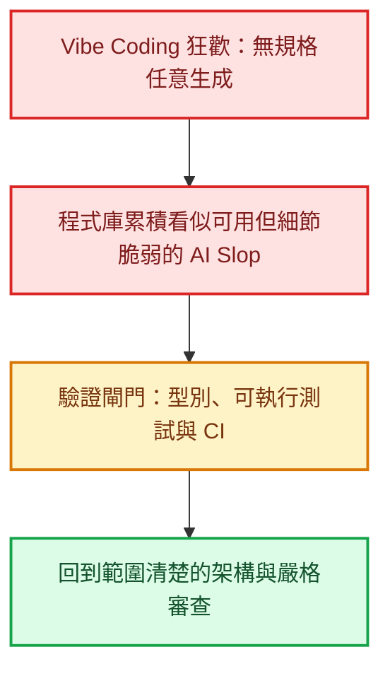

當 Andrej Karpathy 在社群上拋出 **Vibe Coding**——「只要感覺對了就跑，甚至不用看一行程式碼」——這概念時，整個科技社群瞬間陷入了狂歡。社群平台上滿是「完全不懂程式的小白在週末用 Prompt 刻出一個 App」的神話，伴隨而來的，是各種「軟體工程師已死」、「程式碼打字員即將全數失業」的預言。

然而，當這股熱潮進入生產級系統與真實團隊後，社群討論與公開調查呈現了另一面。2025 年 Stack Overflow 開發者調查中，對 AI 輸出抱持不信任的人多於信任者；最常見的挫折之一，就是「答案看似正確卻差一點」，以及除錯生成程式碼反而更花時間。

工程師確實可以少寫一些樣板程式，但痛苦點也可能轉移到另一端：**AI 能在短時間內產生大量變更，人類仍必須花時間審查、理解、執行測試並修復邊界問題。**這不代表 AI 一定拖慢開發，而是提醒我們不能只用產生程式碼的速度衡量生產力。

<!--more-->

## 1. AI Slop 與 PR 審查地獄：技術公地悲劇的誕生

在過去一年多的社群討論中，一個被頻繁提及的詞彙是 **AI Slop**（AI 產生的程式碼垃圾）。

在許多開發者討論中，資深工程師與 Tech Lead 提到「審查塞車」現象：

- **看似能動，但結構脆弱（Technically correct, but architecturally wrong）**：AI 產生的程式碼往往能通過基本的快樂路徑（Happy Path），但內部卻充斥著層層無意義的包裝器（Wrappers）、被悄悄吞掉的例外錯誤（Swallowed Exceptions）、重複卻互不相通的邏輯，以及看似精美實則空洞的「假抽象」。
- **審查者的公地悲劇**：提交者只要按一下按鈕、甚至不用理解細節，就能在三秒內送出一個包含 800 行程式碼的 Pull Request。而審查者卻必須耗費巨大的認知能量，逐行追蹤隱蔽的非同步競態（Race Condition）、記憶體洩漏與安全性盲點。
- **維護信心的瓦解**：一旦程式庫被大量未經理解的生成程式碼滲透，團隊更難判斷哪些抽象能安全修改，長期維護成本也會提高。

這些現象指向同一件事：**生成程式碼變便宜了，但信任與驗證仍然需要工程判斷。**METR 在 2025 年針對 16 位熟悉大型開源專案的資深開發者進行隨機實驗，該情境下使用當時的 AI 工具平均慢了 19%。研究團隊也明確提醒，這只是特定工具、任務與樣本的結果，不能推論所有開發者都會變慢。

## 2. 初階工程師斷崖：如果沒有練習場，未來的 Senior 從哪裡來？

在 Reddit 的 r/cscareerquestions 等討論版上，另一個引發廣泛焦慮的議題被稱為 **The Junior Developer Cliff（初階工程師斷崖）**。

傳統的軟體工程培訓體系，本質上建立在「從基礎踩坑中成長」的路徑上：
新人從撰寫樣板代碼、修復瑣碎的小 Bug、編寫基礎單元測試開始。正是這數千小時看似低效的「手刻經驗」，讓工程師的大腦建立了對記憶體模型、執行緒狀態、邊界條件與網路延遲的直覺。

當企業開始期待 AI 吸收樣板程式、簡單測試與初步文件時，社群也出現一個合理擔憂：如果初階任務減少，新人要在哪裡累積除錯與系統判斷經驗？這是仍在發展的產業問題，不能簡化成所有公司都已改成「一位 Senior 加多個 AI 代理人」。

這引發了整個產業最深刻的結構性難題：
**如果所有初階任務都被 AI 吞噬，新手該如何累積足夠的架構直覺與批判能力，在未來成為能夠看穿 AI 幻覺的資深架構師？**

一個較可行的方向是：**初階工程師的職責需要隨工具改變。** 新人不能只定位為「語法打字員」，也要更早學會設計規格、定義測試邊界，並對 AI 產出的結果進行行為審查。

## 3. 無聊技術的強勢逆襲：為什麼 Boring Tech 在 AI 時代大獲全勝？

在過去幾年，技術社群流行追求過度工程化：微前端、數十個微服務、複雜的動態框架與多層分散式快取。

到了 2026 年，**Choose Boring Technology（選擇無聊技術）**再次受到重視。原因很實際：成熟工具的文件、錯誤模式與範例較多，人與 AI 都比較容易理解和驗證。

### Context Window 的物理限制
AI 代理人在處理分散於許多倉庫的微服務時，比較容易遺漏跨服務脈絡。相對而言，範圍清楚、高內聚的**單體式架構（Monolith）**，通常更容易提供完整相關檔案；但大型單體同樣可能超出上下文限制，重點仍是清楚的模組邊界。

### 凌晨三點的除錯可預測性
Postgres、SQLite、標準 SQL、簡單的 REST/RPC 與傳統伺服器端渲染（SSR），因此成為許多團隊優先考慮的選項。這不是說新技術都不值得採用，而是當程式碼大量由 AI 協助產出時，工程師更需要**清楚的日誌、成熟的工具與可預測的故障模式**。

## 4. 驗證即一切：測試驅動開發（TDD）與型別系統的黃金時代

Kent Beck 在「Augmented Coding: Beyond the Vibes」案例中示範如何用 TDD 約束 AI；Simon Willison 也主張，使用 Coding Agent 時自動化測試已不再是可有可無。更準確的說法是：**AI 沒有取代測試，反而讓可執行規格、測試與人工驗收變得更重要。**

當代碼生成的成本趨近於零：
- **強型別系統（TypeScript、Rust）** 能在編譯期提早攔截一部分型別與介面錯誤，但效果取決於專案設定，沒有可信證據支持固定的 60% 比例。
- **自動化測試套件（Unit / Integration / E2E）** 不再只是覆蓋率報告，也能讓人類用可執行的方式表達系統意圖；但測試不是唯一形式，規格、程式碼審查與實際操作驗收同樣重要。
- **嚴格的 CI/CD 閘門** 充當全自動守門人，沒有通過所有測試與靜態分析的變更，一律不得進入主分支。

## 5. 獨立開發者的超級槓桿：一人軍團的崛起

雖然大型團隊在 PR 審查與組織流程上面臨新問題，但對於**獨立開發者（Indie Hackers）**與微型團隊而言，這仍是生產力槓桿明顯增加的時期。

一位具備系統思維的工程師，現在能藉由規範清楚的 AI 工作鏈，更有效率地處理資料庫、前後端、自動化測試與基礎設施等不同工作。

關鍵差異在於：
**你是讓 AI 在毫無邊界的情況下自由塗鴉，還是為它搭建了一套包含型別約束、測試閘門與標準化狀態機的堅固鐵軌？**

在清楚的規格與驗證流程上，個人的生產力槓桿可以明顯增加；缺乏約束時，增加的產出量也可能快速轉化成技術債。

## 結語：軟體工程從未死亡，它只是剝離了表象

回顧這幾年的變革，我們會發現：**軟體工程從未死亡，死去的只是低思考密度的打字行為。**

當寫程式碼的門檻被抹平，軟體開發重新回歸到它最核心的本質——**理解真實世界的不確定性、定義清晰的系統邊界、在複雜的權衡中做出架構取捨，並為系統的正確性與長期穩定負起責任。**

未來的頂尖工程師，不再是以「每分鐘能產出多少行代碼」來定義身價，而是以「能把多複雜的業務混沌，梳理為優雅、穩健且可驗證的系統」來展現其不可替代的核心價值。

## 資料來源

- [Stack Overflow 2025 Developer Survey：AI 使用、信任與常見挫折](https://survey.stackoverflow.co/2025/ai)
- [METR：2025 年 AI 對資深開源開發者生產力的隨機實驗](https://metr.org/blog/2025-07-10-early-2025-ai-experienced-os-dev-study/)
- [METR：2026 年後續研究設計與限制說明](https://metr.org/blog/2026-02-24-uplift-update/)
- [Kent Beck：Augmented Coding: Beyond the Vibes](https://kentbeck.com/summaries/augmented-coding-beyond-the-vibes/)
- [Simon Willison：First run the tests](https://simonwillison.net/guides/agentic-engineering-patterns/first-run-the-tests/)
