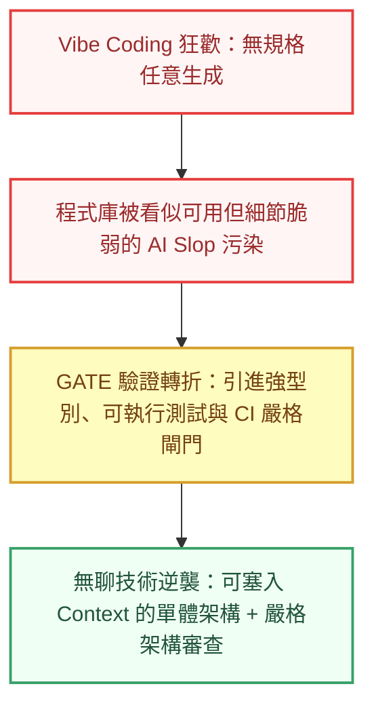

當 Andrej Karpathy 在社群上拋出 **Vibe Coding**——「只要感覺對了就跑，甚至不用看一行程式碼」——這概念時，整個科技社群瞬間陷入了狂歡。社群平台上滿是「完全不懂程式的小白在週末用 Prompt 刻出一個 App」的神話，伴隨而來的，是各種「軟體工程師已死」、「程式碼打字員即將全數失業」的預言。

然而，當這股熱潮進入生產級系統與真實團隊後，如果我們把視角移向 **Hacker News**、**Reddit**（r/programming）、**The Pragmatic Engineer** 以及一線開發團隊的日常，看到的卻是一幅截然不同、甚至極具黑色幽默的景象：

工程師確實不用花時間寫樣板代碼了，但所有人的**痛苦點**，被原封不動地轉移到了一個更令人崩潰的深淵——**AI 產生程式碼只要五秒鐘，但人類工程師審查、理解並修復那兩千行看似合理卻千瘡百孔的變更，卻要花上整整兩天。**

<!--more-->

## 1. AI Slop 與 PR 審查地獄：技術公地悲劇的誕生

在過去一年多的社群討論中，一個被頻繁提及的詞彙是 **AI Slop**（AI 產生的程式碼垃圾）。

在 Hacker News 的無數篇熱門討論串中，資深工程師與 Tech Lead 們痛陳著當前團隊面臨的「審查塞車」現象：

- **看似能動，但結構脆弱（Technically correct, but architecturally wrong）**：AI 產生的程式碼往往能通過基本的快樂路徑（Happy Path），但內部卻充斥著層層無意義的包裝器（Wrappers）、被悄悄吞掉的例外錯誤（Swallowed Exceptions）、重複卻互不相通的邏輯，以及看似精美實則空洞的「假抽象」。
- **審查者的公地悲劇**：提交者只要按一下按鈕、甚至不用理解細節，就能在三秒內送出一個包含 800 行程式碼的 Pull Request。而審查者卻必須耗費巨大的認知能量，逐行追蹤隱蔽的非同步競態（Race Condition）、記憶體洩漏與安全性盲點。
- **維護信心的瓦解**：一旦程式庫被大量未經深思的生成代碼滲透，沒有人敢對舊系統進行重構，系統腐化速度比以往快了數倍。

越來越多工程團隊開始意識到：**在軟體開發中，生成程式碼的邊際成本已經降為零，但「信任與驗證」的成本卻達到了歷史最高點。**

## 2. 初階工程師斷崖：如果沒有練習場，未來的 Senior 從哪裡來？

在 Reddit 的 r/cscareerquestions 等討論版上，另一個引發廣泛焦慮的議題被稱為 **The Junior Developer Cliff（初階工程師斷崖）**。

傳統的軟體工程培訓體系，本質上建立在「從基礎踩坑中成長」的路徑上：
新人從撰寫樣板代碼、修復瑣碎的小 Bug、編寫基礎單元測試開始。正是這數千小時看似低效的「手刻經驗」，讓工程師的大腦建立了對記憶體模型、執行緒狀態、邊界條件與網路延遲的直覺。

但在 AI 工具普及後，許多企業縮減了初階職缺，轉而推行「1 位 Senior + 多個 AI 代理人」的配置。

這引發了整個產業最深刻的結構性難題：
**如果所有初階任務都被 AI 吞噬，新手該如何累積足夠的架構直覺與批判能力，在未來成為能夠看穿 AI 幻覺的資深架構師？**

社群正在醞釀的解答是：**初階工程師的職責定義必須被徹底重寫。** 未來的新人不能再定位為「語法打字員」，而必須從第一天起就被訓練為 **Human-in-the-loop Operator**——學會設計規格、定義測試邊界、並對 AI 產出的結果進行行為審查。

## 3. 無聊技術的強勢逆襲：為什麼 Boring Tech 在 AI 時代大獲全勝？

在過去幾年，技術社群流行追求過度工程化：微前端、數十個微服務、複雜的動態框架與多層分散式快取。

然而在 2026 年，技術界迎來了 **Choose Boring Technology（選擇無聊技術）** 哲學的巨大文藝復興。原因非常現實且符合工程邏輯：

### Context Window 的物理限制
AI 代理人在處理分散於十幾個倉庫的微服務時，極易發生上下文丟失與幻覺。相反地，結構清晰、高內聚的**單體式架構（Monolith）**，可以整包納入上下文視窗中，讓 AI 一次看清全貌並給出高精度的修改。

### 凌晨三點的除錯可預測性
Postgres、SQLite、標準 SQL、簡單的 REST/RPC 與傳統伺服器端渲染（SSR）重新成為最受歡迎的架構基石。當程式碼大量由 AI 產出時，工程師最需要的不是前衛的黑魔法，而是**在半夜系統出狀況時，能夠透過乾淨的日誌和最成熟的工具，一眼看出問題所在**。

## 4. 驗證即一切：測試驅動開發（TDD）與型別系統的黃金時代

如知名軟體工程專家 Kent Beck 與 Simon Willison 在社群討論中所強調的：**AI 並沒有殺死測試，反而讓可執行的規格與測試驅動開發（TDD）成為唯一的保命手段。**

當代碼生成的成本趨近於零：
- **強型別系統（TypeScript、Rust）** 成為最基礎的物理約束，直接在編譯期淘汰掉 60% 以上的 AI 型別幻覺。
- **自動化測試套件（Unit / Integration / E2E）** 不再是為了應付覆蓋率報告，而是成為人類向 AI 表達「系統意圖（Intent）」的唯一形式——先寫出斷言，再讓 AI 去填補實作。
- **嚴格的 CI/CD 閘門** 充當全自動守門人，沒有通過所有測試與靜態分析的變更，一律不得進入主分支。

## 5. 獨立開發者的超級槓桿：一人軍團的崛起

雖然大企業團隊在 PR 審查與組織架構上陷入陣痛，但對於**獨立開發者（Indie Hackers）**與微型團隊而言，這卻是歷史上最好的時代。

一位具備深厚系統思維的資深工程師，現在能藉由一套規範嚴謹的 AI 工作鏈，獨自包辦從資料庫架構、前後端開發、自動化測試到基礎設施部署的所有工作。

關鍵差異在於：
**你是讓 AI 在毫無邊界的情況下自由塗鴉，還是為它搭建了一套包含型別約束、測試閘門與標準化狀態機的堅固鐵軌？**

在鐵軌之上，個人的生產力槓桿被放大了數倍；而在缺乏約束的泥地上，只會迅速被自己製造的技術債淹沒。

## 結語：軟體工程從未死亡，它只是剝離了表象

回顧這幾年的變革，我們會發現：**軟體工程從未死亡，死去的只是低思考密度的打字行為。**

當寫程式碼的門檻被抹平，軟體開發重新回歸到它最核心的本質——**理解真實世界的不確定性、定義清晰的系統邊界、在複雜的權衡中做出架構取捨，並為系統的正確性與長期穩定負起責任。**

未來的頂尖工程師，不再是以「每分鐘能產出多少行代碼」來定義身價，而是以「能把多複雜的業務混沌，梳理為優雅、穩健且可驗證的系統」來展現其不可替代的核心價值。
