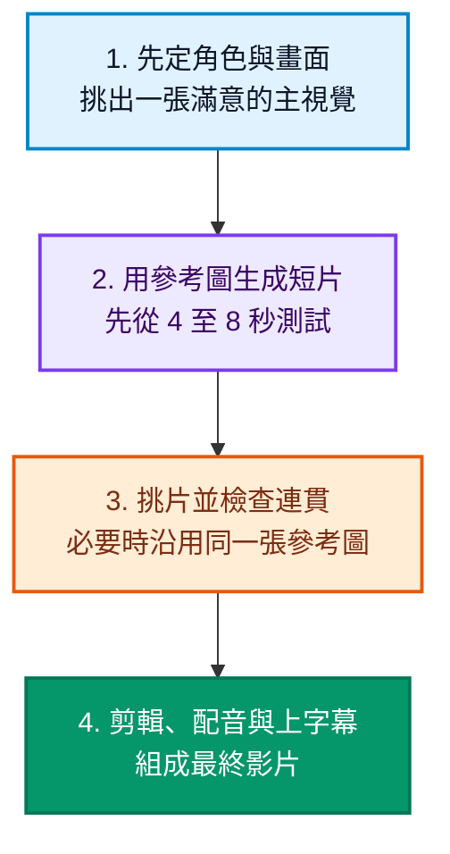

2026 年的 AI 繪圖與生成影片工具越來越多，真正難的不是找到「最強模型」，而是判斷哪一個適合你的用途與預算。這篇將盲測榜、官方定價與實際工作流程整理成一份簡單的選擇指南。

<!--more-->

## 先看盲測榜，但不要只看名次

以 [Artificial Analysis 圖像盲測榜](https://artificialanalysis.ai/image/leaderboard/text-to-image) 2026 年 8 月 29 日的資料為例，以下是幾個值得注意的模型：

| 排名 | 模型 | 盲測分數 | 約略價格 |
| :---: | :--- | :---: | :--- |
| 1 | **GPT Image 2 high** | 1,370 | 每千張 211 美元 |
| 2 | **MAI-Image-2.6 Preview** | 1,351 | 尚未公開 |
| 3 | **Reve 2.1** | 1,323 | 每千張 200 美元 |
| 4 | **Nano Banana 2** | 1,321 | 1K 圖片每千張約 67 美元 |
| 6 | **MAI-Image-2.5** | 1,303 | 每千張約 48.1 美元 |

盲測分數適合看整體偏好，但分數差幾分不代表每種圖都有明顯差距。實際選擇還要看風格、文字、編輯功能與商用權利。

## AI 繪圖工具怎麼選

| 你要做的事 | 建議工具 | 原因 |
| :--- | :--- | :--- |
| 複雜場景、廣告或需精準照指示生圖 | **GPT Image 2** | 對長指示與多個物件的理解較強，但價格高 |
| 大量生圖、程式串接或快速修圖 | **Nano Banana 2** | 品質與價格比較均衡，1K 輸出約每張 0.067 美元 |
| 強調插畫、電影感或社群封面 | **Midjourney** | 風格一致性好，適合快速探索視覺方向 |
| 海報、標題與圖中文字 | **Ideogram 4** | 排版表現通常穩定，但正式使用前仍要校對文字 |
| Logo、圖示與可編輯 SVG | **Recraft V4.1 Vector** | 可直接生成向量圖，API 約每張 0.08 美元 |
| 想在自己電腦上控制流程 | **FLUX.2 dev 或 klein** | 這些才是較適合本機使用的版本；max、pro 與 flex 主要是雲端服務 |

要特別注意：[Recraft 免費方案](https://www.recraft.ai/pricing?tab=api)的圖片由 Recraft 擁有，不適合直接用於商業專案。FLUX.2 也要先分清雲端與本機版本，不要把兩者的價格與電腦需求混在一起。

## AI 生成影片怎麼選

影片榜必須先分清「文字生影片」、「圖片生影片」，以及有沒有同步生成聲音。不同類別的分數不能直接互比。

| 盲測類別 | 2026-08-29 領先模型 | 適合情境 |
| :--- | :--- | :--- |
| 文字生影片，含聲音 | **Wan 3.0** | 從零發想單一鏡頭，畫面與聲音一次生成 |
| 圖片生影片，含聲音 | **Minimax H3 Max（fal 微調版）** | 已有角色圖或產品圖，希望保留主體特徵 |
| 文字或圖片生影片，無聲音 | **Gemini Omni Flash** | 重視畫面品質與速度，聲音另外處理 |

完整名次可參考 [Artificial Analysis 圖片生影片榜](https://artificialanalysis.ai/video/leaderboard/image-to-video) 與 [文字生影片榜](https://artificialanalysis.ai/video/leaderboard/text-to-video)。如果重視角色連貫，可從 **Kling** 或 **Runway** 的圖片生影片開始；如果要同時產生對白與環境音，再考慮 Minimax、Wan 或 Gemini。

## 簡單可用的四步驟流程

這套流程是建議，不是鐵律。不需要固定角色的風景或轉場，直接用文字生影片也很方便；需要角色一致時，圖片生影片通常較好控制。提示詞以動作與運鏡為主，但仍可補充必要的服裝或道具特徵。

## 每月 30 美元內的實用組合

以美元月付、稅金與匯率差異未計為前提，可以這樣分配：

| 用途 | 方案 | 每月預算 |
| :--- | :--- | :---: |
| 主視覺與風格圖 | **Midjourney Basic** | 10 美元 |
| 短片生成 | **Runway Standard** | 15 美元 |
| 精準修圖或補圖 | **Nano Banana 2 API** | 5 美元額度 |
| 剪輯 | **CapCut 或 DaVinci Resolve 免費版** | 0 美元 |
| **合計** |  | **30 美元** |

Midjourney Basic 提供每月 200 分鐘快速生成，不包含無限慢速模式。Runway Standard 月付為 15 美元，若點數都用在 Gen-4.5，約可生成一分鐘影片。Nano Banana 2 的 1K 輸出每張約 0.067 美元，5 美元約可支付 74 張圖片輸出，實際數量還會受輸入費用影響。

需要更多影片時，可先把 Midjourney 的 10 美元移到影片預算，改用 Nano Banana 2 生成底圖。現行 Runway **Unlimited** 已不對新用戶開放；高用量方案是每月 95 美元的 **Max**，因此不應再把「76 美元無限生成」當成新用戶預算。

## 最後怎麼挑

- 想要精準照指示生圖：**GPT Image 2**。
- 重視價格與大量產出：**Nano Banana 2** 或 **MAI-Image-2.5**。
- 重視藝術風格：**Midjourney**。
- 需要 SVG 向量圖：**Recraft V4.1 Vector**。
- 需要角色連貫的短片：先用圖片定稿，再用 **Kling** 或 **Runway** 生成影片。
- 希望畫面與聲音一起生成：考慮 **Minimax H3**、**Wan 3.0** 或 **Gemini Omni Flash**。

榜單會變，但選擇方法不會：先確定要交付的作品，再用少量預算試做，比追著單一名次更有效。

---

### 官方資料與延伸閱讀

- [Google Gemini API 價格](https://ai.google.dev/gemini-api/docs/pricing)
- [Midjourney 方案比較](https://docs.midjourney.com/hc/en-us/articles/27870484040333-Comparing-Midjourney-Plans)
- [Runway 方案說明](https://help.runwayml.com/hc/en-us/articles/21664961171475-Which-plan-is-right-for-me)
- [FLUX.2 版本說明](https://docs.bfl.ai/flux_2/flux2_overview)
- [選模型別再憑感覺！Artificial Analysis 完整指南](/2026/08/17/選模型別再憑感覺！Artificial-Analysis-完整指南：從品質、速度到成本，情境化挑出最適合你的-AI/)
