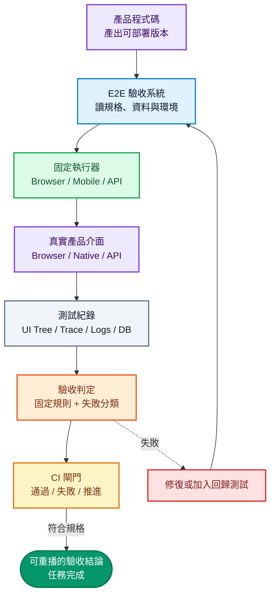
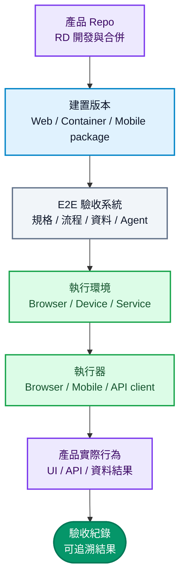
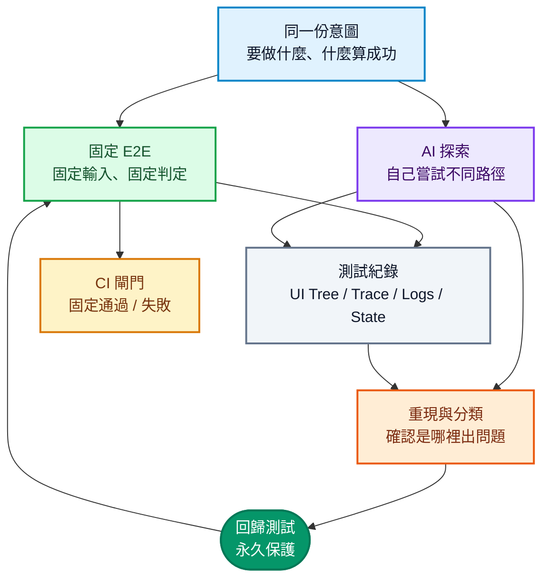
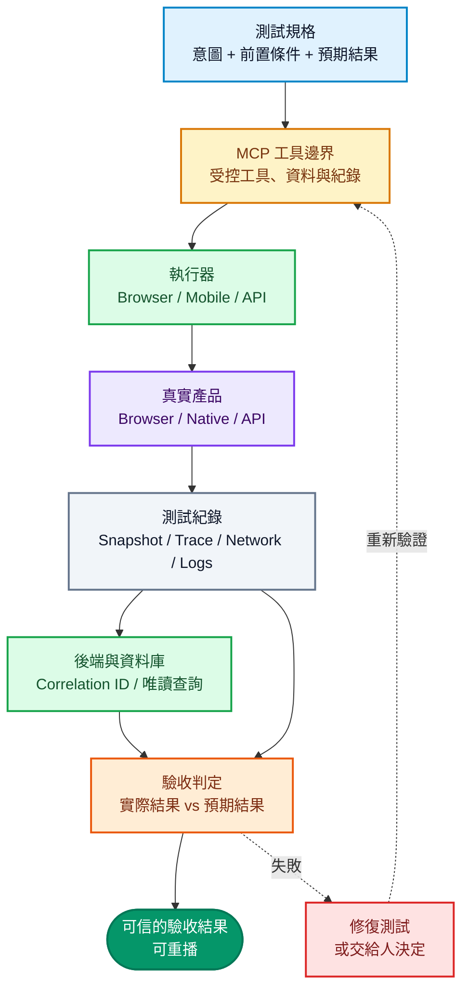

一支 E2E 測試只負責跑一個情境；**E2E Harness（端到端驗收系統）則負責從建置版本、測試資料、執行、結果判定到失敗回饋的整條路。**

AI 讓產品變更變快，也讓錯誤、測試維護與驗收工作一起增加。因此真正要升級的不是腳本數量，而是這套驗收系統的**邊界、紀錄和回饋**。

本文只談一件事：當 Agent 能持續修改產品時，E2E Harness 要怎麼設計，才能讓固定測試守住 CI、讓 Agent 找到未知問題，並把結果送回開發流程。Browser、API、Desktop、Mobile 都可以套用這個架構；Appium、WebView 只在其中一節作為行動產品的例子。

<!--more-->

## 一、先把名詞講清楚：E2E Test 是案例，Harness 是完整驗收系統

再換一個角度看：**Test Case 決定要測什麼；Runner 負責把測試跑起來；Harness 負責確定測試測到的是哪個產品、結果是否可信，以及失敗後要做什麼。**Harness 不是某一個新套件，也不等於 Playwright、WebDriver 或 Appium。

### 為什麼多寫測試不一定更可靠

傳統 E2E 專案常被當成一個測試檔案資料夾：幾支 spec、一些 Page Object、幾個 CI 指令。當 Coding Agent 不斷產生 Pull Request，這種結構會立刻暴露三個問題：

- 測試和產品原始碼共享上下文，容易一起複製錯誤假設。
- 測試只回傳綠燈或紅燈，Agent 沒有足夠證據判斷是產品、資料、環境還是測試壞掉。
- 找到新 Bug 後沒有升格流程，下一次仍然要靠人工重新發現。

這就是 **AI 測試劇場**：同一個 Builder Agent 寫完產品，又照自己的假設寫測試，最後看到綠燈就說完成。覆蓋率可能上升，真正的錯誤卻沒被抓到，因為產品、測試和預期結果都來自同一個錯誤假設。單元測試仍然重要，但它只是 Builder 的本機快速檢查，不是獨立的產品驗收。要拆掉這個盲點，Validator 必須拿著 build，從產品外部跑過真實介面，再用另一套固定規則判定結果。

把它拆成三層會比較清楚：

| 層次 | 負責什麼 | 典型內容 |
| --- | --- | --- |
| E2E Test Case | 驗證一個固定情境 | 輸入、操作、預期結果 |
| Test Runner | 把測試送進產品介面執行 | Playwright Test、WebDriver client、API runner |
| E2E Harness | 管理整套驗收流程 | build、環境、資料、Evidence、判定、CI、Agent 規則 |

所以，團隊說「我們用了 Playwright」，只代表有了自動化執行工具。只有當它還能接收指定 build、準備隔離資料、留下可重播紀錄、做出固定判定，並把新問題加入回歸測試，才稱得上是一個 E2E Harness。

「Harness」在測試領域也不是 AI 才發明的新詞。ISTQB 2019 年的術語表把 test harness 定義為執行測試套件所需的測試環境、stubs 與 drivers；更早的 FDA／IEEE 軟體工程術語則把 test driver／test harness 描述成負責呼叫測試對象、提供輸入、監控執行與回報結果的元件。[ISTQB Glossary](https://api.glossary.istqb.org/storage/help/R0uz58NqLzUz48LVUuyGSF76NFj4LHQazSs0GlNS.pdf)、[FDA／IEEE Software Glossary](https://www.fda.gov/inspections-compliance-enforcement-and-criminal-investigations/inspection-guides/glossary-computer-system-software-development-terminology-895)

近年變得流行的是 **AI-native Harness** 這個用法：當 Agent 會自己讀規格、修改產品、執行測試、分析失敗與提出修復時，Harness 不再只是測試執行器的外殼，而是替 Agent 提供工具、上下文、限制、證據與完成條件的控制面。OpenAI 對 Harness Engineering 的描述，正是把重點從「如何下更好的 prompt」移到「如何設計讓 Agent 可靠工作的環境與回饋迴圈」。[Harness engineering](https://openai.com/index/harness-engineering/)

### Harness 怎麼工作



這張圖就是本文的主題。Harness 不是替 AI 猜答案，而是把**規格、真實產品、測試結果和後續動作**接起來。所謂可信結果，也不是模型說「看起來沒問題」，而是用固定規則比對真實介面、API、環境與資料後留下的紀錄。

## 二、先把 Harness 和產品分開

### E2E 不直接引用產品程式碼

不論受測的是 Web、Mobile、Desktop、API 或混合產品，第一個原則都是：**E2E 從產品外部測試，不直接呼叫產品內部程式。**執行器和目錄可以依產品形態調整，但這條界線不變。

兩個 Repo 的關係應該是：



E2E Repo 禁止出現這類依賴：

```ts
import productStore from 'product';
import productService from 'product';
```

允許的輸入依產品形態而定，常見包括：

- Web build、容器 image、Mobile package、Desktop binary 或其他可部署 artifact。
- 測試帳號、測試資料與明確版本的 fixture。
- QA backend、sandbox、seed／reset API 或測試資料服務。
- DOM、Accessibility Tree、Native UI Tree、服務 log 與執行器 log。
- 以 read-only 或 allowlist 限制的後端與資料庫查詢。

這樣做不是為了把「黑箱」當口號，而是避免測試直接依賴元件、狀態管理、服務或內部函式。E2E 要驗證的是使用者拿到可執行版本後看到的行為，不是內部函式能不能被呼叫。

### 產品要提供哪些測試介面

黑箱也不代表產品團隊什麼都不用準備。如果沒有穩定的定位方式、可重設的資料和可追蹤的 request ID，測試就只能靠脆弱的 workaround。因此可以用 **TESTABILITY_REQUIREMENTS.md** 列出需要的測試介面：

- Web 元件可用的 role、label、語意文字與必要的 `data-testid` 規則。
- Native 元件的 accessibility identifier、Android resource-id 或 iOS accessibility id。
- API 可驗證的 schema、錯誤碼、idempotency 與測試 endpoint。
- 建立、查詢、清除測試資料的 test-support API。
- 登入、權限、背景／前景、重新整理或其他產品生命週期行為的可控方式。
- 每個 build 或部署版本的 commit SHA、版本號與環境資訊。
- API、queue、資料庫寫入可以用 correlation ID 串回同一個使用者操作。

找不到元素時，AI 不應該直接生成更長的 XPath。缺少測試介面是產品需求，應交回負責該介面的工程團隊修正。

## 三、Harness 應該怎麼分層

### 讓 Agent 找得到東西的目錄

目錄要讓 Agent 知道規格、資料、執行器和測試紀錄放在哪裡。以下是跨 Web、Mobile 與 API 的參考骨架；不是每個產品都要照抄，沒有用到的資料夾就不要建立：

```text
e2e-harness/
├── AGENTS.md
├── docs/
│   ├── product-map.md
│   ├── test-strategy.md
│   ├── environments.md
│   ├── selector-contract.md
│   └── known-issues.md
├── specs/
│   ├── smoke/
│   ├── critical/
│   └── regression/
├── pages/                 # Web UI，需要時使用
├── screens/               # 其他 UI surface，需要時使用
├── components/            # 共用 UI，需要時使用
├── flows/
├── assertions/
├── fixtures/
├── support/
├── adapters/
│   ├── browser/           # Playwright
│   ├── mobile/            # Mobile adapter，可選
│   └── api/               # API client／contract，可選
├── observability/
├── agent/
│   ├── exploratory/
│   ├── failure-analysis/
│   ├── test-generation/
│   └── maintenance/
├── config/
└── scripts/
```

各資料夾只負責一件事：

| 資料夾 | 負責什麼 |
| --- | --- |
| `specs/` | 描述「要驗證什麼」，不直接操作低階 driver |
| `flows/` | 描述跨頁面、跨畫面或跨 API 的業務操作，例如登入、結帳、取消訂單 |
| `pages/`／`screens/` | 依產品形態封裝 Web Page 或 UI Screen 的定位、輸入、點擊與狀態等待 |
| `components/` | 依需要封裝 Modal、Filter Panel、Date Picker、Checkout Form 等共用 UI |
| `fixtures/`／`support/` | 帳號、資料種子、付款資料、reset、cleanup |
| `adapters/` | 把 Browser、Mobile、API 等工具的差異藏起來 |
| `observability/` | Screenshot、DOM／UI Tree、Trace、Network、服務 log、DB diff |
| `agent/` | 探索、失敗分析、案例生成與低風險維護 |

### 先寫要驗證什麼，再寫怎麼操作

Spec 應該寫清楚前置條件、使用者要做什麼、什麼結果算成功，以及哪些情況算失敗，不要只列 selector。流程層和執行器再把它翻成實際操作：Web 用 role、label、語意文字或 test ID；其他介面使用對應的 accessibility id、resource id 或服務契約。找不到元素時，Agent 可以修定位方式，但不能把預期結果改寬。

範例：

```ts
await checkoutFlow.placeOrder({
  product: catalog.inStockItem,
  account: users.standard,
});

await checkoutAssertions.expectCreatedOnce();
```

流程可以跨多個頁面、畫面或 API，但頁面物件不應該塞進完整業務流程。這樣 Agent 修一個定位方式或 API 執行器時，不必重新理解整個產品。

### 三種測試，各自負責什麼

| Suite | 目的 | 執行頻率 | 是否阻擋 CI |
| --- | --- | --- | --- |
| Smoke | 確認 build 可啟動並完成最短 Critical Journey | 每個 PR／Build | 是 |
| Critical | 覆蓋發布不能壞掉的核心業務流程 | PR、QA、Release Candidate | 是 |
| Regression | 已修 Bug、權限、生命週期、錯誤狀態與邊界案例 | Merge 後、Nightly | 依風險設定 |

這就是這套驗收系統的分工：本機先跑快速測試，固定 E2E 守住重要流程，AI 探索則不直接決定 CI 是否放行。不同產品可能沒有 `screens/` 或 UI 層，但重點不變：**只有固定執行器能決定固定驗收是否通過**。

## 四、固定測試和 AI 探索要分工

### 可以共用紀錄，不能共用放行權



### 固定 E2E：CI 的守門員

固定 E2E 必須具備：

- 固定輸入、測試資料、預期結果與可重設的環境。
- 每支測試可以單獨執行，不依賴上一支測試留下的狀態。
- 不讓 LLM 決定通過或失敗。
- UI 改版時，不自動放寬預期結果。
- 失敗時留下完整紀錄，讓下一個 Agent 可以重播。

AI 可以先產生初稿，但放進 `specs/smoke/`、`specs/critical/` 或 `specs/regression/` 前，要確認測的是產品行為，不是剛好出現的 DOM、UI Tree 或 API 回應格式。

### AI 探索：找固定案例沒想到的問題

AI 探索不是取代固定 E2E，而是找出還沒有寫進規格的路徑。例如：

- 提交訂單或其他狀態變更時快速連點、返回、重新整理。
- 產品在 Loading 中切到背景，再回到前景。
- 拒絕定位、通知或其他權限後繼續操作（產品有這些權限時）。
- 有 WebView 的產品重新載入頁面、切換介面，或鍵盤遮住按鈕。
- API 延遲、網路中斷、409、部分成功與逾時。
- 兩個隔離使用者同時修改同一筆訂單。

探索必須在可重設的測試環境、預先準備的資料庫或 network mock 中進行，並限制 Agent 可用的帳號、資料、工具與外部寫入權限。探索結果只是候選問題，不是 CI 綠燈。

真正的價值在「升格流程」：

```text
探索
  → 留下紀錄
  → 分析
  → 重現
  → 建立固定回歸測試
  → 再跑一次
```

如果問題能穩定重現，才放進 `specs/regression/`。這樣每抓到一個新問題，就多一條永久保護。

### 修改產品的人和驗收的人要分開

| 角色 | 主要工作 | 不可自行決定 |
| --- | --- | --- |
| Builder（修改產品） | 修改產品或測試系統、執行本機檢查 | 不能用自己的測試全綠宣告產品完成 |
| Validator（獨立驗收） | 取得 build、從外部執行 E2E、讀取紀錄、分類失敗 | 不能先改預期結果來消除紅燈 |
| QA／RD／人類審查者 | 定義要驗證的行為、確認變更、接受風險例外 | 不能只看 AI 摘要而跳過原始紀錄 |

是否使用不同模型不是重點。重要的是把角色、上下文、環境和決策權分開。2026 年一項 LLM 測試生成研究在特定實驗中觀察到，先生成錯誤程式碼再生成測試，抓錯率低於獨立生成測試；這也是 Builder 和 Validator 不應共用同一套錯誤假設的原因。[On the risk of coding before testing](https://arxiv.org/abs/2607.05139)

## 五、把測試紀錄留下來，讓 Agent 能查問題

### 不要只留下錯誤訊息

只留下 `Expected visible, received hidden`，幾乎無法幫 Agent 找原因。測試至少要在失敗時保存：

- 失敗前後的 DOM Snapshot、ARIA Snapshot 或 Native UI Tree。
- Screenshot、必要時的 video、Trace 和執行 log。
- Console、request URL、HTTP status 和 response 摘要。
- Product commit、E2E commit、build number、OS／Browser／Runtime 與環境。
- 測試資料 seed、帳號、correlation ID、後端 log，以及資料庫前後差異。

以 Web 測試為例，Playwright 的 [Trace Viewer](https://playwright.dev/docs/trace-viewer) 可以重播操作，查看 DOM、Network 和 Console；[Test Isolation](https://playwright.dev/docs/browser-contexts) 則提供每支測試使用乾淨 Browser Context 的方式。其他執行器也應提供同等程度的紀錄與隔離。

### 先分辨問題，再修測試

```json
{
  "scenario": "checkout-with-expired-session",
  "status": "failed",
  "classification": "product-regression",
  "observed": {
    "result": "order-confirmed",
    "httpStatus": 201,
    "orderCountDelta": 1,
    "runtime": "browser"
  },
  "expected": {
    "result": "login-required",
    "httpStatus": 401,
    "orderCountDelta": 0
  },
  "evidence": [
    "trace.zip",
    "accessibility-snapshot.json",
    "runner.log",
    "network.ndjson",
    "database-diff.json"
  ],
  "nextAction": "send-to-builder"
}
```

失敗至少分成六類：產品回歸、刻意的產品變更、測試框架問題、測試資料問題、環境問題，以及偶發／時序問題。分類完成前，Agent 不應修改定位方式或預期結果。

### 自動修測試，但不能改產品答案

自動修測試可以改 locator、等待條件或 fixture 初始化，但必須通過以下檢查：

1. 新的定位方式在正確容器內只找到一個元素。
2. 原本的業務判定完整保留。
3. 原本的失敗案例、相鄰情境和一個反例都重新執行。
4. PR 列出修改前後的定位方式、Trace 和結果。
5. 不得刪掉判定、無限增加等待或重試，也不能把錯誤改成成功。

Playwright 官方的 [Test Agents](https://playwright.dev/docs/test-agents) 已提供規劃、生成和修復測試的 Agent。它們可以協助維護測試，但不能修改產品的預期答案。

## 六、把不同產品介面接到 Harness

### Playwright 等工具只是執行器

執行器要依產品介面選擇，不要讓整套 Harness 被某一個工具綁死：

- Web 介面可以使用 Playwright，處理瀏覽器操作、語意定位、Network、Trace 與 DOM 判定。
- API 產品可以使用 HTTP client、契約測試或服務專用執行器。
- 如果產品包含 Native／Hybrid Mobile App，才加入 TypeScript、WebdriverIO、Appium 2、Android UiAutomator2 與 iOS XCUITest。Appium 透過 driver 將 WebDriver 命令映射到不同平台的自動化 API。[Appium Drivers](https://appium.io/docs/en/2.3/ecosystem/drivers/)
- Desktop、CLI、IoT 或其他介面，則依外部可觀測行為建立對應執行器；工具可以不同，但要驗證的意圖、測試紀錄和判定規則不應改變。

Appium 不是 Harness，而只是 Native／Hybrid Mobile 介面的其中一個執行器；同一個位置可以替換成其他工具。

如果產品有 Hybrid App，才需要把 Native 和 WebView 當成不同的操作環境，並把切換集中在 `adapters/mobile/webview/`，不要散落到每支 Spec。[Appium Managing Contexts](https://appium.io/docs/en/2.11/guides/context/)

Web 端的定位方式應優先使用 role、label、語意文字或明確 test ID，不要依賴 CSS nth-child 或 XPath。[Playwright Locators](https://playwright.dev/docs/locators)

MCP 是 Agent 和外部工具之間的受控入口，不是測試執行器，也不是最後裁判。它可以提供規格、Browser／Mobile／API 工具、log reader、後端查詢和資料庫唯讀查詢。實作時仍要保留 allowlist、最小權限和 audit log。[MCP Server Features](https://modelcontextprotocol.io/specification/2025-06-18/server/index)



### CI 怎麼安排測試

產品 Repo 和測試 Repo 可以用建置版本連接：

| 階段 | 做什麼 | 失敗時 |
| --- | --- | --- |
| Product Build | 建立可部署版本，記錄產品 commit 和 build number | 不能進入測試 |
| Smoke | 啟動產品，跑最短的重要流程 | 阻擋合併或推進 |
| Critical | 跑發布前不能壞的核心流程 | 阻擋候選版本 |
| Nightly Regression | 跑已修 Bug、錯誤狀態與邊界案例 | 產出修復或新測試候選 |
| AI Exploration | 在隔離環境嘗試未知組合，保存可重現步驟 | 不直接修改 main |

每份報告至少要記錄產品 commit、測試 commit、build number、OS／Browser／Runtime、環境、資料 seed 和測試帳號。沒有這些資料，Agent 很容易把環境問題誤判成產品問題。

### 怎麼判斷測試覆蓋得夠不夠

對 E2E Harness，覆蓋率不應只回答「跑過多少行程式碼」，而要回答：「重要的產品行為，有多少真的被驗證過？」可以把一個測試項目想成：

`意圖 × 狀態 × 資料 × 介面`

例如「結帳 × session 過期 × 標準帳號 × Web／Chrome」是一個測試項目；「提交付款 × 重複點擊 × 已存在訂單 × API＋Web」是另一個。只有測試真的跑過這個組合，並檢查產品結果和必要的資料變化，才算覆蓋。Agent 隨機探索一次、畫面沒有報錯，不能直接算成覆蓋率。

| 指標 | 評斷方式 | 它回答的問題 |
| --- | --- | --- |
| 需求覆蓋 | 已驗證的需求 ÷ 核准的需求，最好按風險加權 | 重要需求是否都有驗收案例 |
| 狀態覆蓋 | 已驗證的狀態轉移 ÷ 需要驗證的狀態轉移 | 是否只測成功，漏掉過期、重試、逾時、回復 |
| 資料與邊界覆蓋 | 已驗證的資料分區與邊界 ÷ 風險清單中的資料分區 | 空值、極限值、重複資料、不同角色是否被驗證 |
| 介面與環境覆蓋 | 通過的必要介面與環境 ÷ 宣告的必要矩陣 | Browser、API、裝置、OS 或部署環境是否真的跑過 |
| 判定與紀錄覆蓋 | 有業務結果、資料變化和可重播紀錄的核心測試 ÷ 全部核心測試 | 測試能不能判定結果，而不是只點過畫面 |
| 抓錯能力 | 被測試抓到的有效錯誤 ÷ 有效錯誤總數 | 測試能不能抓到故意注入的錯誤 |

程式碼的行覆蓋率、函式覆蓋率和分支覆蓋率仍然有用，但它只表示某段程式跑過，不表示判定寫對，也不表示產品符合需求。ISTQB 也把敘述覆蓋率和決策／條件覆蓋率分開定義；它們是程式結構的指標，不是產品品質分數。[ISTQB Testing Glossary](https://api.glossary.istqb.org/storage/help/R0uz58NqLzUz48LVUuyGSF76NFj4LHQazSs0GlNS.pdf)

因此 CI 不應只設一條「80% 就通過」的規則。比較實用的做法是：

- PR：這次變更涉及的需求、風險狀態和必要環境都有固定 E2E；核心測試缺少判定或紀錄就阻擋。
- Release：所有重要流程都通過必要矩陣，沒有未分類失敗；高風險規則要做變異測試。
- Nightly：擴大資料、狀態、平台和 AI 探索範圍；探索結果重現並變成固定回歸測試後，才算正式覆蓋。

若團隊需要一個總覽數字，可以自訂風險加權分數：`Σ(風險權重 × 測試是否通過 × 判定與紀錄品質) ÷ Σ風險權重`。這只是管理用的訊號，不是業界標準。真正重要的是：高風險行為能重播驗證，故意注入的錯誤也能被測試抓到。Stryker 把「變異分數」定義成被測試抓到的故意錯誤比例，正好說明「跑過」和「抓得到錯」是兩件事。[Stryker Mutation Score](https://stryker-mutator.io/docs/General/faq/)

### 測試怎麼跑得快，也確定真的抓得到錯

- 本機快速檢查只跑 lint、型別、單元、元件與契約測試。
- PR 只跑受影響的 Smoke／Critical E2E；失敗時才叫 Agent 分析原因。
- Nightly 才跑完整回歸測試與 AI 探索。
- 同一個版本有時通過、有時失敗的測試，要標成「不穩定測試」；不能靠重跑把紅燈洗成綠燈。
- 每支測試自己準備資料、清理狀態，並支援平行執行。
- 針對權限、訂單狀態、付款、重試與資料遷移等高風險規則做「故意改錯」檢查（變異測試）：如果把規則改錯後測試仍然通過，就代表測試沒有抓到這個問題。Stryker 的[變異測試說明](https://stryker-mutator.io/docs/)與 [MUTGEN 研究](https://arxiv.org/abs/2506.02954)都說明，覆蓋率不能取代抓錯能力。

不要讓 Agent 讀完整 Repo，只提供和這次失敗有關的 Snapshot、Trace 摘要、前後狀態差異與 correlation ID。**固定工具負責決定通過與否，AI 協助找原因與維護測試。**

## 七、結語：AI 時代的 E2E 是驗收系統

當 AI 只負責生成程式碼時，E2E 主要是發布前的測試工具；當 AI 開始自己修改、測試和修復時，E2E Harness 就必須變成整套驗收系統：

- 用獨立 Repo 把產品和測試分開。
- 用規格、流程、頁面、測試資料和執行器分開管理。
- 用固定 E2E 守住 CI 的放行線。
- 用 AI 探索固定案例沒想到的行為。
- 留下完整紀錄，讓每次失敗都能查、能分類、能重播。
- 把確認過的新 Bug 變成固定回歸測試。

RD 要提供容易測試、也容易追蹤的產品版本；QA 要定義重要流程和風險；Agent 負責執行、探索、分析和提出修復。**Agent 可以操作驗收系統，但不能自行降低驗收標準。**

這才是 AI 變聰明後 E2E 真正的變化：它不再只是一堆等待維護的腳本，而是一套讓 AI 能持續修改、讓人和工具有證據驗收，並把未知問題變成回歸保護的工程系統。

## 參考資料與延伸閱讀

- [Harness engineering: leveraging Codex in an agent-first world](https://openai.com/index/harness-engineering/)
- [ISTQB Standard Glossary of Terms Used in Software Testing](https://api.glossary.istqb.org/storage/help/R0uz58NqLzUz48LVUuyGSF76NFj4LHQazSs0GlNS.pdf)
- [FDA／IEEE Glossary of Computer System Software Development Terminology](https://www.fda.gov/inspections-compliance-enforcement-and-criminal-investigations/inspection-guides/glossary-computer-system-software-development-terminology-895)
- [On the risk of coding before testing: An empirical study on LLM-based test generation workflow](https://arxiv.org/abs/2607.05139)
- [Playwright Locators](https://playwright.dev/docs/locators)
- [Playwright Trace Viewer](https://playwright.dev/docs/trace-viewer)
- [Playwright Test Isolation](https://playwright.dev/docs/browser-contexts)
- [Playwright Test Agents](https://playwright.dev/docs/test-agents)
- [Playwright MCP](https://playwright.dev/mcp/introduction)
- [Appium Drivers](https://appium.io/docs/en/2.3/ecosystem/drivers/)
- [Appium Managing Contexts](https://appium.io/docs/en/2.11/guides/context/)
- [Model Context Protocol Server Features](https://modelcontextprotocol.io/specification/2025-06-18/server/index)
- [Stryker Mutation Testing](https://stryker-mutator.io/docs/)
- [Towards More Effective Fault Detection in LLM-Based Unit Test Generation](https://arxiv.org/abs/2506.02954)
