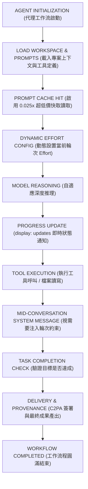

Anthropic 於 2026 年 9 月 1 日正式推出了專為長時程代理式工作（Long-horizon Agentic Work）與極限複雜推理打造的全新旗艦模型 **Claude Fable 5.1**（以及同步於 Project Glasswing 計畫中開放受邀客戶使用的 Claude Mythos 5.1）。這款模型不僅具備高達 1M tokens 的上下文視窗與 128K tokens 的單次最大輸出能力，更將提示快取讀取價格大幅砍到僅需基本輸入費用的四十分之一（0.025 倍），直接替需要反覆讀取龐大專案歷史的自主開發代理帶來了顯著的成本與效能優勢。

<!--more-->

在過去幾個月的代理式軟體開發（Agentic SDLC）與多步驟深度研究實踐中，開發者常面臨兩大痛點：一是長時間執行的多輪對話會讓 Token 與提示快取成本急速攀升；二是模型在處理橫跨數十個檔案的重構或深層除錯時，容易因為缺乏動態推理彈性而陷入卡關。Claude Fable 5.1 的誕生正是為了解決這些極高難度的推理瓶頸。本文將深入剖析 Claude Fable 5.1 的技術規格、核心破壞性變更、全新功能特性，並提供開發者完整的遷移與實戰指引。

---

## 為什麼需要 Claude Fable 5.1？模型定位與核心規格

在 Anthropic 現行的模型家族中，**Claude Opus 5** 依然是應對絕大多數高難度日常任務的最佳起點。但當專案規模擴大到需要自主代理連續執行數小時、跨多檔案重構、從零生成包含即時公式的百頁試算表，或是執行需要不斷自我修正的多步驟網路研究時，全新登場的 **Claude Fable 5.1** 便展現出無可取代的深度推理與長時程容錯能力。

### Claude Fable 5.1 vs Claude Fable 5 前後代升級對比

作為 Fable 5 的重大迭代版本，Claude Fable 5.1 在維持相同輸入與輸出價格的前提下，針對長時程代理工作流進行了多項底層架構重塑與成本最佳化：

| 規格與功能特性 | Claude Fable 5.1（最新旗艦） | Claude Fable 5（前代版本） | 升級差異解析 |
| :--- | :--- | :--- | :--- |
| **模型 ID** | **claude-fable-5-1** | **claude-fable-5** | 升級直接替換模型字串 |
| **基本輸入 / 輸出價格** | **$10 / $50 / MTok** | **$10 / $50 / MTok** | 價格維持相同水準 |
| **快取讀取價格（Cache Read）** | **$0.25 / MTok (0.025x)** | **$1.00 / MTok (0.1x)** | **狂降 75%！僅需原本 1/4 成本** |
| **強制工具選擇（tool_choice）** | **僅支援 auto 與 none**（tool/any 報 400） | **支援 auto, none, any, tool** | **重大變更：禁止強制模式** |
| **逐訊息 Effort 動態設定** | **支援（Beta，不破壞快取）** | **不支援** | 可在對話中途自由調整思考深度 |
| **輪次中途系統訊息** | **支援（Beta）** | **不支援** | 可在 messages 陣列注入特定輪次約束 |
| **工具執行進度更新** | **支援 `display: "updates"`（Beta）** | **不支援** | 工具呼叫間即時串流面向使用者的狀態 |
| **思考區塊向後相容** | **可讀取 Fable 5 與舊模型思考** | **無法讀取 Fable 5.1 思考** | 單向相容，降級時 API 自動剔除 |
| **歷史篡改防護校驗** | **強綁定（修改歷史報 400）** | **無歷史簽章綁定** | 防止長推理鏈被惡意或意外篡改 |
| **內容來源標記** | **C2PA 憑證 + 統計文字浮水印** | **僅基本文字浮水印** | 媒體產出全面支援 C2PA 憑證驗證 |
| **Priority Tier 支援** | **不支援** | **支援** | 僅一般佇列與 Batch API |
| **長時程代理推理表現** | **顯著躍升（尤其在 high/max effort）** | **基準表現** | 多檔案重構與長時程任務成功率大增 |

### 與 Claude 家族其他模型的定位區別

除了與前代 Fable 5 的重大差異外，在整體模型梯隊中：
- **Claude Sonnet 5**（$2 / $10）：適合即時客服、文字潤飾、日常單檔開發與高吞吐 API。
- **Claude Opus 5**（$5 / $25）：適合絕大多數複雜程式架構、深度分析與專業撰寫（快取讀取為 $0.50 / MTok）。
- **Claude Fable 5.1**（$10 / $50）：專攻連續多輪自主代理、跨十幾個模組的大規模重構、端到端生出含即時公式的試算表與多步驟深度研究。得益於 **$0.25 / MTok** 的超低快取讀取價，在超長代理對話中，綜合營運成本甚至往往比 Opus 5 更具優勢！

---

## 開發者必知：三大重大破壞性變更

如果您打算將既有的工作流或專案升級至 Claude Fable 5.1，必須特別注意以下三項與過往模型不同的重大行為變更（Breaking Changes）：

### 1. 禁止強制工具選擇（tool_choice 不再支援 tool 與 any）

在過往的 Claude 模型中，開發者可以透過 `tool_choice: {"type": "tool", "name": "..."}` 或 `tool_choice: {"type": "any"}` 強迫模型在下一輪必須呼叫特定工具。

在 **Claude Fable 5.1** 中，這兩種強制設定會直接回傳 **HTTP 400 invalid_request_error**。

**官方升級解法：**
1. 將 `tool_choice` 維持為 `{"type": "auto"}`，並在 prompt 提示詞中明確指示呼叫時機。
2. 針對工具定義設定 `strict: true`，確保參數型態與結構描述（JSON Schema）嚴格吻合。
3. 若僅需要輸出符合結構的 JSON 資料，請改用官方提供的 **JSON 輸出模式**（`output_config.format`）。
4. 若是由應用程式要求在多輪對話當前輪次強制呼叫工具，可使用全新的**對話中途系統訊息（Mid-conversation System Message）**。

### 2. 思考區塊模型綁定與向後相容機制

Claude Fable 5.1 的思考區塊（Thinking Blocks）帶有專屬的模型簽章（Signature）。
- **單向相容**：Claude Fable 5.1 可以完整讀取來自舊模型（如 Opus 5、Sonnet 5、Fable 5）的歷史思考區塊。
- **降級時自動剝除**：如果對話因為網路重試、分類器拒絕或負載均衡而回退（Fallback）至舊模型，API 會自動將舊模型無法辨識的 Fable 5.1 思考區塊剔除，避免報錯且不會計入輸入 Token 費用，但降級後的模型需要重新規劃推理。

### 3. 對話歷史修改會使思考簽章失效

為了確保長推理鏈的嚴謹性與安全性，Claude Fable 5.1 的每一個思考區塊都與先前的系統提示詞、工具定義以及對話歷史產生了強綁定。如果您的後端程式在多輪對話中途修改了先前的訊息內容，該請求將會直接收到簽章無效的 400 錯誤。在設計代理框架時，務必確保對話前綴（Prefix）的位元組完全一致。

---

## 五大殺手級新功能與架構優化

除了核心推理能力的躍升，Claude Fable 5.1 還引入了多項專為代理架構設計的原生能力：

### 1. 逐訊息 Effort 動態調控（Beta）

以往在對話中切換思考強度（Effort）通常需要變更全域設定，甚至可能破壞既有的快取狀態。Claude Fable 5.1 支援在單一對話的不同輪次中，動態指定 `effort: "low"`、`"medium"`、`"high"` 或 `"max"`，且**完全不會破壞先前的提示快取命中**。

例如在代理工作流中，當進行簡單的檔案讀取與確認時可使用 `low` effort 節省時間；當遇到複雜演算法設計或測試錯誤修復時，則可動態提升至 `high` 或 `max`。

### 2. 輪次範圍系統訊息（Turn-scoped System Messages, Beta）

開發者現在可以在 `messages` 陣列中途附加 `role: "system"` 訊息。這項功能對於自動化代理框架極具價值——您可以在不更動頂層 Prompt、完全保留提示快取的前提下，精準告知當前步驟的特殊規範或工具使用條件。

```python
# 中途系統訊息範例
messages = [
    {"role": "user", "content": "我的訂單 A1234 狀態為何？"},
    {"role": "assistant", "content": "好的，我來為您查詢。"},
    # 注入輪次系統指令，要求本輪必須先呼叫查詢工具
    {
        "role": "system",
        "content": "Tool-use requirement: The application requires a call to the order_lookup tool before answering. Begin response with tool call."
    }
]
```

### 3. 工具呼叫間自然語言進度更新（display: "updates", Beta）

在長達數十輪的自主代理執行過程中，模型在呼叫各項工具時往往不會輸出面向使用者的文字，導致前端介面長時間呈現靜止狀態。透過設定 `thinking: {"type": "adaptive", "display": "updates"}`（搭配 beta 標頭 `thinking-display-updates-2026-08-18`），模型會在執行工具之間主動生成簡短的進度狀態（如說明發現了什麼、下一步要執行什麼），讓前端能即時渲染狀態列，同時隱藏深層思維鏈。

### 4. 0.025 倍極致快取讀取費率

長時程代理最耗費成本的地方在於每一輪工具調用後，都需要將累積的程式碼、檔案清單與終端機輸出重新送回模型。Claude Fable 5.1 將快取讀取費率壓低至 **$0.25 / MTok**，這意味著即便對話歷史長達數十萬 Token，每一輪額外產生的讀取成本幾乎微不足道。

### 5. 內容來源標記（Content Provenance）

輸出的文字全面內嵌 Anthropic 統計式文字浮水印，在不影響語意、不增加額外 Token 的前提下提供來源鑑別。透過程式碼工具或 Files API 產生的圖片與影片更全面支援 **C2PA 數位憑證簽署**。

---

## 長時程代理工作流執行架構

下圖展示了採用 Claude Fable 5.1 建構高強韌度自主代理系統時的標準運作流程：



---

## 提示詞微調建議：避免 Fable 5.1 的常見盲點

在將既有提示詞遷移至 Fable 5.1 時，建議針對以下行為特徵進行微調：

1. **批次處理獨立工具呼叫**：Fable 5.1 在長時間代理迴圈中，有時傾向每輪只發出單一工具呼叫。若希望加快並行讀取速度，可在系統提示詞中加入明確指示：**「當需要讀取多個獨立檔案時，請在單一回應中並行發出多個工具呼叫」**。
2. **優先採用針對性編輯（Targeted Edits）**：在修改程式碼時，Fable 5.1 有時會傾向重寫整個檔案。在提示詞中加入 **「優先提供局部差異修訂（Diff/Patch），非必要勿覆寫整份檔案」** 可大幅節省輸出 Token 與等待時間。
3. **低 Effort 下的檢索強化**：若在某些輪次將 effort 設為 `low`，模型會傾向憑記憶回答。對於必須仰賴最新外部資料的步驟，建議維持在 `medium` 以上或在提示詞中強化檢索觸發。

---

## 總結：何時該選擇 Claude Fable 5.1？

**Claude Fable 5.1** 是 Anthropic 在 2026 年下半年針對「長時程代理式運算」所樹立的全新標竿。它並非用來全面取代輕巧快速的 Sonnet 5 或泛用強悍的 Opus 5，而是在面對最棘手、最具挑戰性的架構級任務時的終極武器。

- 如果您的應用場景是 **即時客服、文字潤飾、常規 API 串接**：請選擇 **Claude Sonnet 5**（速度最快、性價比最高）。
- 如果您的任務是 **標準功能開發、單模組撰寫、一般複雜度推理**：請選擇 **Claude Opus 5**（均衡且強大）。
- 如果您的工作流是 **全自主長時間代理、跨數十檔案重構、端到端數據模型與簡報產出、極限除錯**：升級至 **Claude Fable 5.1** 將能為您帶來更高的成功率與更穩健的交付品質。
