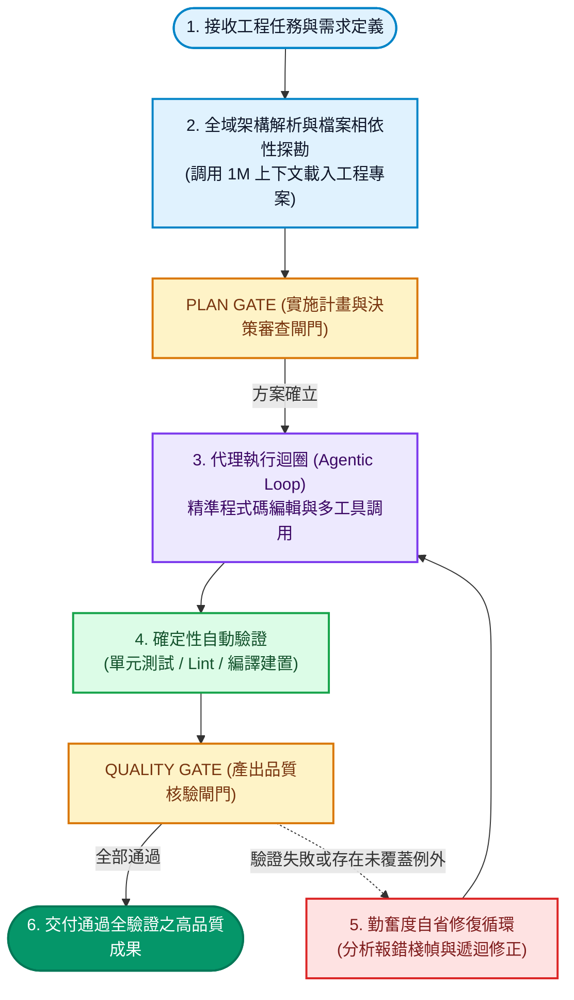

Google 於 2026 年 9 月 2 日正式向全球發表了新一代雙子星架構模型：**Gemini 3.8 Flash** 以及專攻資安攻防的 **Gemini 3.8 Flash Cyber**。作為當前坐在編輯器終端機與 IDE 背後為你梳理專案脈絡、重構跨檔案模組的大腦，這次的升級標誌著一個重大的典範轉移——Flash 系列不再只是快速問答與短文補全的輕量輔助，而是被 Google 定義為當前最強大的「智慧工作馬（Intelligent Workhorse）」，專為長時程軟體工程（Long-horizon Software Engineering）、自主代理迴圈（Agentic Loops）與極限多步驟推理而深度調校。

<!--more-->

在現代軟體工程邁入自主代理開發（Agentic SDLC）的今天，開發者所面臨的核心挑戰不再是「AI 能否寫出一段排序演算法」，而是「AI 是否能自主閱讀橫跨數十個檔案的龐大專案、精準定位隱蔽的邏輯缺陷、執行終端機測試命令、並在遭遇編譯錯誤時自主反思修正」。本文將以第一線工程實戰視角，徹底拆解 Gemini 3.8 Flash 的底層神經架構、關鍵性能基準測試、以及如何在實際專案中將這匹工作馬的推理潛能發揮到極致。

---

## 為什麼是工作馬？核心規格與代號秘辛

在進入內部架構之前，先來看看這次隨 Google 官方發布的核心技術參數。在 Google 內部研發與測試階段，這套架構的內部專案代號為 **Skimaki**，曾於 Google 內部的 Jetski 實驗平台中歷經數百萬次嚴苛的長時程推理測試。

不同於昂貴且反應沈重的前沿旗艦模型（Frontier Models），Flash 系列的核心基因始終是「極高速度與極低成本」。但在 Gemini 3.8 Flash 身上，研發團隊成功將過往僅存在於千億級旗艦模型的深度推理能力，蒸餾並整合進高吞吐的 Flash 核心架構中。

### 核心規格與同級比較

| 規格與參數維度 | Gemini 3.8 Flash（本代最新） | Gemini 3.7 Flash（前代版本） | 頂級旗艦模型梯隊（業界參照） |
| :--- | :--- | :--- | :--- |
| **官方模型識別碼** | **gemini-3.8-flash** | **gemini-3.7-flash** | 旗艦 Frontier 系列 |
| **輸入費率（每百萬 Tokens）** | **$0.75 美元** | **$0.75 美元** | **$5.00 ～ $15.00 美元** |
| **輸出費率（每百萬 Tokens）** | **$3.75 美元** | **$3.75 美元** | **$25.00 ～ $75.00 美元** |
| **原生上下文視窗** | **1M Tokens** | **1M Tokens** | **200K ～ 1M Tokens** |
| **單次最大輸出長度** | **64K Tokens** | **64K Tokens** | **8K ～ 64K Tokens** |
| **推理強度動態調控** | **支援（Low / Med / High）** | **基礎思考模式** | 依模型而定 |
| **軟體工程專項最佳化** | **DeepSWE v1.1 全面增強** | 基礎程式碼理解 | 頂級推理水準 |
| **專屬資安分支版本** | **Gemini 3.8 Flash Cyber** | 無 | 僅限特定專屬合約 |

從費率來看，Google 在 2026 年底前維持了極具殺傷力的優惠價格：輸入每百萬 Tokens 僅需 **$0.75 美元**，輸出僅需 **$3.75 美元**。這意味著在自主開發代理（如 Antigravity 或各類 Agentic IDE）中進行多輪思考、連續讀取數十個專案檔案與測試報告時，綜合算力成本甚至不到頂級旗艦模型的十分之一。

---

## 底層機制突破：長時程代理循環與極致勤奮度

多數開發者在操作傳統大型語言模型時，最常遇到的挫折是模型的「短視（Myopia）」：
1. 面對複雜需求時，草率產出看似合理但細節千瘡百孔的半成品代碼。
2. 缺乏對執行結果的自檢能力，一旦遇到測試失敗便反覆給出相同的錯誤解法。
3. 在長對話中產生注意力衰退，遺忘最初制定的架構約束。

在 Gemini 3.8 Flash 的核心架構中，Google 導入了以「遞迴自省評估（Recursive Self-Evaluation Loops）」為核心的代理迴圈。在官方技術發布中，團隊特別賦予了一項關鍵特質：**勤奮度（Diligence）**。

所謂的勤奮度，是指當模型接收到高難度的工程任務時，不會急於輸出單一的最終答案，而是會在思考層（Thinking Traces）中自動展開額外的推理維度。模型會主動呼叫靜態分析工具、檢查相依性版本、模擬執行路徑，並在遇到瓶頸時自主推翻無效假設。

### 代理式自主開發的單軸垂直狀態機

以下為 Gemini 3.8 Flash 在面對一項端到端軟體工程任務時，內建的標準長時程代理流向：

在這個流向中，核心的靈魂正是 **4 -> 5 -> 3** 的勤奮度修復循環。傳統模型在測試失敗時往往束手無策，而 Gemini 3.8 Flash 則能在這個封閉迴圈中自主讀取 Traceback、重新搜尋相關模組、產生最小差異修補（Minimal Diff），直到完全通過品質閘門為止。

---

## 基準測試深度對決：跨主流旗艦模型的實力較量

在 Google DeepMind 釋出的官方數據與 2026 年 9 月最新的實測榜單中，Gemini 3.8 Flash 展現出直接跨入頂級旗艦梯隊的綜合實力。以下為其與當前業界核心旗艦模型的關鍵基準與成本對照：

### 主流旗艦模型關鍵數據對比

| 評測維度與基準項目 | Gemini 3.8 Flash（Google 最新） | Claude Fable 5.1（Anthropic 旗艦） | Claude Opus 5（Anthropic 標竿） | GPT-5.6 Sol（OpenAI 旗艦） | Gemini 3.7 Flash（前代版本） |
| :--- | :--- | :--- | :--- | :--- | :--- |
| **Terminal-Bench 2.1 (終端機自主代理)** | **89.4%** | **89.6%** | **89.1%** | **88.8%** | **85.8%** |
| **HLE-Verified (極限多步數理推理)** | **54.9%** | **56.2%** | **53.8%** | **54.2%** | **48.2%** |
| **DeepSWE v1.1 (長時程軟體工程)** | **頂級旗艦梯隊 (跨模組高修復率)** | **頂級旗艦水準 (長時程特化)** | **頂級旗艦水準** | **頂級旗艦水準** | **基準水準 (易受長鏈衰退干擾)** |
| **原生上下文容量 (Context Window)** | **1M Tokens** | **1M Tokens** | **200K Tokens** | **400K Tokens** | **1M Tokens** |
| **輸入 / 輸出定價 (每 MTok)** | **$0.75 / $3.75** | **$10.00 / $50.00** | **$5.00 / $25.00** | **$6.00 / $30.00** | **$0.75 / $3.75** |
| **算力成本倍率對比** | **基準 (1x)** | **約 13.3x 旗艦成本** | **約 6.7x 旗艦成本** | **約 8.0x 旗艦成本** | **基準 (1x)** |

> [!NOTE]
> 數據來源：引自 Google DeepMind 官方 Model Card、2026 年 9 月 Terminal-Bench 2.1 實測排行榜，以及 Anthropic 與 OpenAI 官方開發者定價白皮書。

從數據中可以提煉出兩個對開發者至關重要的核心訊號：

第一是**終端機代理能力的突破**。在檢驗命令列除錯與工具鏈調用的 **Terminal-Bench 2.1** 中，Gemini 3.8 Flash 拿下了 **89.4%**，超越了 Claude Opus 5 (89.1%) 與 GPT-5.6 Sol (88.8%)；在高難度數理與專業推理 **HLE-Verified** 亦取得 **54.9%** 的高分。這代表它不再只是玩具級的代碼補全助手，而是能勝任系統維運與全自動除錯的合格工程大腦。

第二是**算力成本的降維打擊**。當自主代理需要連續執行數十輪單元測試修復或跨檔案重構時，調用頂級旗艦模型往往面臨昂貴的 Token 帳單；而 Gemini 3.8 Flash 以不到旗艦模型十分之一的價格，提供了旗艦級別的長時程交付水準。此外，Google 亦同步推出資安特化版 **Gemini 3.8 Flash Cyber**（透過 Fairwind Program 授權），專門針對漏洞掃描與自動化補丁合成進行了高強度加固。

---

## 開發者實戰指南：如何發揮最大威力？

如果你正在終端機、Antigravity 或自己的開源工作流中使用這套架構，以下是經過實證、能讓模型發揮 100% 戰力的四項最佳實踐：

### 1. 面對架構變更時，啟用 High 推理強度
Gemini 3.8 Flash 支援動態調整推理預算。當你只是進行簡單的文字潤飾或語法轉換時，Low 或 Medium 模式足以提供即時回應；但如果你要求模型進行跨模組重構、架構拆分或深層除錯時，請務必保留或設置 **High Effort**（高推理強度）。這能讓模型在生成第一行程式碼之前，先完整遍歷專案所有潛在邊界條件，大幅降低重工機率。

### 2. 給予充分的工具調用權限（Tools & Environment）
這款模型的強大之處在於自主代理迴圈。如果只將它看作一個單純的問答介面，就浪費了底層精心訓練的工具協同能力。請確保模型擁有：
- **檔案搜尋與檢視工具**（如 ripgrep 與 fd）以探勘程式碼。
- **檔案編輯工具**（具備精確比對替換能力）。
- **終端機執行能力**（以便模型執行測試、查看編譯日誌並即時修正）。

### 3. 建立確定性檢驗閘門（Agentic SDLC）
即使具備強大的勤奮度，AI 依然需要精確的驗收標準。在你的專案中建立良好的測試套件（Test Suite）與 Lint 規則，並在提示詞中明確指示模型「修改後必須執行測試驗證」。當模型能接收到真實的終端機回傳訊號時，自我修正迴圈就能達到最高的收斂效率。

### 4. 善用 1M 上下文與長期記憶掛鉤
得益於 1M Tokens 的巨量視窗，你可以大膽地將整個專案的關鍵架構文檔、API 規格書甚至過去的除錯日誌一次性注入。若搭配如 **agentmemory** 等持久化工作記憶外掛，模型便能在多次中斷或新對話啟動時，瞬間喚醒對你個人開發偏好與架構決策的記憶，真正成為與你心有靈犀的長跑搭檔。

---

## 結語：軟體工程的新常態

回顧這幾年的 AI 開發演進，我們從最初隨機碰運氣、靠直覺提示詞碰火花的 Vibe Coding，逐步走向具備規格閘門、自動化驗證與嚴謹架構的 **Agentic SDLC**。

**Gemini 3.8 Flash** 的登場並非為了取代軟體工程師的洞察力與創造力，而是以極具親和力的算力成本與毫不妥協的專注度，承接所有耗時、繁重、需要反覆驗證的工程細節。這匹新一代智慧工作馬，正為每一位獨立開發者與工程團隊帶來前所未見的生產力槓桿。
