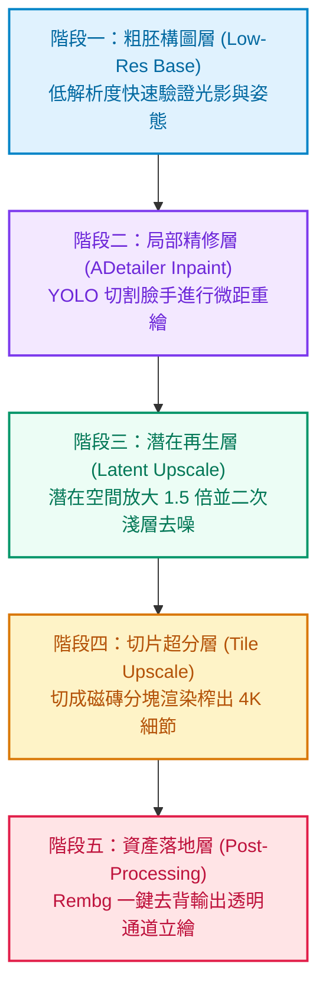

許多剛接觸開源 AI 繪圖的開發者與創作者，最初都會經歷一段痛苦的抽卡時期：寫了一長串精美的提示詞，按下生成按鈕，結果角色不是手指多了一根、肢體怪異抽筋，就是換個場景與角度直接換了一張臉。

在真正的商業級插畫、遊戲美術資產與動畫製作中，沒有人依靠運氣抽卡。專業創作者的出圖成功率往往在九成以上，因為他們早已將生圖視為一條高度工程化的**確定性資料管線（Deterministic Pipeline）**。本文將從軟體工程與架構視角，徹底拆解開源繪圖生態的核心模組，帶你搞懂 Checkpoint、LoRA、ControlNet 與 ADetailer 的本質，並揭秘 ComfyUI 的五層工業級微調流水線。

<!--more-->

## 核心名詞白話拆解：大腦、外掛、眼鏡與枷鎖

開源 AI 繪圖生態（如 Stable Diffusion、Flux）充滿了各類學術黑話。如果用現代軟體工程或工廠流水線的視角來分類，它們的角色邊界非常清晰：

### 1. Checkpoint（底模）：基礎作業系統與百科全書
- **檔案體積**：通常在 **2GB 到 20GB** 之間（如 SDXL、Flux.1）。
- **架構角色**：它是整個生成系統的根基。底模在數以億計的高清圖像與文字對中完成預訓練，具備了對現實物理世界、光影材質、人體結構與藝術風格的基礎認知。
- **限制**：底模雖然通用，但對特定角色的微觀特徵、小眾畫風或專屬道具難以面面俱到。

### 2. LoRA（低秩適應）：輕量化外掛補丁
- **檔案體積**：極其輕量，通常只有 **10MB 到 200MB**。
- **技術本質**：全稱是 **Low-Rank Adaptation**。它凍結原始底模的龐大權重，僅透過在關鍵注意力層矩陣插入微小的低秩分解矩陣來捕捉特定概念。
- **實戰價值**：你不需要花費高額運算資源重新訓練底模，只要掛載專屬 LoRA，模型就能立刻學會畫出特定虛擬角色、特殊服裝配件或極致的像素美術（Pixel Art）風格。

### 3. VAE（變分自編碼器）：潛在空間解碼眼鏡
- **技術本質**：擴散模型為了節省顯示卡記憶體，並不是直接在可視的 RGB 像素空間計算，而是在高度壓縮的潛在維度（Latent Space）進行去噪運算。
- **常見故障**：算完潛在特徵後，必須由 VAE 將數學張量解碼為人類肉眼可見的高清圖片。許多新手算出的圖總是灰暗無光、宛如蒙上一層白霧，九成以上都是因為沒有掛載或掛載了錯誤版本的 VAE。

### 4. ControlNet：空間幾何的硬性枷鎖
- **痛點根源**：人類自然語言在描述空間三維座標時極度貧乏，無論多麼詳盡的提示詞，都無法精確告訴 AI「手肘夾角幾度、視角仰角幾度、光影從哪裡切入」。
- **技術突破**：ControlNet 引入額外的神經網路分支，接收邊緣線稿（Canny）、3D 深度圖（Depth）或姿態骨架（OpenPose）。它如同給擴散模型戴上手銬，死死鎖定構圖邊界，迫使 AI 只能在限定的幾何線條內部進行色彩與紋理渲染。

---

## 攻克兩大世紀難題：肢體抽筋與角色一致性

在掌握基礎名詞後，最讓創作者困擾的兩大瓶頸，正是**手腳畸形**與**同角色無法維持長相**。業界對此早已沉澱出成熟的標準解法。

### 肢體與手部修復的兩大武器

#### 1. ADetailer（自動局部切片微距重繪）
過去修手需要手動進去筆刷塗抹遮罩，效率極低。**ADetailer（After Detailer）** 引入了電腦視覺檢測模型（如 YOLO），在整張主圖運算完成後，自動框選出「臉部」與「手部」區域。它將手部單獨切裁放大至高解析度畫布，在專門的手部提示詞約束下進行淺層重繪（Denoising 0.3 到 0.4），最後自動將無縫邊緣接回原圖，大幅提高手部五指與眼神細節的成功率。

#### 2. 3D 擺拍與多重 ControlNet 鎖定
資深創作者極少單靠打字抽姿勢。標準做法是在 **Blender** 或簡易 3D 姿態工具中，花費一分鐘拖曳出精確的人偶動作與鏡頭透視，輸出 **OpenPose 骨架圖** 與 **Depth 深度圖**。當骨架與深度雙重約束同時生效時，AI 無法自由捏造肢體長度，從根源上消除了人體比例失調的問題。

### 維持角色一致性的三大架構方案

做遊戲立繪或漫畫分鏡時，角色換了衣服或視角就變成另一個人是最大的致命傷。業界主要依據精確度要求採用以下方案：

| 方案名稱 | 準備成本 | 一致性表現 | 適用情境 |
| :--- | :--- | :--- | :--- |
| **IP-Adapter / FaceID** | 低（只需一張清晰正面圖） | 約 80% 至 85% | 快速概念驗證、原型設計、多風格測試 |
| **自訓練專屬 LoRA** | 中（需 15 至 25 張多角度素材） | 高達 95% 以上 | 獨立遊戲主角、原創 IP、需長期穩定出圖 |
| **LoRA 加 IP-Adapter 雙保險** | 中高（同時載入權重與參考圖） | 98% 商業級穩定 | 複雜動態場景、視角劇烈切換之關鍵幀 |

對於原創遊戲主角，終極解法是利用 15 到 25 張角色素材訓練一個專屬的角色 LoRA（權重設定在 0.7 左右），同時在流水線中掛載一張標準立繪作為 IP-Adapter 參考（權重設定在 0.5 左右）。這種雙重錨定策略，既能防止單一 LoRA 權重過高造成動作僵硬，又能確保五官特徵在不同光影下高度一致。

---

## 揭秘 ComfyUI 的五層工業級微調流水線

傳統 WebUI 將所有功能包裝在單一表單中，難以拆解各階段的中間產物。而 **ComfyUI** 的節點式架構（Node-based Pipeline），將生圖過程完全解構為一條透明、可重複調用的非同步管線。

專業工作室出圖，從不追求一步到位，而是採用嚴格的**五層漸進式微調**：

### 1. 粗胚構圖層（Low-Res Base）
在 **512x512** 或 **1024x1024** 的中低解析度下進行。此階段不耗費算力追求毛孔與指甲細節，目標是在幾秒鐘內驗證人物姿態、視角透視與整體色彩基調是否符合要求。

### 2. 局部器官精修層（ADetailer Inpaint）
粗胚確定後，自動觸發檢測節點，將臉部與手部切出為獨立圖層，在較低的重繪幅度（Denoising 0.35）下注入高頻細節，讓眼神與手指關節清晰自然。

### 3. 潛在空間二次採樣層（Latent Upscale）
不能直接使用雙線性插值放大像素，否則畫面會模糊失真。正確做法是將影像重新送回潛在空間（Latent Space）放大 1.5 到 2 倍，並分配 10 到 15 個去噪步數進行二次渲染。模型會依照提示詞，在衣服皺摺、髮絲與材質表面上無中生有地生長出逼真紋理。

### 4. 切片超分層（Tile Upscale，突破顯卡記憶體極限）
若需要輸出 4K 或 8K 的超高解析度遊戲海報，直接全圖渲染會瞬間耗盡顯示卡記憶體。流水線在此會啟動 **ControlNet Tile**，將大圖切割成數十個重疊的小磁磚（Tiles）分別精算，並在接縫處嚴格鎖定邊界特徵，最後完美縫合。即便在消費級顯卡上，也能穩定輸出極致細節。

### 5. 資產落地層（Post-Processing & Rembg）
在管線最末端，串接 **LayerDiffuse** 或 **Rembg** 節點，自動識別主體邊緣並剔除背景，輸出具備 Alpha 透明通道的 PNG 人物立繪。同時可串接調色節點校準色彩飽和度，直接交付遊戲引擎使用。

---

## 結論：從隨機抽卡到工程化交付的思維躍遷

| 評估維度 | 傳統抽卡思維 | 工業級管線思維 |
| :--- | :--- | :--- |
| **控制核心** | 堆砌複雜提示詞，祈求模型隨機命中 | 採用 3D 骨架、深度圖與線稿作為硬邊界 |
| **生成策略** | 單次採樣一步直出大圖 | 分層推進：粗胚驗證、器官微調、切片放大 |
| **一致性保障** | 頻繁更換隨機種子抽卡 | 鎖定 Seed 並以專屬 LoRA 與參考特徵雙重錨定 |
| **工作載體** | 表單式點選按鈕 | 節點式資料流，可匯出 JSON 自動化批次運行 |

當你不再將 AI 繪圖視為魔法黑盒，而是將其拆解為「基底模型、特徵補丁、空間邊界與分層濾鏡」的軟體工程管線時，那些看似玄妙的崩壞問題便都能迎刃而解。將這套管線封裝成 ComfyUI 工作流，你就能在獨立開發與創作專案中，以極高的確定性穩定產出高品質的視覺資產。
