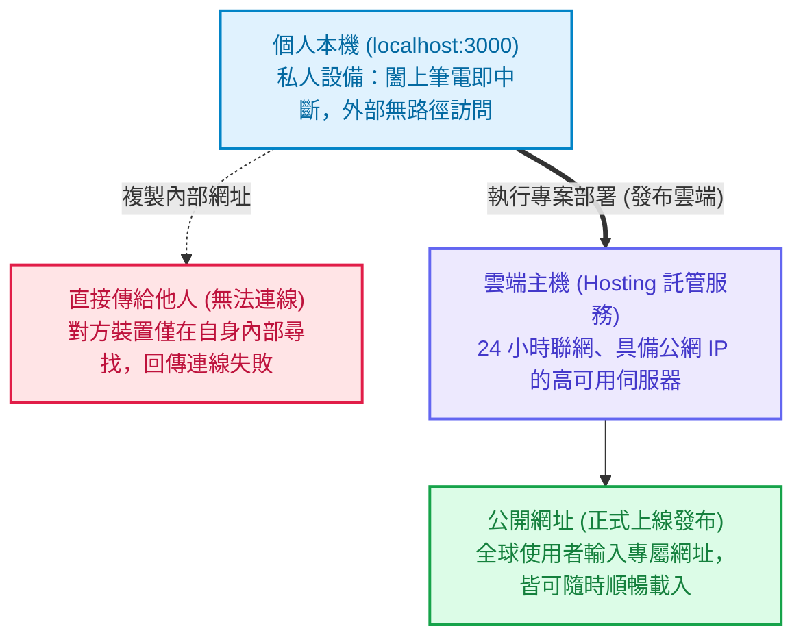
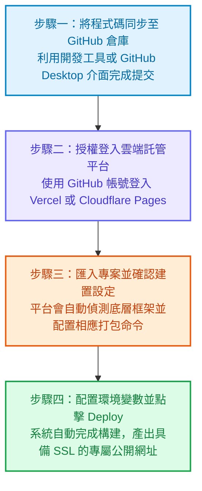

打開 Cursor、Lovable、v0 或 Bolt，輸入幾句清晰的提示詞，看著螢幕上幾秒鐘內建構出一個精緻的記帳工具、個人作品集或 SaaS 原型，那種將想法快速具象化的成就感令人振奮。介面漂亮、按鈕互動流暢，此時你的瀏覽器網址列正顯示著一串熟悉的地址：`http://localhost:3000`。

許多創作者在完成原型後的第一件事，就是興奮地把這串網址複製下來，貼到通訊軟體傳給朋友、社群夥伴或潛在用戶，期待第一時間收到回饋。

然而，對方點開後往往只會傳來一張截圖，上面顯示著冰冷的瀏覽器提示：**無法連上這個網站（This site can’t be reached）**。

即使你拿起自己的手機連上相同的網址，同樣無法開啟。你可能會感到困惑：**「明明在我的電腦上跑得好好的，為什麼傳給別人就打不開？」**

<!--more-->

這並不是 AI 生成的程式碼有瑕疵，也不是朋友的網路出現故障。這是每位構建者在將點子從個人電腦推向真實世界的過程中，必然會遇到的核心課題：**本機環境與公開網路的本質差異**。

本文將拋開艱澀的網路通訊協定理論，從實務架構出發，釐清三個關鍵問題：
1. **為什麼別人的裝置無法連上你的 localhost？**
2. **真正的「線上網站」是如何讓全世界穩定訪問的？**
3. **現代創作者如何以最短路徑將 AI 專案正式發布上線？**

---

## 理解 localhost 的運作本質

要明白朋友為何無法連上該網址，首先要拆解網址列上的兩個核心元素：**localhost** 與通訊埠號碼。

### localhost 代表「這台電腦自己」

在電腦網路架構中，每一台連網裝置都有專屬的網路識別。而 **localhost** 是全球作業系統共通約定的保留主機名稱，其定義非常純粹：**「當前正在發出請求的本機設備本身」**。

因此：
- 當你在自己的筆電瀏覽器輸入 **localhost**，瀏覽器是在向筆電本機的作業系統索取資料。
- 當你把這串網址傳給朋友，朋友點擊後，對方的瀏覽器只會嘗試在「他自己的手機或電腦內部」尋找該專案。
- 朋友的設備內部自然沒有運行你的專案，結果必然是連線失敗。

這就像你在自己書房的桌上放了一本筆記本，然後傳訊息告訴遠處的夥伴：「筆記本就在桌上，你翻開第三頁看一下。」對方在自己的書房桌上，自然找不到你那本筆記本。

### 數字 3000 代表的是連接埠

常見的 `:3000`、`:5173` 或 `:8080`，在網路架構中稱為**連接埠（Port）**。

你可以把你的電腦想像成一棟建築，而 **Port 3000** 就是該建築裡的 **3000 號特定房門**。AI 工具在你的電腦內部啟動了一個開發伺服器，將做好的網頁暫時陳列在 3000 號房間供你預覽與驗證功能。

關鍵在於：**這棟建築完全位於你的私人內部網路中，對外並沒有任何一條公共道路直接連通。**一旦你將筆電螢幕蓋上，或是關閉了終端機的運作視窗，這個臨時預覽空間便會立刻終止服務，就連本機瀏覽器也無法再次載入。

---

## 真正的線上網站是如何運作的？

若要讓全世界的使用者隨時隨地用手機或電腦打開你的作品，專案就必須具備三項基礎設施：**持續運行的雲端主機、清晰的網域名稱，以及安全加密憑證**。

### 1. 託管主機（Hosting）
個人電腦無法且不應充當常態運行的網站伺服器。因此，我們需要將專案遷移至專業的雲端機房。這類伺服器具備 24 小時不斷電、高速光纖頻寬與專業冷卻系統，隨時準備響應用戶的請求。

這項流程稱為**專案託管（Hosting）**。專案在雲端建置並運行後，無論你的個人電腦是否關機，外界的請求都能由雲端伺服器承接並回應。

### 2. 網域名稱（Domain）
雲端伺服器在公開網路上的原始地址是一串數字（IP 位址，例如 `76.76.21.21`）。為了讓大眾容易記憶與傳播，我們會為網站配置一個專屬的**網域名稱（Domain）**，例如 `myawesomeapp.com`。

### 3. 解析與加密：DNS 與 SSL
- **DNS（網域名稱系統）**：相當於全球網路的通訊錄。當訪客在瀏覽器輸入網址時，DNS 會在數毫秒內將網域名稱轉換為對應伺服器的 IP 位址，指引用戶前往正確的雲端主機。
- **SSL 憑證**：即網址開頭的 **https** 與瀏覽器網址列的小鎖頭圖示。它確保用戶與伺服器之間的所有通訊皆經由加密傳輸，防止資料遭到竊聽或竄改，並避免瀏覽器跳出安全警告。

將專案從本機推向雲端伺服器的整個過程，就是實務上所稱的**「部署（Deployment）」**。

---

## 專案搬遷到雲端後的常見問題

不少創作者在首次將專案發布至雲端平台時，會遇到網頁能開啟但功能異常的情況，例如畫面一片空白或點擊特定按鈕沒有反應。這通常源於本機開發環境與正式生產環境的設定差異：

### 1. 遺漏環境變數（Environment Variables）
在本地開發時，AI 通常會將 API 金鑰（如 OpenAI API Key）或資料庫連線字串存放在名為 **.env** 的檔案中。

基於資安考量，版本控制工具預設會隱藏並忽略此檔案，避免私密金鑰遭到公開外洩。當你將程式碼同步上傳至雲端主機時，該檔案並不會一併送達。雲端伺服器若缺少相應的連線憑證，程式便會中止執行導致畫面空白。

**處理方式**：在託管平台（例如 Vercel 或 Cloudflare Pages）的後台設定中，進入 **Environment Variables** 區塊，手動將對應的變數名稱與數值逐一建立。

### 2. 開發模式與正式建置（Production Build）的嚴謹度差異
在個人電腦運行專案時，系統處於**開發模式（Development Mode）**。開發模式具備高度容錯機制，即使存在型別微調或未引用的變數，仍會盡力將畫面呈現於瀏覽器中。

但在正式發布至雲端時，系統會執行嚴格的**生產打包（Build）**。這是一道完整的品質與結構檢查程序，若存在語法衝突或套件遺漏，建置程序將會中止並提示錯誤。

### 3. 單頁應用（SPA）的重新整理 404 錯誤
若你的專案採用前端路由架構，從首頁點擊選單前往次級頁面通常運作良好；但若直接在次級頁面按下瀏覽器的重新整理，可能會收到 **404 Not Found** 錯誤。

這是因為瀏覽器直接向雲端伺服器索取該子路徑的實體檔案，而雲端伺服器找不到該獨立頁面。

**處理方式**：於託管平台中設定單頁路由重寫規則（Rewrite），引導所有路由請求統一指向首頁入口檔案，交由前端應用程式自行接管渲染。

---

## 現代創作者將網站無痛發布的四大步驟

在現代雲端架構的支援下，發布網頁專案已不再需要手動租用實體主機或在命令列中繁複配置。透過主流的雲端發布平台（如 **Vercel** 或 **Cloudflare Pages**），只需透過直觀的介面即可完成上線：

1. **同步代碼庫**：使用開發編輯器或 GitHub Desktop 的視覺化介面，將本機專案檔案同步推送到個人 GitHub 儲存庫。
2. **連結雲端平台**：前往 Vercel 或 Cloudflare Pages 官網，直接使用 GitHub 帳號登入整合。
3. **選取並匯入專案**：在平台專案列表中選取剛才同步的專案，系統將智慧識別前端框架（例如 Next.js、React、Vite 等）並備妥相關建置命令。
4. **設定變數並執行部署**：若專案需調用外部 API，在後台填入對應的環境變數，最後點擊 **Deploy** 按鈕。

通常在數分鐘內，平台便會完成打包與全域網路節點分發，並提供一串所有人皆可隨時訪問的正式公開網址。

---

## 結語與後續實踐

當你的專案成功取得公開網址並在行動裝置上流暢載入時，這代表你的想法已經正式從本機私有環境跨入公共網路，具備了向真實市場驗證價值的基礎。

然而，當開始有訪客在你的應用程式中填寫表單、嘗試註冊帳號或進行操作時，下一個常見的挑戰將接踵而至：

> 「為什麼別人在他的手機輸入了資料，重新整理後內容就全部消失了？」
> 「為什麼不同使用者看到的內容無法同步保存？」

這涉及到了資料持久化與後端儲存的架構設計。在下一篇文章中，我們將以同樣平實務實的視角，深入探討**「為什麼重新整理後資料全沒了？網頁前端與資料庫架構解析」**。
