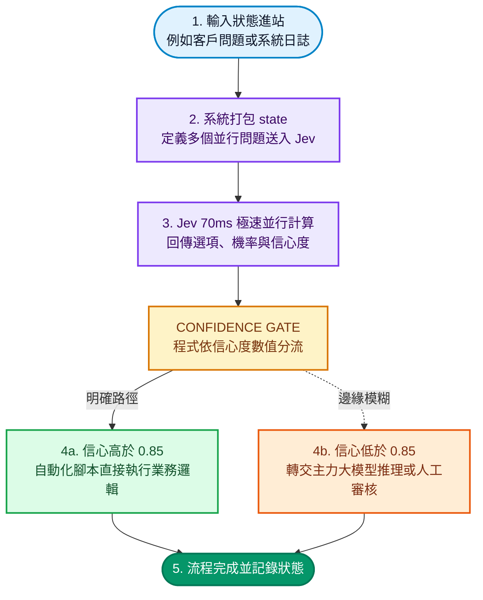

ChatGPT 共同發明人、前 OpenAI 研究員 Diogo Almeida 創立的 **TypeSafe AI**，最近推出了一款非常特別的新模型 **Jev**。它最引人注目的特徵只有一句話：**完全不生成任何文字**。

你丟給它一段使用者輸入或系統狀態，它不會客套回覆、不會寫信，更不會長篇大論解釋；它只會回傳你事先定義好的選項，並附帶校準過的機率值（例如 `{"billing": 0.08, "technical": 0.85, "sales": 0.07}`）。

很多工程師在開發 AI Agent 或自動化工作流時，最常遇到的痛點就是：明明程式只需要一個單純的 `if/else` 分支，卻得叫大模型慢吞吞地逐字吐出字串，再花心思寫正規表達式解析，既耗時又花錢，還隨時得防範模型格式跑版。Jev 走的就是截然不同的「純決策路線」。

這篇文章不談艱深的學術推導，直接把重點放在兩件事：**它能解決哪些真實業務場景？** 以及 **如果你想在本地或開源生態玩出類似效果，有哪些開源工具可以搭配？**

<!--more-->

## 三秒搞懂：它跟傳統 LLM 到底差在哪？

我們平常熟悉的 ChatGPT、Claude 或 Gemini 都是「生成式模型」，本質上是在猜下一個字。而 Jev 這種「System One 決策模型」，本質上是在做**並行機率分佈計算**。

用一個日常工程問題來看兩者的巨大差異：

| 比較面向 | 傳統生成式 LLM | Jev 決策模型 |
| --- | --- | --- |
| **處理方式** | 逐字序列解碼，輸出一段文字 | 針對預設選項並行計算機率 |
| **回應速度** | 約 2 到 10 秒（視輸出長度而定） | **70 到 500 毫秒**（極速反應） |
| **輸出格式** | 字串，需要寫程式解析與驗證 | **100% 型別安全的結構化數值** |
| **幻覺風險** | 可能回傳不存在的選項或格式錯誤 | **數學上不可能出現未定義選項** |
| **計費方式** | 輸入貴、輸出通常更貴 | 輸入每百萬 token 僅 **$0.042**，**輸出免費** |

簡單來說：**如果你的程式最後只是要把 AI 的結果拿來做 `if` 判斷，傳統 LLM 既慢又浪費；Jev 則是直接給你一個帶機率的下拉選單。**

## 三種問題原語：Choice、Score、Noul

Jev 的 API 只有單一端點（`POST https://api.typesafe.ai/v1/systemone`），每次請求包含一個 `state`（可以是客訴信、程式碼片段或系統 JSON 狀態）以及一組 `questions`。

每個問題屬於以下三種型別之一：

1. **Choice（多選一）**：從固定的標籤清單中選出一個最符合的項目。
2. **Score（等級評分）**：對照一組有序的級距（如「外觀問題」、「有替代方案」、「完全阻礙」）給出分數。
3. **Noul（是非機率）**：單純問一個是非題，回傳該條件為真的機率（0 到 1 之間）。

### 請求與回應範例

一次發送給 Jev 的請求大致長這樣：

```json
{
  "model": "jev-latest",
  "state": "我被重複扣款了，請幫我退回第二筆扣款。",
  "questions": {
    "department": {
      "type": "choice",
      "instructions": "應該由哪個部門處理？",
      "criteria": {
        "billing": "帳單、發票、退款相關",
        "technical": "系統錯誤、連線異常",
        "sales": "業務洽詢、方案升級"
      }
    },
    "severity": {
      "type": "score",
      "instructions": "問題嚴重程度為何？",
      "criteria": ["輕微問題", "有暫時替代做法", "重大阻礙"]
    },
    "requestsRefund": {
      "type": "noul",
      "instructions": "客戶是否提出退款要求？"
    }
  }
}
```

Jev 會在幾十毫秒內，**並行計算所有問題**並回傳結構化資料：

```json
{
  "answers": {
    "department": {
      "value": "billing",
      "probabilities": { "billing": 0.88, "technical": 0.07, "sales": 0.05 },
      "confidence": 0.91
    },
    "severity": {
      "value": 2.1,
      "probabilities": [0.12, 0.65, 0.23],
      "confidence": 0.84
    },
    "requestsRefund": {
      "value": true,
      "probability": 0.96,
      "confidence": 0.95
    }
  }
}
```

所有的答案都附帶**誠實校準過的信心度（Confidence）**。這代表你在後端寫商業邏輯時，可以用很踏實的條件來分流。

## 五大高頻落地場景：什麼時候該用它？

Jev 不是拿來寫小說或聊天用的，但只要涉及系統流轉與自動化，它能發揮極大威力：

### 1. AI Agent 的極速路由與工具分流（Fast Router）
在現有的 Agent 框架中，每當 Agent 要決定「下一步調用搜尋工具、資料庫工具，還是直接回覆」時，如果每一次都叫主力大模型（如 Claude Opus 或 GPT-6）跑一次完整的思考鏈，單單選工具就要等 3 秒以上。

把第一層決策交給 Jev：
- 90% 的明確指令在 **100ms** 內瞬間分流完畢。
- 只有當 Jev 回報整體信心度低於門檻（例如 `< 0.6`）時，系統才將狀態交給高階大模型進行慢速推理。整體 Agent 回應速度能提升數倍。

### 2. 巨量資料打標與 Map-Reduce（Data Pipeline）
如果你手上有十萬筆錯誤日誌（Error Logs）、社群貼文或使用者問卷需要分類打標：
- 傳統做法：逐筆送給 LLM，除了耗時數十小時，API 帳單往往令人卻步。
- Jev 做法：每百萬輸入 token 僅 $0.042 美元、輸出免費，且支援並行評估。可以在幾分鐘內以極低成本將整座資料湖打上型別安全的結構化標籤。

### 3. LLM 輸出的即時安全護欄（Guardrails）
許多企業不敢讓客服機器人自由發揮，原因就是怕模型胡亂承諾優惠或洩漏機密。
傳統的雙模型審查（用模型 A 生成，再叫模型 B 審核）會讓終端使用者多等一倍的時間。而 Jev 的延遲僅 70～150 毫秒，在大模型回話送出給用戶前的瞬間，毫秒級並行檢查「是否有未授權承諾？」、「是否含有個資？」、「合規程度評分」，發現異常立刻在閘門攔截。

### 4. 即時遊戲 AI 與互動系統（Game AI）
遊戲中的 NPC 行為樹或動態事件系統需要每秒運算多次。
以往「讓遊戲 NPC 接入 LLM 思考」最大的阻礙就是幾秒鐘的網路與生成延遲。Jev 支援每秒 10 次以上的決策頻率，將玩家血量、環境狀態作為 JSON state 輸入，NPC 可以在 0.1 秒內並行取得「逃跑 / 埋伏 / 尋求支援」的機率分佈，既保有 AI 的非線性隨機感，又完全不會延遲掉幀。

### 5. 表單智慧驗證與詐欺風險預警（Fraud Detection）
使用者在結帳備註或表單輸入的非結構化文字，往往藏有潛在風險。透過 Jev 可以在後端提交時，即時運算詐欺風險分數與爭議意圖機率，高風險立即觸發二階段驗證，低風險則順暢放行。

## 實際架構流程範例

在實際系統中，Jev 通常扮演「大腦前額葉的快速反應閘門」角色：



## 開源替代方案與工具鏈生態

如果你目前還沒拿到 Jev 的早期存取權限，或者專案要求**完全本地部署、開源且私有化**，開源生態系中也有幾套非常優秀的工具可以達成類似理念：

### 1. `system-one-adapter-python`（官方開源適配器）
TypeSafe 官方在 GitHub 開源了一個 Python 適配器（[`typesafe-ai/system-one-adapter-python`](https://github.com/typesafe-ai/system-one-adapter-python)）。它可以把任何現有的開源模型（例如 Ollama 或 vLLM 運行的 Llama 3、Qwen、DeepSeek）包裝成與 Jev 相同的 Choice / Score / Noul 介面。這讓你能先在本地用既有模型驗證架構，未來再無縫切換。

### 2. Outlines 與 Guidance（開源結構化解碼引擎）
如果你想在自己的伺服器上自建「絕不出錯的型別安全輸出」，**Outlines** 與 **Guidance** 是開源領域的黃金標準。它們不是靠 prompt 祈求模型吐出 JSON，而是在推論的 Logits 取樣層直接透過有限狀態機（FSM）或正規表達式進行約束。模型根本沒辦法吐出選項以外的 token，同樣能達成數學上的零幻覺。

### 3. Instructor（Pydantic 結構化資料庫）
Python 開源社群中最受歡迎的結構化輸出庫 **Instructor**，能將 OpenAI、Anthropic 或本地開源模型的呼叫封裝成帶型別定義的 Pydantic 模型。它具備內建的自動重試機制與自定義驗證器，是目前主流框架中最平易近人的選擇。

### 4. ModernBERT / SetFit（超輕量本地開源分類模型）
如果你的任務本質上只是「在 5 到 10 個固定分類中挑一個」，甚至連大型 LLM 都不需要開！HuggingFace 上的 **ModernBERT** 或是基於對比學習的 **SetFit**，模型體積只有幾十到幾百 MB，只要幾十筆標註範例就能完成微調，在一般 CPU 上就能跑出 **10 毫秒**等級的極速推論，完全零成本、零雲端依賴。

### 5. Vercel AI SDK 整合
在前端與全端領域，Vercel 的 AI SDK 已經將 TypeSafe 提供者納入支援。透過 `experimental_evaluate` 函式，直接傳入 `typeSafeAi.evaluationModel('jev-latest')`，就能以原生 TypeScript 型別獲得 Choice、Score 與 Boolean 判定。

## 一句話選型心法

- 當你需要**撰寫程式碼、總結長文、複雜推理或對話閒聊**：請繼續使用 **傳統生成式 LLM**。
- 當你需要**智慧路由、條件判斷、資料打標、即時護欄或等級評分**：請毫不猶豫地拆出決策車道，交給 **Jev 或開源結構化引擎**。

讓對話模型專注說話，讓決策模型專注判斷，這才是未來高效、省錢且穩定的 AI 系統架構。
