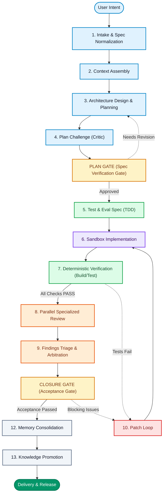
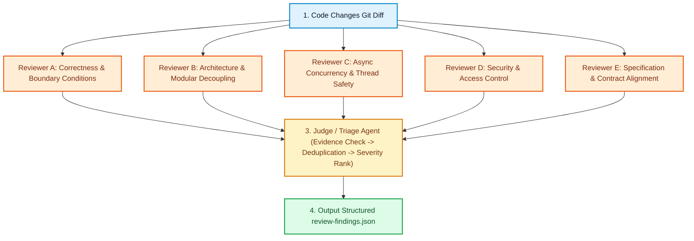
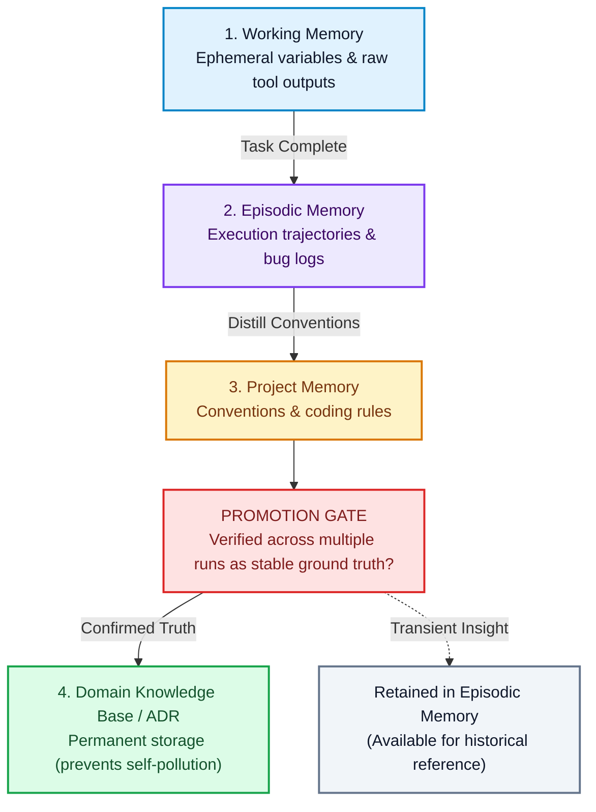

title: >-
  Beyond Vibe Coding: The Complete Guide to Agentic SDLC, State Machines,
  Verification Gates, and Open-Source Frameworks
description: >-
  A practical guide to Agentic SDLC architecture, covering hooks, skills, MCP,
  orchestration, state machines, verification gates, and open-source tools.
permalink: 2026/08/24/agentic-sdlc-architecture-guide/
translation_key: agentic-sdlc-architecture-guide
translations:
  zh-TW: /2026/08/24/告別-Vibe-Coding！Agentic-SDLC-完整架構解析：從狀態機、驗證閘門到熱門開源專案實戰/
  zh-CN: /zh-cn/2026/08/24/agentic-sdlc-architecture-guide/
categories:
  - Software Engineering
tags:
  - AI
  - Claude
  - Codex
  - Frontend Development
date: 2026-08-24 14:10:32
updated: 2026-08-29 19:08:22
---

Over the past year, AI-assisted software engineering transitioned from code completion tools to the high-energy excitement of **Vibe Coding**. Many developers grew accustomed to the intuitive loop: "Write a quick prompt -> Let AI generate code -> Run tests." In toy projects with a few dozen lines of code, this intuitive mode feels magical. But once applied to complex production codebases with tens of thousands of lines and tightly coupled modules, vibe coding collapses rapidly.

You have likely encountered this frustrating scenario: the AI confidently claims a bug is fixed, but modifying module A silently breaks module B; five top-tier models review the code and declare it clean, yet production hits an immediate race condition; or the AI records "historical learnings" that pollute the knowledge base with hallucinated conventions after a single month of autonomous runs.

In software engineering, the real bottleneck has never been **"code generation velocity"**; it has always been **"verification and delivery confidence."** To bridge the gap where generation speed vastly outpaces verification capability (the GenAI Divide), the only viable path is to establish an industrial-grade **Agentic SDLC (Agent Software Development Life Cycle)**.

<!--more-->

## The Four Core Truths: Defining Hooks, Skills, MCP, and Orchestrators

When attempting agent automation, teams often make the mistake of dumping all responsibilities into a single monolithic prompt or chat session. Before building a robust agentic architecture, it is essential to understand the distinct responsibilities of these four foundational components:

| Component | The Core Question It Answers | Architectural Role in the System |
| :--- | :--- | :--- |
| **Hook** | **When must this deterministically occur?** | Lifecycle guard and deterministic interception mechanism |
| **Skill** | **How should this class of problem be solved?** | On-demand procedural bundles and decision manuals |
| **MCP** | **What external tools or datasets need to be accessed?** | Agent I/O bus and capability protocol layer |
| **Orchestrator** | **Where are we now, and where do we go next?** | Global finite state machine and workflow execution engine |

This taxonomy is critical. For instance, in Claude Code's design philosophy, Hooks fire deterministically at specific lifecycle events (e.g., **SessionStart**, **PreToolUse**, **PostToolUse**, **TaskCompleted**, **Stop**, **SessionEnd**) to enforce rigid policy checks. Meanwhile, MCP (Model Context Protocol) serves purely as an I/O bus providing standardized Tools, Resources, and Prompts; it should never be conflated with the workflow itself.

The global execution trajectory is governed by the underlying **Orchestrator (State Machine)**.

---

## The 13-Stage Agentic SDLC State Machine & Open-Source Stack

A production-grade Agentic SDLC is not a linear generative loop. It is a 13-stage deterministic state machine featuring intake normalization, verification gates, parallel role-based reviews, and closed-loop memory consolidation:

Below is an in-depth breakdown of the 13 lifecycle stages, their Hook/Skill/MCP bindings, and industry-standard open-source implementations:

---

### Stage 1: Intake & Intent Normalization
* **Objective**: Transform unstructured, colloquial human prompts (e.g., "Add a point deduction API") into structured requirements with boundary conditions and input/output contracts.
* **Mechanism**:
  * **Hook**: Inject global repo guidelines at `PromptSubmit`.
  * **Skill**: Execute `intent-classification` and `spec-normalization`.
  * **MCP**: Ingest tickets via Issue Tracker MCPs (GitHub/Jira).
* **Industry Stacks**:
  * **`Pydantic` / `Instructor`**: Enforce strict JSON Schema compliance to generate a validated `requirements.json`.
  * **GitHub Issues / Linear API**: Automatically extract descriptions, labels, and acceptance criteria.

---

### Stage 2: Context Assembly
* **Objective**: Retrieve only the relevant codebase files, architectural conventions, and memory records without exhausting token limits.
* **Mechanism**:
  * **Hook**: Load project guidelines and active memory at `SessionStart` and `PreCompact`.
  * **Skill**: Execute `context-builder` and `code-retrieval`.
  * **MCP**: Query Memory, Database, and Documentation MCP servers.
* **Industry Stacks**:
  * **`Repomix` (yamadashy/repomix)**: Packages repositories into structured, AI-friendly context bundles.
  * **`ast-grep` / `Tree-sitter`**: Precise AST retrieval for symbol definitions and call graphs, avoiding fuzzy keyword matching.
  * **`Mem0` / `agentmemory`**: Hybrid vector and graph databases querying past decisions and bug logs.

---

### Stages 3 & 4: Design, Planning & Plan Challenge
* **Objective**: Draft `plan.md` and subject it to an adversarial Critic Agent acting as Devil's Advocate before passing through the **PLAN GATE**.
* **Mechanism**:
  * **Skill**: Invoke `planning-skill` and `plan-review-skill`.
  * **Gate**: Unapproved plans loop back to Stage 3; direct execution without gate clearance is strictly prohibited.
* **Industry Stacks**:
  * **`LangGraph`**: Build Plan-Challenge state machines with Human-in-the-Loop approval nodes.
  * **Mermaid Flowchart Generation**: Automatically diagram proposed architecture changes for rapid human review.

---

### Stage 5: Test & Eval Specification (TDD)
* **Objective**: Enforce strict Test-Driven Development (TDD). Define executable tests and Done-When criteria prior to writing any production code.
* **Mechanism**:
  * **Skill**: Load `tdd-design` and `eval-spec-skill`.
* **Industry Stacks**:
  * **`Vitest` / `Jest` / `Pytest`**: Construct failing (Red) test suites.
  * **`SWE-bench` Style Evals**: Define Fail-to-Pass test matrices translating acceptance criteria into automated suites.

---

### Stage 6: Implementation in Ephemeral Sandboxes
* **Objective**: Execute code changes inside secure, isolated environments to prevent corruption of the host machine.
* **Mechanism**:
  * **Hook**: Intercept dangerous commands (e.g., editing `.env` or running `rm -rf`) at `PreToolUse`.
  * **Skill**: Load `implementation-skill`.
* **Industry Stacks**:
  * **`E2B` (e2b-dev/E2B)**: Fast MicroVM sandboxes providing isolated Linux environments with instant state snapshots and resets.
  * **`All-Hands-AI/OpenHands`**: Autonomous sandbox coding platform supporting multi-agent delegation.
  * **`paul-gauthier/aider`**: Terminal-based pair programming with Git commit iteration.

---

### Stage 7: Deterministic Verification
* **Objective**: **[First Line of Defense]** Execute Build, Lint, Typecheck, Unit Tests, and E2E suites using non-hallucinatory, deterministic tooling.
* **Mechanism**:
  * **Hook**: Automatically trigger validation scripts at `PostToolUse` or `TaskCompleted`.
  * **Skill**: Execute `deterministic-verification-skill`.
* **Industry Stacks**:
  * **Typechecking & Linting**: `TypeScript (tsc)`, `Ruff`, `Mypy`, `Biome`.
  * **Testing**: `Vitest`, `Pytest`, `Playwright` (End-to-End browser tests).
  * **Local CI Runners**: Run GitHub Actions workflows locally via `nektos/act`.

---

### Stages 8 & 9: Specialized Parallel Review & Findings Triage
* **Objective**: **[Second Line of Defense]** Once deterministic tests pass, spin up specialized reviewer models in parallel, arbitrated by a Judge Agent.
* **Mechanism**:
  * **Orchestrator**: Trigger concurrent reviewer child processes.
  * **Skill**: Distribute specialized reviewer prompts.
* **Industry Stacks**:
  * **`qodo-ai/pr-agent`**: Automated PR diff analysis targeting security, architecture, and missing edge cases.
  * **`Open Policy Agent (OPA)`**: Policy-as-Code checks for regulatory and organizational compliance.
  * **`LLM-as-a-Judge`**: Arbitrates multi-reviewer findings into a deduplicated `review-findings.json`.

---

### Stages 10 & 11: Patch Loop & Closure Gate
* **Objective**: If blocking findings are identified, loop back to the implementation sandbox, generate fixes, and re-run deterministic checks until clearing the **CLOSURE GATE**.
* **Mechanism**:
  * **Hook**: Validate test status at `Stop`; abort exit if regressions remain.
* **Industry Stacks**:
  * **`Temporal`**: Distributed state engine offering retry budgets and state rollback guarantees.
  * **GitHub Branch Protection Rules**: Enforce all status checks green before enabling PR merges.

---

### Stages 12 & 13: Memory Consolidation & Knowledge Promotion
* **Objective**: Flush ephemeral working memory, write execution traces to episodic memory, and promote recurring validated patterns to long-term documentation via the **PROMOTION GATE**.
* **Mechanism**:
  * **Hook**: Trigger consolidation and promotion routines at `SessionEnd`.
* **Industry Stacks**:
  * **`Mem0` / `agentmemory`**: Tiered memory storage and vector indexing.
  * **Architecture Decision Records (ADRs)**: Commit permanent architectural decisions as Markdown files in `docs/adr/`.

---

## Two Non-Negotiable Engineering Laws

Within the Agentic SDLC, two foundational rules govern reliability:

### Law 1: Order Dictates Survival—Deterministic Verification Precedes Model Review
**Never prompt five LLMs to review code before confirming that the project compiles and passes type checks.**

* **Stage 7 (Deterministic Verification)**: Build, Lint, Typecheck, and Unit Tests form a zero-hallucination, low-cost baseline.
* **Stage 8 (Parallel Model Review)**: Spend expensive tokens on higher-level architectural scrutiny only after deterministic checks pass 100%.

### Law 2: Model Consensus Is Never Ground Truth
Within an autonomous system, **voting consensus among multiple models does not equal code correctness**. The hierarchy of trust must be rigidly observed:

> **Hierarchy of Trust**: **Executable Test Results** > **Static Analysis Evidence** > **Original Specification Alignment** > **Single Model Reasoning** > **Multi-Model Voting Consensus**

**A passing test suite in an execution sandbox always outranks an AI model's stated confidence.**

---

## The Structured Evidence & Artifact Layer

Between stages and agents, **natural language handoffs are strictly prohibited** (e.g., "The previous agent told me everything is done").

All inter-stage state transitions must rely on structured, immutable artifacts:

* **`requirements.json`**: Normalized boundary conditions and acceptance criteria.
* **`plan.md`**: Architectural blueprints and risk assessments.
* **`test-report.json`**: Verified exit codes, runtimes, and test coverage metrics.
* **`review-findings.json`**: Categorized issues with severity tags and line citations.
* **`git-diff` / `commit-sha`**: Exact source code modifications.

Downstream agents always operate on the structured artifacts produced by upstream stages, eliminating context drift and transmission distortion.

---

## Conclusion: Converting Tokens into Engineering Reliability

Moving from Vibe Coding to an Agentic SDLC is a necessary return to software engineering rigor.

Instead of expecting a single frontier model to think in a black box for 40 minutes, code for 40 minutes, and review itself for 20 minutes, modern teams distribute token budgets across a structured pipeline:

> **End-to-End Flow**: **Architect** -> **Plan Critics** -> **Sandbox Impl** -> **Deterministic Tests** -> **Parallel Reviewers** -> **Judge Triage** -> **Acceptance Gate**

When the **State Machine** directs progress, **Verification Gates** safeguard quality, and **Structured Artifacts** preserve fidelity, AI evolves from an unpredictable code generator into a dependable, production-ready software assembly line.

---

### Related Reading

- [Grok 4.6 in Grok Build: What Changes for Long-Running AI Developer Workflows?](/en/2026/08/13/grok-4-6-in-grok-build-long-running-workflows/)
- [Put AI to Work in the Cloud: Inside xAI Grok Bot's 4 Core Architectures & 6 Mind-Blowing Workflows](/en/2026/08/28/grok-bot-cloud-vm-autonomous-agent-guide/)
- [AI Coding Tool Comparison: Claude Code vs. Codex vs. Cursor](/en/2026/05/06/claude-code-vs-codex-vs-cursor/)
