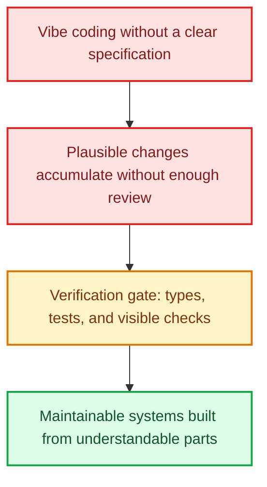

title: >-
  From Vibe Coding to PR Review Bottlenecks: What Changed in Software
  Engineering?
description: >-
  AI can generate code quickly, but review remains expensive. This guide
  examines vibe coding, stable technology, verification, and testing.
permalink: 2026/08/26/vibe-coding-pr-review-engineering-shift/
translation_key: vibe-coding-pr-review-engineering-shift
translations:
  zh-TW: /2026/08/26/從-Vibe-Coding-狂歡到-PR-審查地獄：這幾年軟體工程界到底發生了什麼事？/
  zh-CN: /zh-cn/2026/08/26/vibe-coding-pr-review-engineering-shift/
categories:
  - Software Engineering
tags:
  - AI
  - AI Coding
  - Software Engineering
  - Developer Tools
date: 2026-08-26 22:08:22
updated: 2026-08-29 18:50:35
---

When Andrej Karpathy introduced the phrase **vibe coding**, the idea captured a real change: people could describe an application, accept generated code, and get something running without reading every line. Weekend prototypes became dramatically easier, and social media quickly filled with predictions that software engineering itself was about to disappear.

Production work has revealed a more complicated picture. In the 2025 Stack Overflow Developer Survey, more respondents distrusted the accuracy of AI tools than trusted it. Two common frustrations were solutions that were almost correct and the extra time required to debug generated code.

AI can produce a large change quickly, but a human still has to understand its impact, run the system, review edge cases, and decide whether the result is safe to maintain. Generation became cheaper; verification did not.

<!--more-->

## 1. AI Slop and the New Review Bottleneck

The term **AI slop** is often used for generated code that appears plausible but does not fit the system around it. The problem is not always an obvious syntax error. More often, the code works on the happy path while creating subtle costs elsewhere:

- **Locally correct, architecturally wrong**: The change passes a simple test but introduces duplicated logic, unnecessary wrappers, swallowed errors, or a second way to perform an existing operation.
- **Asymmetric review cost**: Producing hundreds of lines may take minutes, while understanding their behavior can take much longer.
- **Eroding confidence**: When a codebase accumulates changes that nobody fully understands, refactoring becomes riskier and maintenance slows down.

This does not prove that AI always reduces productivity. It shows why output volume is a poor measure of engineering value. A randomized METR study of 16 experienced open-source developers found that early-2025 AI tools made participants 19% slower on tasks in mature repositories they already knew well. METR also cautioned that the result applied to that specific sample, tool generation, and task setting; it should not be generalized to every developer.

The useful conclusion is narrower: **AI-assisted work still needs review, execution, and evidence.**

## 2. The Junior Developer Cliff

Traditional engineering careers include years of small debugging tasks, test fixes, support work, and routine implementation. Those tasks may look inefficient, but they help developers build intuition about state, concurrency, boundaries, and failure modes.

As companies expect AI to absorb more boilerplate, documentation, and simple tests, the industry faces a legitimate training question: if entry-level tasks shrink, where will new engineers gain the experience required to review AI-generated systems later?

It would be too broad to claim that every company has already replaced junior teams with one senior engineer and several agents. A more realistic direction is that junior work changes. New developers need to learn earlier how to:

- turn an unclear request into a testable specification;
- identify missing cases rather than merely accept a generated solution;
- run tests and inspect real behavior;
- explain why a change belongs in the existing architecture;
- stop an agent when evidence is missing.

The goal is not to skip fundamentals. It is to learn them while using AI as a tool rather than as an authority.

## 3. Why Boring Technology Looks Attractive Again

The renewed interest in **Choose Boring Technology** has a practical explanation. Mature databases, frameworks, and protocols have extensive documentation, familiar failure modes, and many examples. Both humans and AI agents have an easier time reasoning about systems built from well-understood parts.

A clear monolith can also be easier for an agent to understand than a feature spread across many repositories and services. That does not make every monolith good or every distributed system wrong. It means complexity needs to justify itself.

Postgres, SQLite, standard SQL, simple REST or RPC, and server-rendered pages are therefore common starting points. Their value is not fashion. It is the ability to inspect logs, reproduce failures, and use mature tools when something breaks.

## 4. Testing Matters More, Not Less

Kent Beck's **Augmented Coding: Beyond the Vibes** describes using test-driven development to keep AI-generated work aligned with the intended design. Simon Willison similarly argues that automated tests are no longer optional when working with coding agents.

The strongest version of this idea is not that tests are the only form of truth. It is that AI increases the need for several layers of verification:

- **Type systems** can catch some interface and data-shape mistakes at compile time, but no reliable evidence supports a fixed claim such as eliminating 60% of AI errors.
- **Unit, integration, and end-to-end tests** make important expectations executable.
- **Continuous integration gates** prevent changes that fail agreed checks from entering the main branch.
- **Manual testing and review** cover visible behavior and assumptions that automated tests may miss.

Tests are especially valuable because an agent can run them, inspect failures, and iterate. But passing tests only proves that the tested behavior passed. It does not guarantee that the specification was complete.

## 5. A Bigger Lever for Small Teams

For independent developers and small teams, AI still creates substantial leverage. An experienced builder can move between database design, interface work, tests, deployment, and documentation with less context-switching overhead.

The difference is the workflow around the model. An unconstrained prompt may produce a large patch that is difficult to trust. A clearer process uses a specification, narrow changes, tests, visible checks, and review gates. Our related guide to [Agentic SDLC](/en/2026/08/24/agentic-sdlc-architecture-guide/) explores that structure in more detail.

AI has not made software engineering irrelevant. It has shifted value away from typing speed and toward problem definition, system boundaries, verification, and long-term judgment.

## Sources

- [Stack Overflow 2025 Developer Survey: AI adoption, trust, and frustrations](https://survey.stackoverflow.co/2025/ai)
- [METR: Measuring the impact of early-2025 AI on experienced open-source developers](https://metr.org/blog/2025-07-10-early-2025-ai-experienced-os-dev-study/)
- [METR: 2026 follow-up on study design and limitations](https://metr.org/blog/2026-02-24-uplift-update/)
- [Kent Beck: Augmented Coding: Beyond the Vibes](https://kentbeck.com/summaries/augmented-coding-beyond-the-vibes/)
- [Simon Willison: First run the tests](https://simonwillison.net/guides/agentic-engineering-patterns/first-run-the-tests/)
