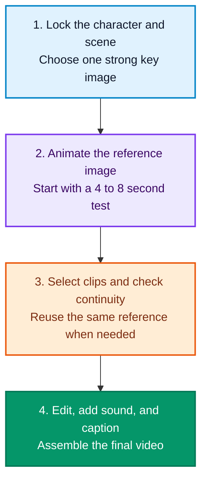

title: 'How to Choose AI Image and Video Tools in 2026: Rankings and a $30 Setup'
description: >-
  A concise 2026 guide to AI image and video tools, blind rankings, practical
  workflows, and a verified creator setup under $30 per month.
permalink: 2026/08/29/how-to-choose-ai-image-and-video-tools-2026/
translation_key: how-to-choose-ai-image-and-video-tools-2026
translations:
  zh-TW: /2026/08/29/2026-AI-繪圖與生成影片怎麼挑？一篇看懂各大工具強項、盲測排行榜與每月-30-美元最佳組合/
  zh-CN: /zh-cn/2026/08/29/how-to-choose-ai-image-and-video-tools-2026/
categories:
  - AI Technology
tags:
  - AI Image Generation
  - AI Video
  - AI Tools
date: 2026-08-29 18:10:00
updated: 2026-08-29 18:31:17
---

There are more AI image and video tools than ever in 2026. The hard part is no longer finding the model with the highest score; it is choosing the right tool for your work and budget. This guide combines blind rankings, official pricing, and a simple production workflow.

<!--more-->

## Start with blind rankings, but do not stop there

The following entries come from the [Artificial Analysis text-to-image leaderboard](https://artificialanalysis.ai/image/leaderboard/text-to-image), captured on August 29, 2026.

| Rank | Model | Blind-test score | Approximate price |
| :---: | :--- | :---: | :--- |
| 1 | **GPT Image 2 high** | 1,370 | $211 per 1,000 images |
| 2 | **MAI-Image-2.6 Preview** | 1,351 | Not yet published |
| 3 | **Reve 2.1** | 1,323 | $200 per 1,000 images |
| 4 | **Nano Banana 2** | 1,321 | About $67 per 1,000 1K images |
| 6 | **MAI-Image-2.5** | 1,303 | About $48.10 per 1,000 images |

These scores show overall preference, not a universal winner. A small gap does not guarantee a visible advantage for every prompt. Style, text rendering, editing tools, and usage rights still matter.

## Which AI image tool should you choose?

| What you need | Suggested tool | Why |
| :--- | :--- | :--- |
| Complex scenes and strict instructions | **GPT Image 2** | Strong prompt following, but expensive |
| High-volume generation and editing | **Nano Banana 2** | A good balance of quality and price; 1K output costs about $0.067 per image |
| Illustration, cinematic mood, and social covers | **Midjourney** | Fast visual exploration with consistent styling |
| Posters and text-heavy graphics | **Ideogram 4** | Usually strong typography, though final text still needs proofreading |
| Logos, icons, and editable SVG files | **Recraft V4.1 Vector** | Produces vector output; API pricing starts around $0.08 per image |
| A local, customizable workflow | **FLUX.2 dev or klein** | These are the local-friendly versions; max, pro, and flex are mainly hosted services |

One licensing detail matters: images made on the [Recraft Free plan](https://www.recraft.ai/pricing?tab=api) belong to Recraft and are not licensed for commercial use. Also, do not mix the pricing or hardware needs of hosted FLUX.2 models with the local versions.

## Which AI video tool should you choose?

Video rankings are split by text-to-video versus image-to-video, and by whether audio is generated. Scores from different categories should not be compared directly.

| Blind-test category | Leader on 2026-08-29 | Best fit |
| :--- | :--- | :--- |
| Text-to-video with audio | **Wan 3.0** | Creating a new shot with picture and sound together |
| Image-to-video with audio | **Minimax H3 Max, fal post-trained version** | Animating an existing character or product image |
| Text- or image-to-video without audio | **Gemini Omni Flash** | Prioritizing visual quality and speed while handling audio separately |

See the full [image-to-video](https://artificialanalysis.ai/video/leaderboard/image-to-video) and [text-to-video](https://artificialanalysis.ai/video/leaderboard/text-to-video) rankings for changing scores. For recurring characters, start with image-to-video in **Kling** or **Runway**. If native dialogue and ambient sound matter, consider Minimax, Wan, or Gemini.

## A simple four-step workflow

This is a useful starting point, not a strict rule. Text-to-video works well for landscapes, transitions, and shots without recurring characters. Image-to-video usually gives more control when a person or product must remain recognizable. Focus prompts on motion and camera movement, but repeat essential wardrobe or prop details when necessary.

## A practical setup under $30 per month

Using monthly US prices before tax and exchange-rate differences:

| Use | Plan | Monthly budget |
| :--- | :--- | :---: |
| Key art and visual style | **Midjourney Basic** | $10 |
| Short video generation | **Runway Standard** | $15 |
| Precise edits and extra images | **Nano Banana 2 API** | $5 usage budget |
| Editing | **CapCut or DaVinci Resolve Free** | $0 |
| **Total** |  | **$30** |

Midjourney Basic includes 200 Fast GPU minutes and does not include unlimited Relax Mode. Runway Standard costs $15 monthly and provides roughly one minute of Gen-4.5 output if all credits are spent on that model. At about $0.067 per 1K output, a $5 Nano Banana 2 budget covers roughly 74 output images before small input charges.

If video matters more than Midjourney styling, move that $10 to the video budget and use Nano Banana 2 for base images. Runway **Unlimited** is no longer available to new subscribers; the current high-volume **Max** plan costs $95 per month, so the old "$76 unlimited" recommendation no longer applies.

## The short answer

- Choose **GPT Image 2** for strict prompt following.
- Choose **Nano Banana 2** or **MAI-Image-2.5** for lower-cost volume.
- Choose **Midjourney** for visual style.
- Choose **Recraft V4.1 Vector** for editable SVG assets.
- For consistent characters, create a key image first, then animate it with **Kling** or **Runway**.
- For video with native audio, consider **Minimax H3**, **Wan 3.0**, or **Gemini Omni Flash**.

Rankings will change. The reliable approach is to define the final deliverable, test a small batch, and spend more only after the tool proves suitable.

---

### Official sources and related reading

- [Google Gemini API pricing](https://ai.google.dev/gemini-api/docs/pricing)
- [Midjourney plan comparison](https://docs.midjourney.com/hc/en-us/articles/27870484040333-Comparing-Midjourney-Plans)
- [Runway plan guide](https://help.runwayml.com/hc/en-us/articles/21664961171475-Which-plan-is-right-for-me)
- [FLUX.2 model guide](https://docs.bfl.ai/flux_2/flux2_overview)
- [Artificial Analysis: How to choose AI models without guessing](/en/2026/08/17/artificial-analysis-definitive-guide-llm-selection/)
