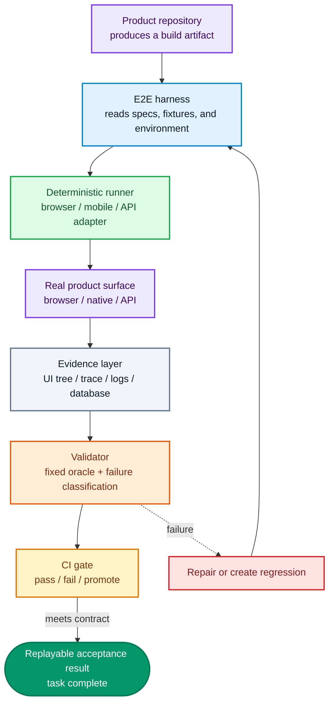
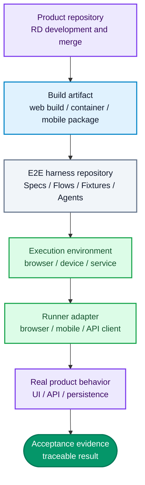
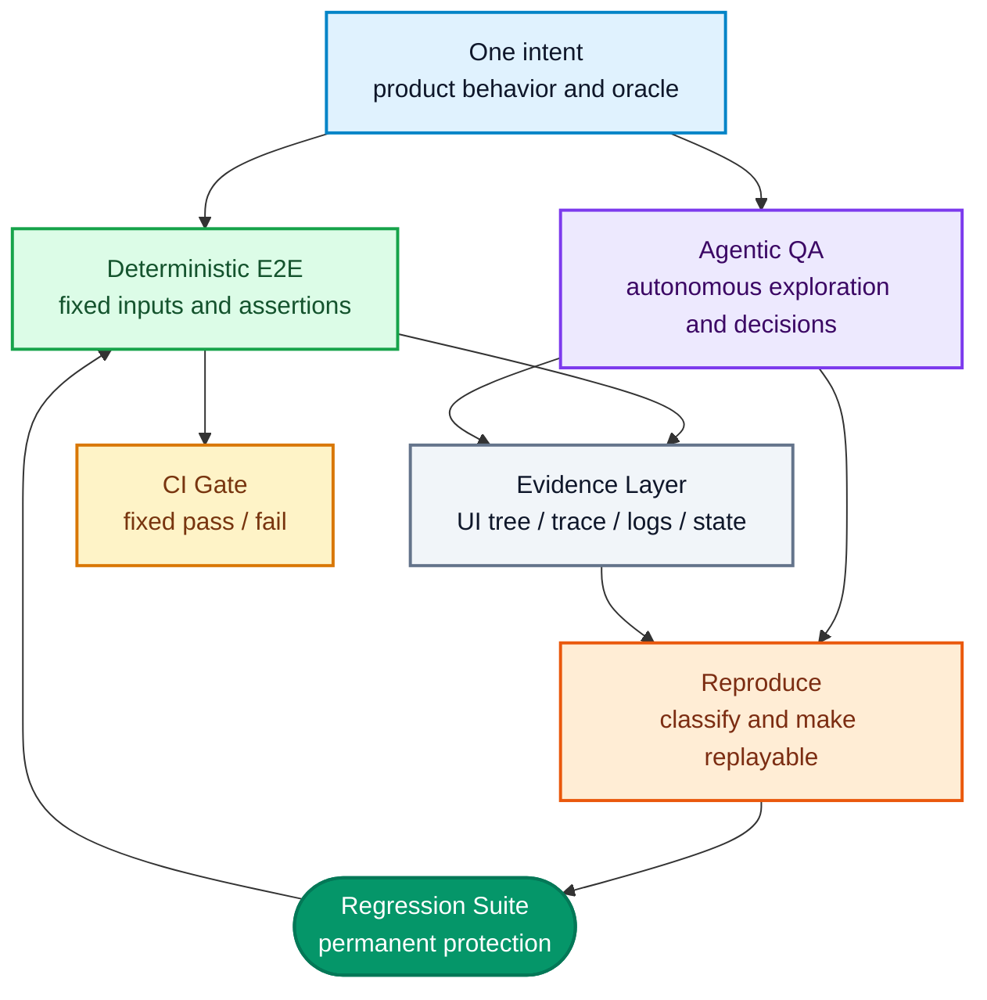
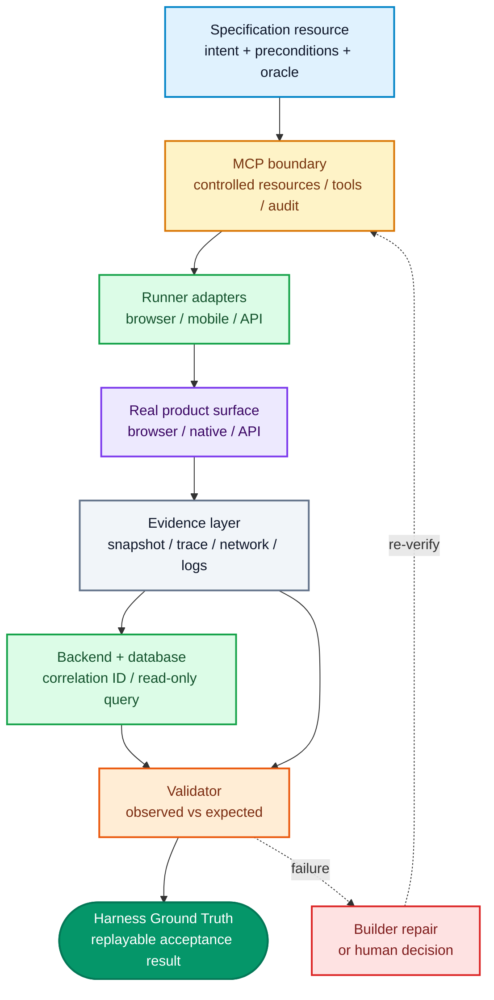

The short answer is this: **in the AI era, E2E is not about asking AI to write more tests. It is about building an E2E harness that receives a build, executes a real user journey, preserves complete evidence, classifies failures, and turns new defects into regression protection.**

A single E2E test case answers whether one scenario passes. An E2E harness owns the specification, test data, execution environments, runner adapters, observability, CI gates, and the protocols that tell agents how to explore and repair. AI makes product changes faster, but it also increases the volume of defects, maintenance work, and changes. The upgrade is therefore not more scripts. It is better **boundaries, observability, and feedback loops**.

This article focuses on one question: when a Builder can continuously produce product changes, how should an AI-native E2E harness be designed so that fixed tests protect CI, agents explore unknown paths, and every result returns to development as useful evidence? Browser, mobile, API, and hybrid systems may use different adapters and folders; the architecture below is a general reference model, while Appium and WebView appear only as optional examples. The invariants are the black-box boundary, observable evidence, fixed acceptance, and exploratory feedback.

<!--more-->

## 1. Start with the Definition: an E2E Test Is a Case; an E2E Harness Is the Quality Control Plane

In one sentence: **an E2E test case is the scenario to run; an E2E harness is the complete acceptance system that executes that scenario against the real product, judges it, diagnoses failures, and turns confirmed defects into regression protection.** It is not a new package, and it is not the same thing as Playwright, a WebDriver client, or Appium.

### Why generating more tests is not the answer

Traditional E2E projects are often treated as folders of test files: a few specs, some Page Objects, and several CI commands. That structure can survive while humans make changes at a limited rate. Once coding agents continuously produce pull requests, it exposes three problems:

- tests and product code share context and can copy the same faulty assumption;
- a test returns only green or red, leaving an agent without enough evidence to distinguish a product defect, data problem, environment failure, or test defect;
- a newly discovered bug has no path back into regression coverage, so people must rediscover it later.

This is **AI Test Theater**: the same Builder Agent writes the product, writes tests from its own assumptions, and then treats a green run as proof that the change is done. Coverage can rise while the real defect remains because the product, test, and expected result share one faulty assumption. Unit tests still matter, but they are the Builder's fast local check, not independent product acceptance. The Validator must take the build, exercise the real product from the outside, and compare it with a separate fixed rule.

Three layers make the distinction clearer:

| Layer | Responsibility | Typical contents |
| --- | --- | --- |
| E2E test case | Verify one fixed product scenario | Fixed inputs, actions, and assertions |
| Test runner/framework | Send test code through the product interface | Playwright Test, WebDriver clients, API runners, fixtures |
| E2E harness | Manage the whole acceptance process | Product build, environment, data, evidence, verdict, CI, and agent rules |

So when a team says “we use Playwright,” that only proves it has an automation tool. It has an E2E harness when the toolchain can receive a specified build, prepare isolated data, keep replayable records, make a fixed verdict, and add confirmed defects to regression tests.

“Harness” is not a term invented for AI. The ISTQB glossary defined a test harness in 2019 as the test environment, including stubs and drivers, needed to execute a test suite. An earlier FDA／IEEE software glossary described the related test driver／test harness as the component that invokes the test item, provides inputs, monitors execution, and reports results. [ISTQB Glossary](https://api.glossary.istqb.org/storage/help/R0uz58NqLzUz48LVUuyGSF76NFj4LHQazSs0GlNS.pdf), [FDA／IEEE Software Glossary](https://www.fda.gov/inspections-compliance-enforcement-and-criminal-investigations/inspection-guides/glossary-computer-system-software-development-terminology-895)

What has become popular recently is **AI-native harness**. When an agent reads specifications, edits the product, runs tests, analyzes failures, and proposes repairs, the harness becomes more than a test runner: it provides the agent with tools, context, constraints, evidence, and a definition of done. OpenAI’s discussion of Harness Engineering makes this shift explicit by focusing on the environment and feedback loops that let agents work reliably, rather than only on better prompts. [Harness engineering](https://openai.com/index/harness-engineering/)

### How the harness works



That is the subject of this article. The harness does not ask AI to guess the answer. It connects **the specification, the real product, execution evidence, and the next action** into a replayable chain. Ground truth here does not mean a model saying “looks good.” It means comparing a fixed oracle with real product behavior, runtime, and data state.

## 2. Keep the Harness Separate from the Product

### E2E must not import product source

Regardless of whether the product is web, mobile, desktop, API, or hybrid, one rule comes first: **E2E tests the product from the outside; it does not call the product from the inside.** The runner and folders can change by product shape; this boundary stays.

The repository relationship should look like this:



The E2E repository must not contain dependencies such as:

```ts
import productStore from 'product';
import productService from 'product';
```

It may consume:

- a web build, container image, mobile package, or other deployable artifact;
- test identities, test data, and versioned fixtures;
- a QA backend, sandbox, and seed/reset API;
- a DOM, accessibility tree, native UI tree, service log, or runner log;
- backend and database queries constrained by read-only permission or an allowlist.

This is not black-box testing for the sake of a slogan. It stops tests from depending on components, state managers, services, or internal functions. E2E should verify what a user or external client sees after receiving a deployable version, not whether an internal function can be called directly.

### What the Product Must Expose for Testing

Black-box testing does not mean the product team provides nothing. Without stable locators, resettable data, or traceable request IDs, the tests will need fragile workarounds. Put the requirements in **TESTABILITY_REQUIREMENTS.md**, selecting what the product needs:

- accessibility identifiers, Android resource IDs, or iOS accessibility IDs for native controls;
- semantic locators and necessary `data-testid` rules for web interfaces;
- API schemas, error codes, idempotency behavior, and test endpoints when applicable;
- test-support APIs for creating, querying, and clearing test data;
- controllable login, permissions, lifecycle, refresh, and session behavior when applicable;
- the product commit SHA, version, and environment metadata for every artifact;
- correlation IDs that connect a user action to API, queue, service, and database events.

When an element cannot be found, an agent should not generate a longer XPath. A missing test interface is a product requirement for the team that owns that surface.

## 3. How to Structure the Harness

### A Directory an Agent Can Navigate

The folders should make it obvious where an agent finds specifications, data, runners, and test records. The following is a cross-product reference structure; do not create folders a product does not need:

```text
e2e-harness/
├── AGENTS.md
├── docs/
│   ├── product-map.md
│   ├── test-strategy.md
│   ├── environments.md
│   ├── selector-contract.md
│   └── known-issues.md
├── specs/
│   ├── smoke/
│   ├── critical/
│   └── regression/
├── pages/                 # Web UI, optional
├── screens/               # Other UI surfaces, optional
├── components/            # Shared UI, optional
├── flows/
├── assertions/
├── fixtures/
├── support/
├── adapters/
│   ├── browser/           # Playwright
│   ├── mobile/            # Appium, optional
│   └── api/               # API client/contract, optional
├── observability/
├── agent/
│   ├── exploratory/
│   ├── failure-analysis/
│   ├── test-generation/
│   └── maintenance/
├── config/
└── scripts/
```

Each folder should have one job:

| Folder | Responsibility |
| --- | --- |
| `specs/` | Describe what must be verified, without low-level driver calls |
| `flows/` | Describe cross-page, cross-screen, or cross-API business actions such as login, checkout, and cancellation |
| `pages/` / `screens/` | Encapsulate the UI surface that exists for the product: page or screen locators, input, clicks, and state waits |
| `components/` | Encapsulate shared UI such as modals, filter panels, date pickers, and checkout forms when needed |
| `fixtures/` / `support/` | Accounts, data seeds, payment data, reset, and cleanup |
| `adapters/` | Hide browser, mobile, API, or other product-interface differences |
| `observability/` | Screenshots, DOM/UI trees, traces, network, service logs, and database diffs |
| `agent/` | Exploration, failure analysis, case generation, and low-risk maintenance |

### Describe What to Verify Before How to Operate

The spec should describe preconditions, user intent, observable outcomes, and failure boundaries—not a selector list. Flows, Pages/Screens, and Runner Adapters translate that intent into semantic locators and stable waits: roles, labels, semantic text, or explicit test IDs on the web; equivalent accessibility IDs, resource IDs, or service contracts on other surfaces. An agent may complete these layers, but it must not turn “the element is temporarily missing” into “anything visible counts as success.”

For example:

```ts
await checkoutFlow.placeOrder({
  product: catalog.inStockItem,
  account: users.standard,
});

await checkoutAssertions.expectCreatedOnce();
```

A flow may cross pages, screens, or APIs, but a page object should not contain the whole business journey. This lets an agent repair one locator or runner without relearning the product.

### Three Test Groups, with Different Responsibilities

| Suite | Purpose | Frequency | Blocks CI? |
| --- | --- | --- | --- |
| Smoke | Confirm that the build launches and completes the shortest Critical Journey | Every PR or build | Yes |
| Critical | Cover business journeys that cannot break before release | PR, QA, release candidate | Yes |
| Regression | Preserve fixed bugs, permissions, lifecycle, error states, and edge cases | Post-merge, nightly | Risk-based |

The practical split is simple: fast checks stay local, fixed E2E protects important journeys, and AI exploration does not decide whether CI passes. A product may have no `pages/`, `screens/`, or mobile adapter. The key rule is that **only the fixed runner decides whether fixed acceptance passes**.

## 4. Fixed Tests and AI Exploration Have Different Jobs

### Share Records, Not Release Authority



### Fixed E2E: the CI Gate

Fixed E2E must have:

- fixed inputs, test data, expected results, and a resettable environment;
- independent execution without relying on the previous test’s state;
- no LLM deciding pass or fail;
- no automatic relaxation of expected results after a UI change;
- complete records on failure so the next agent can replay it.

AI may generate a draft, but before it enters `specs/smoke/`, `specs/critical/`, or `specs/regression/`, confirm that it describes product behavior rather than an accidental DOM or native-tree shape.

### AI Exploration: Find Problems the Fixed Cases Miss

AI exploration does not replace fixed E2E. It searches for behavior that has not yet been written into a specification:

- rapidly click, go back, or reload while an order or other state-changing action is being submitted;
- move a lifecycle-aware client to the background during loading and bring it back to the foreground;
- reject location, notification, or other permissions when the product has them;
- reload a WebView, fail a Native/WebView context switch, or let the keyboard cover a button when the product is hybrid;
- inject API latency, network loss, a 409 response, partial success, or timeout;
- let two isolated users update the same order concurrently.

Exploration belongs in resettable staging, a seeded database, or a network mock. Limit the agent’s accounts, data, tools, and external writes. An exploration result is a candidate problem, not a CI green light.

The useful loop is:

```text
Explore
  → Record
  → Analyze
  → Reproduce
  → create a fixed regression test
  → Run again
```

If the issue is reproducible, add it to `specs/regression/`. Every captured unknown then becomes permanent protection.

### Separate the Builder from the Validator

| Role | Primary work | Must not decide alone |
| --- | --- | --- |
| Builder Agent | Modify the product or harness and run local checks | That its own green tests mean product acceptance is complete |
| Validator Agent | Obtain the build, run black-box E2E, read evidence, and classify failures | To change assertions first to remove a red result |
| QA / RD / human Judge | Define intent, confirm product changes, and accept risk exceptions | To skip raw evidence and trust a model summary |

The model brand is not the point. Keep roles, context, environment, and decision rights separate. In one 2026 study, tests generated after faulty code had weaker fault detection than independently generated tests in that experiment. That is another reason to keep Builder assumptions out of the Validator’s acceptance context. [On the risk of coding before testing](https://arxiv.org/abs/2607.05139)

## 5. Keep Test Records So Agents Can Diagnose Problems

### Do Not Leave Only an Error Message

`Expected visible, received hidden` is not enough to find the cause. On failure, the harness should keep at least:

- the DOM snapshot, ARIA snapshot, or native UI tree before and after the failed step;
- screenshots, video when needed, traces, and execution logs;
- console output, request URL, HTTP status, and response summaries;
- product commit, E2E commit, build number, OS/browser/runtime, locale, and environment;
- test-data seed, account, correlation ID, backend logs, and the before/after database difference.

[Playwright Trace Viewer](https://playwright.dev/docs/trace-viewer) can replay actions and inspect the DOM, network, and console. [Test Isolation](https://playwright.dev/docs/browser-contexts) gives each web test a clean Browser Context. Other runners should provide comparable records and isolation.

### Classify the Problem Before Repairing the Test

```json
{
  "scenario": "checkout-with-expired-session",
  "status": "failed",
  "classification": "product-regression",
  "observed": {
    "result": "order-confirmed",
    "httpStatus": 201,
    "orderCountDelta": 1,
    "runtime": "browser"
  },
  "expected": {
    "result": "login-required",
    "httpStatus": 401,
    "orderCountDelta": 0
  },
  "evidence": [
    "trace.zip",
    "accessibility-snapshot.json",
    "runner.log",
    "network.ndjson",
    "database-diff.json"
  ],
  "nextAction": "send-to-builder"
}
```

Classify every failure as one of at least six types: product regression, intentional product change, test framework problem, test-data problem, environment problem, or intermittent/timing problem. Until the classification is complete, an agent should not change a locator or expected result.

### Automatic Repair May Change the Test, Not the Product Answer

A test-repair PR may change a locator, wait condition, or fixture setup, but it must prove:

1. the new locator matches exactly one element in the correct container;
2. the original business check remains intact;
3. the original case, a neighboring scenario, and one negative case all pass again;
4. the PR includes the old and new locator, trace, and rerun result;
5. no check is deleted, timeout is inflated, retry is made unlimited, or error state is turned into success.

Playwright’s official [Test Agents](https://playwright.dev/docs/test-agents) include planner, generator, and healer capabilities. They can help maintain tests, but must not have permission to change the product’s expected answer.

## 6. Connect Product Interfaces to the Harness

### Playwright and Similar Tools Are Runners

Choose the runner adapter based on the product surface rather than coupling the whole harness to one tool:

- Use Playwright for web interfaces, including browser actions, semantic locators, network inspection, traces, and DOM assertions.
- Use an HTTP client, contract runner, or service-specific adapter for API products.
- If the product includes a native or hybrid mobile app, add TypeScript, WebdriverIO, Appium 2, Android UiAutomator2, and iOS XCUITest. Appium drivers map WebDriver commands to platform-specific automation APIs. [Appium Drivers](https://appium.io/docs/en/2.3/ecosystem/drivers/)
- For desktop, CLI, IoT, or other surfaces, add an adapter around the observable external interface. The tool may change; the intent, evidence, and validator contracts should not.

Appium is not the harness. It is one optional adapter for a native or hybrid mobile surface, and another runner can occupy the same boundary.

If the product is a hybrid app, treat Native and WebView as different contexts. Keep context switching in `adapters/mobile/webview/` rather than scattering it across every spec. [Appium Managing Contexts](https://appium.io/docs/en/2.11/guides/context/)

For the web, Playwright handles the browser, semantic locators, network, traces, and DOM assertions. Prefer roles, labels, semantic text, or an explicit test ID over CSS `nth-child` or XPath. [Playwright Locators](https://playwright.dev/docs/locators)

MCP is the agent’s I/O boundary, not the test runner or the judge. It can expose specification resources, browser/mobile/API runner tools, log readers, backend queries, and read-only database queries. The MCP specification separates prompts, resources, and tools by control responsibility; implementations still need allowlists, least privilege, and audit logs. [MCP Server Features](https://modelcontextprotocol.io/specification/2025-06-18/server/index)



### How to Schedule Tests in CI

The Product Repo and E2E Repo can be connected by build artifacts:

| Stage | Harness action | Gate |
| --- | --- | --- |
| Product Build | Build and publish the specified web build, container, APK, or IPA with product commit and version | Artifact is deployable |
| Smoke | Start the browser or required device/runtime and run the shortest Critical Journey | Failure blocks merge or promotion |
| Critical | Run core flows, permissions, and the required platform matrix | Failure blocks the release candidate |
| Nightly Regression | Run fixed bugs, lifecycle, hybrid-interface, error-state, and network-fault cases | Produce repair and new-case candidates |
| Agentic Exploration | Explore unknown combinations in an isolated environment and preserve replayable steps | Never edit `main` directly |

Every report must identify the product commit SHA, E2E commit SHA, build number or version, OS/browser/runtime, environment, data seed, and test account. Without this metadata, an agent can easily misclassify an environment problem as a product defect.

### How to Tell Whether Testing Is Sufficient

For an E2E harness, coverage should not answer only “how many lines of code ran?” It should answer: “how much of the known high-risk product behavior can be verified and replayed with fixed inputs, the real interface, and a reliable oracle?” A coverage item can therefore be represented as:

`Intent × State × Data × Surface`

For example, “checkout × expired session × standard account × web／Chrome” is one coverage item; “submit payment × duplicate click × existing order × API＋web” is another. The item is covered only when a runner executes that combination and checks the product outcome plus any required side effects. An agent exploring randomly once and seeing no visible error does not count as coverage.

| Metric | How to judge it | Question it answers |
| --- | --- | --- |
| Intent／Requirement coverage | Verified intents ÷ approved intents, preferably risk-weighted | Does every important requirement have an acceptance case? |
| State／Transition coverage | Verified state transitions ÷ transitions in the behavior model | Are we testing only success, while missing expiry, retry, timeout, or rollback? |
| Data／Boundary coverage | Verified data partitions and boundaries ÷ risk-listed partitions | Are empty values, limits, duplicate data, and roles covered? |
| Surface／Environment coverage | Passing required surfaces and runtimes ÷ the declared required matrix | Did the browser, API, device, OS, or deployment environment actually run? |
| Oracle／Evidence coverage | Critical cases with business results, required side effects, and replayable evidence ÷ all Critical cases | Can the test judge the product, or did it merely click through the UI? |
| Fault-detection coverage | Valid mutants detected by tests ÷ total valid mutants | Can the suite catch deliberately injected defects? |

Line, function, and branch coverage remain useful, but they only show that code executed. They do not prove that an assertion is correct or that product behavior meets the requirement. ISTQB distinguishes statement coverage from decision／condition coverage; these are structural coverage measures, not a total product-quality score. [ISTQB Testing Glossary](https://api.glossary.istqb.org/storage/help/R0uz58NqLzUz48LVUuyGSF76NFj4LHQazSs0GlNS.pdf)

CI should therefore avoid an isolated “80% means pass” rule. More useful gates are:

- PR: every changed intent, risk state, and required runtime has deterministic E2E coverage; a Critical case without an oracle or evidence blocks the change.
- Release: every Critical Journey passes across the declared required matrix, no failure remains unclassified, and targeted mutation runs against high-risk rules.
- Nightly: expand data, state, platform, and agent exploration; an exploration result counts as formal coverage only after it is reproduced and promoted to deterministic Regression.

If the team needs one summary number, define a local risk-weighted score: `Σ(risk weight × coverage item pass × oracle／evidence quality) ÷ Σ risk weight`. This is a management signal, not an industry standard. The real completion condition is replayable verification of high-risk behavior and mutants being detected by tests. Stryker defines mutation score as the percentage of mutants killed by tests, which reinforces the distinction between “executed” and “able to detect a fault.” [Stryker Mutation Score](https://stryker-mutator.io/docs/General/faq/)

### Keep Tests Fast, Stable, and Able to Catch Real Bugs

- The local fast loop runs lint, types, unit, component, and contract tests.
- Pull requests run impacted Smoke/Critical E2E; an agent investigates only when a run fails.
- Nightly runs the full regression suite and AI exploration.
- A test that passes and fails on the same build must be labeled as unstable; rerunning it cannot turn a red result into a normal pass.
- Every test prepares its own data, cleans up, and supports parallel execution.
- Deliberately introduce small mistakes into high-risk rules such as permissions, order state, payment, retries, and migrations. If the tests still pass, they did not catch the mistake. This is mutation testing; [Stryker Mutation Testing](https://stryker-mutator.io/docs/) and the [MUTGEN study](https://arxiv.org/abs/2506.02954) both show why coverage alone is not fault detection.

Do not make the agent read the entire repository. Give it the relevant snapshot, trace summary, state difference, and correlation ID. **Fixed tools decide pass or fail; AI helps find causes and maintain tests.**

## 7. Conclusion: E2E Is the Acceptance System in the AI Era

When AI only generates code, E2E is mainly a pre-release test tool. When AI can change, test, and repair the product, E2E must become the complete acceptance system:

- keep the product and tests in separate repositories;
- keep specifications, flows, test data, runners, and records in separate layers;
- use fixed E2E tests to protect the CI release line;
- use AI exploration to find problems that fixed cases miss;
- keep enough records to investigate, classify, and replay every failure;
- turn confirmed bugs into fixed regression tests.

Engineers should provide a testable product and a traceable build. QA should define important journeys and risks. Agents should execute, explore, analyze, and suggest repairs. **Agents may operate the acceptance system, but they must not lower its standard.**

That is the real E2E change in the AI era: it is no longer just a pile of scripts to maintain. It is a system that lets AI keep working, gives people and tools evidence to judge, and turns unknown problems into lasting regression protection.

## References and Further Reading

- [Harness engineering: leveraging Codex in an agent-first world](https://openai.com/index/harness-engineering/)
- [ISTQB Standard Glossary of Terms Used in Software Testing](https://api.glossary.istqb.org/storage/help/R0uz58NqLzUz48LVUuyGSF76NFj4LHQazSs0GlNS.pdf)
- [FDA／IEEE Glossary of Computer System Software Development Terminology](https://www.fda.gov/inspections-compliance-enforcement-and-criminal-investigations/inspection-guides/glossary-computer-system-software-development-terminology-895)
- [On the risk of coding before testing: An empirical study on LLM-based test generation workflow](https://arxiv.org/abs/2607.05139)
- [Playwright Locators](https://playwright.dev/docs/locators)
- [Playwright Trace Viewer](https://playwright.dev/docs/trace-viewer)
- [Playwright Test Isolation](https://playwright.dev/docs/browser-contexts)
- [Playwright Test Agents](https://playwright.dev/docs/test-agents)
- [Playwright MCP](https://playwright.dev/mcp/introduction)
- [Appium Drivers](https://appium.io/docs/en/2.3/ecosystem/drivers/)
- [Appium Managing Contexts](https://appium.io/docs/en/2.11/guides/context/)
- [Model Context Protocol Server Features](https://modelcontextprotocol.io/specification/2025-06-18/server/index)
- [Stryker Mutation Testing](https://stryker-mutator.io/docs/)
- [Towards More Effective Fault Detection in LLM-Based Unit Test Generation](https://arxiv.org/abs/2506.02954)
