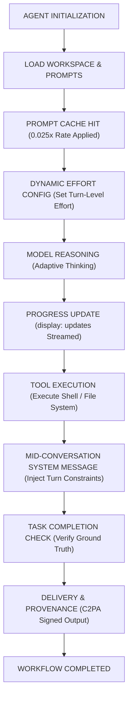

On September 1, 2026, Anthropic officially unveiled its newest flagship model, **Claude Fable 5.1** (alongside Claude Mythos 5.1 for Project Glasswing participants), engineered specifically for demanding reasoning and long-horizon agentic workflows. Featuring a **1M token context window** and **128K token maximum output**, Fable 5.1 introduces a game-changing pricing model: prompt cache reads are slashed to **0.025x of the base input price ($0.25/MTok)**—75% cheaper than the standard 0.1x cache rate across other Claude models.

<!--more-->

In modern agentic software engineering and multi-step deep research, developers frequently hit two roadblocks: runaway token costs during prolonged multi-turn agent loops, and reasoning degradation across complex multi-file refactoring sessions. Claude Fable 5.1 directly tackles these friction points with architectural advancements, dynamic effort scaling, and native agent progress reporting. This deep dive covers everything developers need to know: core specifications, critical breaking changes, new feature capabilities, and migration best practices.

---

## Why Claude Fable 5.1? Positioning and Generational Leap

While **Claude Opus 5** remains the gold standard for high-complexity standalone tasks, **Claude Fable 5.1** is purpose-built for scenarios where autonomous agents must run for hours without human intervention, refactor sprawling codebases across dozens of modules, generate live-formula financial spreadsheets from scratch, or conduct recursive web research.

### Claude Fable 5.1 vs Claude Fable 5 Generational Comparison

As a major upgrade to Fable 5, Claude Fable 5.1 keeps base input/output pricing identical while overhauling caching economics, safety signatures, and agent runtime primitives:

| Feature & Specification | Claude Fable 5.1 (Latest Flagship) | Claude Fable 5 (Predecessor) | Upgrade Analysis |
| :--- | :--- | :--- | :--- |
| **Model ID** | **claude-fable-5-1** | **claude-fable-5** | Direct string replacement in API calls |
| **Base In / Out Price** | **$10 / $50 / MTok** | **$10 / $50 / MTok** | Same baseline rates |
| **Cache Read Price** | **$0.25 / MTok (0.025x)** | **$1.00 / MTok (0.1x)** | **75% reduction (1/4th of previous cost)** |
| **Tool Choice Support** | **auto and none only** (tool/any returns 400) | **auto, none, any, tool supported** | **Breaking Change: Forced tools disabled** |
| **Per-Message Effort Scaling** | **Supported (Beta, cache-preserving)** | **Not supported** | Dynamic thinking intensity per turn |
| **Turn-Scoped System Messages** | **Supported (Beta)** | **Not supported** | In-flight system instructions without prompt mutation |
| **Tool Progress Updates** | **Supported via `display: "updates"` (Beta)** | **Not supported** | Human-readable progress between tool calls |
| **Thinking Compatibility** | **Reads Fable 5 and earlier blocks** | **Cannot parse Fable 5.1 blocks** | One-way signature binding; auto-stripped on fallback |
| **History Tamper Protection** | **Strict block-to-history binding (400 on edit)** | **No historical signature binding** | Guards deep chain-of-thought integrity |
| **Content Provenance** | **C2PA Credentials + Statistical Watermarking** | **Basic watermarking only** | Native signed C2PA credentials for media |
| **Priority Tier Support** | **Not supported** | **Supported** | Standard on-demand and Batch API only |
| **Agentic Coding Reasoning** | **Substantial leap (especially at high/max effort)**| **Baseline** | Higher pass rates in multi-file refactoring |

### Positioning within the Claude Model Family

- **Claude Sonnet 5** ($2 / $10): Optimal for real-time customer support, quick text edits, and high-throughput microservices.
- **Claude Opus 5** ($5 / $25): Best for complex single-turn engineering, architecture reviews, and analytical writing.
- **Claude Fable 5.1** ($10 / $50): The ultimate engine for multi-hour autonomous coding loops, full-codebase refactoring, and multi-step recursive problem solving. With its **$0.25 / MTok** cache read rate, high-iteration agent workloads are significantly cheaper to run than on Opus 5!

---

## Critical Breaking Changes Every Developer Must Know

Migrating existing agent pipelines to Claude Fable 5.1 requires addressing three fundamental breaking changes:

### 1. Forced Tool Choice Is Strictly Prohibited

In earlier Claude models, developers could force tool execution via `tool_choice: {"type": "tool", "name": "..."}` or `tool_choice: {"type": "any"}`. 

In **Claude Fable 5.1**, submitting either option triggers an immediate **HTTP 400 invalid_request_error**.

**How to migrate:**
1. Leave `tool_choice` set to `{"type": "auto"}` and state tool requirements explicitly in your prompts.
2. Enable `strict: true` on your tool schemas to guarantee parameter conformance with your JSON Schema.
3. If your goal was simply structured JSON output, switch to native **JSON Output Mode** (`output_config.format`).
4. If your orchestrator application requires a mandatory tool call at a specific conversation turn, inject a **Mid-conversation System Message**.

### 2. Thinking Block Binding and One-Way Backward Compatibility

Thinking blocks in Claude Fable 5.1 carry cryptographic model-binding signatures:
- **One-Way Compatibility**: Fable 5.1 can read thinking blocks generated by prior models (Opus 5, Sonnet 5, Fable 5).
- **Graceful Fallback Stripping**: If an agent session falls back to an older model due to retries or safety classifiers, the API automatically strips Fable 5.1 thinking blocks. Requests succeed without error or extra input billing, though the fallback model will replan from scratch.

### 3. Modifying Conversation History Invalidates Thinking Signatures

Thinking blocks are strictly bound to their preceding system prompts, tools, and conversation history. Modifying earlier messages will invalidate the block signature and return a 400 error. Maintain absolute prefix integrity across multi-turn agent sessions.

---

## Five Standout Features and Architectural Upgrades

Beyond raw reasoning performance, Claude Fable 5.1 brings dedicated architectural primitives for robust agent systems:

### 1. Per-Message Effort Configuration (Beta)

Developers can now dynamically adjust thinking intensity (`effort: "low"`, `"medium"`, `"high"`, or `"max"`) on a per-turn basis without invalidating prompt cache hits. Use `low` effort for lightweight file reads, and dial up to `high` or `max` when resolving architectural conflicts or multi-layer test failures.

### 2. Turn-Scoped System Messages (Beta)

You can now append `{"role": "system", "content": "..."}` messages midway through the `messages` array. This allows orchestrators to enforce dynamic step requirements without mutating top-level prompts or disrupting cached context prefixes.

```python
# Mid-conversation system message example
messages = [
    {"role": "user", "content": "What is the delivery status for order A1234?"},
    {"role": "assistant", "content": "Let me look up your order details."},
    {
        "role": "system",
        "content": "Tool-use requirement: The application requires calling order_lookup before responding. Begin with the tool call."
    }
]
```

### 3. Tool-to-Tool Progress Updates (display: "updates", Beta)

Long-running agents often run silent between tool calls, leaving user interfaces frozen. By setting `thinking: {"type": "adaptive", "display": "updates"}` alongside the `thinking-display-updates-2026-08-18` beta header, Fable 5.1 streams human-readable progress updates before each tool call while keeping underlying chain-of-thought private.

### 4. 0.025x Cache Read Pricing

At **$0.25 / MTok**, reading 500,000 cached tokens across 20 agent loop iterations costs just **$2.50**, compared to **$10.00** on Opus 5. This makes iterative exploration economically viable at enterprise scale.

### 5. Content Provenance and Watermarking

Text outputs incorporate Anthropic statistical watermarking, while generated images and video files produced through code execution tools natively embed verifiable **C2PA Content Credentials**.

---

## Long-Horizon Agent Execution Architecture

The diagram below illustrates the complete lifecycle of an autonomous agent powered by Claude Fable 5.1:



---

## Prompt Tuning: Avoiding Common Fable 5.1 Pitfalls

1. **Batch Independent Tool Calls**: Fable 5.1 may default to sequential single-tool calls in open loops. Add an explicit instruction: **"When multiple independent files need inspection, emit multiple tool calls in parallel within a single response."**
2. **Favor Targeted Edits over Full Rewrites**: Fable 5.1 can occasionally rewrite entire files. Include a prompt directive: **"Prefer targeted diff patches over full file overwrites to optimize latency and token budget."**
3. **Retrieval in Low Effort Turns**: At `effort: "low"`, the model relies more on parametric memory. For steps requiring live web or codebase queries, keep effort at `medium` or higher.

---

## Summary: When Should You Choose Claude Fable 5.1?

**Claude Fable 5.1** establishes a new benchmark for autonomous agentic computing. Rather than replacing lightweight models, it serves as the ultimate heavy-duty engine for complex software engineering and research:

- **Claude Sonnet 5**: Best for real-time customer support, high-speed API transformations, and standard interactive chat.
- **Claude Opus 5**: Best for architectural design, complex coding tasks, and multi-faceted content generation.
- **Claude Fable 5.1**: The definitive choice for **autonomous long-horizon agents, full-codebase refactoring, live spreadsheet modeling, and multi-step recursive problem solving**.
