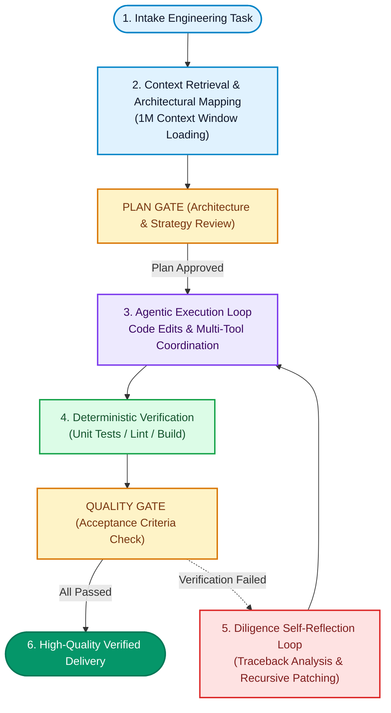

On September 2, 2026, Google officially launched its next-generation Gemini model family: **Gemini 3.8 Flash** alongside the security-specialized **Gemini 3.8 Flash Cyber**. As the intelligence operating behind developer terminals and agentic IDEs to map codebases, refactor multi-module systems, and resolve production bugs, this release marks a decisive architectural turning point. Flash models are no longer lightweight assistants confined to simple conversations; they have evolved into long-horizon **Intelligent Workhorses** designed to challenge expensive frontier-tier flagships while keeping introductory pricing fixed at **$0.75 per million input tokens** and **$3.75 per million output tokens**.

<!--more-->

As software engineering transitions into the era of the **Agentic SDLC** (Agentic Software Development Life Cycle), the primary bottleneck is no longer whether an AI can generate isolated utility code. The real challenge is whether an AI agent can autonomously navigate dozens of files across an unfamiliar repository, isolate subtle bugs, run terminal test suites, and diligently iterate when encountering build breaks. This article unpacks the underlying neural architecture, key benchmark breakthroughs, and the practical workflows needed to unlock the full reasoning potential of Gemini 3.8 Flash.

---

## Why Call It a Workhorse? Core Specs and Internal Roots

Before exploring the underlying mechanics, let us look at the technical foundation. During internal research and testing on Google's Jetski evaluation platform, the architecture's project codename was **Skimaki**, undergoing millions of rigorous iterations across complex long-horizon software tasks.

Unlike heavy, premium-priced frontier models, the core philosophy of the Flash family has always focused on speed and operational economics. With Gemini 3.8 Flash, Google DeepMind researchers successfully distilled deep multi-step reasoning capabilities into a high-throughput Flash core, rivaling frontier-tier performance while preserving lightweight latency and accessible pricing.

### Specifications and Generational Comparison

| Specification / Dimension | Gemini 3.8 Flash (Latest Release) | Gemini 3.7 Flash (Previous Gen) | Typical Frontier Flagships |
| :--- | :--- | :--- | :--- |
| **Model Identifier** | **gemini-3.8-flash** | **gemini-3.7-flash** | Frontier Tier Models |
| **Input Price (per MTok)** | **$0.75** | **$0.75** | **$5.00 - $15.00** |
| **Output Price (per MTok)** | **$3.75** | **$3.75** | **$25.00 - $75.00** |
| **Native Context Window** | **1M Tokens** | **1M Tokens** | **200K - 1M Tokens** |
| **Max Output Tokens** | **64K Tokens** | **64K Tokens** | **8K - 64K Tokens** |
| **Reasoning Effort Control** | **Dynamic (Low / Medium / High)** | **Basic Thinking Mode** | Model Dependent |
| **Software Engineering Focus** | **DeepSWE v1.1 Optimized** | Basic Code Understanding | High-end Reasoning |
| **Specialized Cybersecurity Fork** | **Gemini 3.8 Flash Cyber** | None | Restricted Custom Deals |

From a cost standpoint, Google is maintaining its introductory pricing through the end of 2026: **$0.75 per million input tokens** and **$3.75 per million output tokens**. In an autonomous coding agent loop like Antigravity, where an agent continuously reads project files, diffs, and test outputs over multi-turn sessions, the total operational cost is a fraction—often less than one-tenth—of frontier-tier models.

---

## Architectural Breakthrough: Long-Horizon Loops and Diligence

The primary failure mode for developers using conventional large language models is **myopia**:
1. Generating shallow, brittle code that overlooks edge cases.
2. Inability to self-verify execution results, repeatedly attempting the same failed fixes.
3. Attention decay across prolonged multi-turn conversations.

Gemini 3.8 Flash addresses these limitations with recursive evaluation loops. In official release materials, Google highlights a defining behavior: **Diligence**.

Diligence means that when confronted with high-difficulty engineering tasks, the model does not rush to output a single speculative solution. Instead, within its internal thinking traces, it explores multiple hypotheses, invokes static analysis tools, inspects dependency constraints, simulates execution paths, and proactively discards invalid assumptions.

### The Single-Spine Agentic Workflow

When tasked with an end-to-end software development ticket, the autonomous execution loop follows a strict vertical state flow:

The core engine of this system is the **4 -> 5 -> 3** diligence repair loop. While previous models often halted or hallucinated after an initial test failure, Gemini 3.8 Flash ingests tracebacks, locates related modules, crafts minimal targeted diffs, and reruns verification until all acceptance gates pass cleanly.

---

## Benchmark Showdown: Measuring Up Against Industry Flagships

According to official evaluation data from Google DeepMind and September 2026 benchmark leaderboards, Gemini 3.8 Flash holds its ground directly against top frontier models. Here is a concise overview comparing key benchmarks and operating costs:

### Flagship Model Key Metrics Comparison

| Evaluation Metric / Benchmark | Gemini 3.8 Flash (Google Latest) | Claude Fable 5.1 (Anthropic Flagship) | Claude Opus 5 (Anthropic Reasoning) | GPT-5.6 Sol (OpenAI Flagship) | Gemini 3.7 Flash (Previous Gen) |
| :--- | :--- | :--- | :--- | :--- | :--- |
| **Terminal-Bench 2.1 (CLI Agentic Tasks)** | **89.4%** | **89.6%** | **89.1%** | **88.8%** | **85.8%** |
| **HLE-Verified (Hard Multi-Step Reasoning)** | **54.9%** | **56.2%** | **53.8%** | **54.2%** | **48.2%** |
| **DeepSWE v1.1 (Long-Horizon SWE)** | **Frontier Tier (High Multi-Module Patch)** | **Frontier Tier (Long-Horizon Specialized)** | **Frontier Tier** | **Frontier Tier** | **Baseline (Prone to Context Drift)** |
| **Native Context Window** | **1M Tokens** | **1M Tokens** | **200K Tokens** | **400K Tokens** | **1M Tokens** |
| **Input / Output Price (per MTok)** | **$0.75 / $3.75** | **$10.00 / $50.00** | **$5.00 / $25.00** | **$6.00 / $30.00** | **$0.75 / $3.75** |
| **Relative Operational Cost Ratio** | **Baseline (1x)** | **~13.3x Frontier Cost** | **~6.7x Frontier Cost** | **~8.0x Frontier Cost** | **Baseline (1x)** |

> [!NOTE]
> Data Sources: Google DeepMind Model Card, September 2026 Terminal-Bench 2.1 Leaderboard, and official developer pricing documentation from Anthropic and OpenAI.

Two primary takeaways stand out for software developers:

First, **breakthrough CLI agent reliability**. On **Terminal-Bench 2.1**, which evaluates autonomous command-line navigation and debugging, Gemini 3.8 Flash achieved **89.4%**, surpassing Claude Opus 5 (89.1%) and GPT-5.6 Sol (88.8%). Combined with a **54.9%** score on **HLE-Verified**, it demonstrates that the model is a capable engineering brain rather than a superficial autocomplete tool.

Second, **unmatched cost economics**. Long-horizon agentic loops—such as iterative test-driven repair or multi-file refactoring—can generate substantial token costs on frontier flagships. Gemini 3.8 Flash delivers comparable engineering output at roughly one-tenth the cost. In addition, Google introduced **Gemini 3.8 Flash Cyber** through the Fairwind Program, tailored specifically for exploit detection and automated vulnerability remediation.

---

## Developer Best Practices: Unlocking Peak Performance

To maximize effectiveness within Antigravity, OpenCode, or custom agent pipelines, adopt these four best practices:

### 1. Allocate High Reasoning Effort for Architecture Work
Gemini 3.8 Flash supports variable reasoning effort. For straightforward formatting or simple translations, Low or Medium mode provides near-instant responses. However, for multi-module refactoring or complex debugging, configure **High Effort**. This gives the model ample token budget to explore edge cases before writing code, preventing costly regressions.

### 2. Grant Robust Tooling Access
The true value of Gemini 3.8 Flash emerges when functioning as an active agent rather than a passive chatbot. Ensure your environment exposes:
- **Search and exploration tools** (such as ripgrep and fd) to examine repositories.
- **Precise file editing tools** supporting targeted block replacements.
- **Terminal execution capabilities** so the model can run tests, inspect logs, and self-correct.

### 3. Establish Deterministic Verification Gates
Even with high diligence, agents perform best when provided with unambiguous ground truth. Maintain automated test suites, linting rules, and type checks. Prompt the agent to verify its changes against these gates before finalizing tasks.

### 4. Leverage the 1M Context Window and Persistent Memory
Take advantage of the 1M token context window by including full architectural specifications, schema definitions, and debugging logs. When paired with persistent memory plugins like **agentmemory**, the model retains past architectural decisions and personal preferences across sessions, eliminating context reset friction.

---

## Conclusion: A New Standard for Autonomous Engineering

Software engineering has moved past the initial excitement of speculative vibe coding toward structured, verifiable **Agentic SDLC** workflows.

The debut of **Gemini 3.8 Flash** is not meant to displace human architectural insight, but to serve as a diligent, cost-effective partner handling tedious verification, multi-file edits, and complex refactoring. This new intelligent workhorse brings unprecedented leverage to indie developers and engineering teams worldwide.
