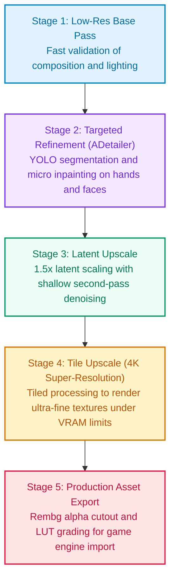

Many developers and digital artists entering the open-source generative AI landscape experience the same initial frustration: crafting verbose text prompts only to receive distorted hands, awkward limbs, or characters whose facial identities completely change across shots.

In production environments, such as indie game development, character concept design, and animation storyboarding, creative teams cannot rely on random lottery mechanics. High-performing production studios achieve single-pass acceptance rates above 90% because they treat image generation as an engineered **deterministic data pipeline**. This guide deconstructs the open-source image generation stack from a software architecture perspective, clarifying Checkpoints, LoRAs, ControlNet, and ADetailer, while uncovering the five-stage multi-pass pipeline powering professional ComfyUI workflows.

<!--more-->

## Demystifying the Core Stack: Kernel, Plugins, Decoders, and Constraints

The open-source generative ecosystem (including Stable Diffusion and Flux) is filled with machine learning jargon. When categorized through a modular software engineering lens, each component has a well-defined boundary:

### 1. Checkpoint (Base Model): The Core Operating System
- **File Size**: Typically between **2 GB and 20 GB** (such as SDXL or Flux.1).
- **Architectural Role**: The foundation of the synthesis engine. Base models are pre-trained on billions of image-text pairs, developing high-level latent representations of anatomy, lighting, spatial depth, perspective, and rendering styles.
- **Limitation**: While generalized, base models lack deep understanding of proprietary indie game characters, custom assets, or highly specific niche aesthetics.

### 2. LoRA (Low-Rank Adaptation): Lightweight Concept Patches
- **File Size**: Extremely compact, typically **10 MB to 200 MB**.
- **Underlying Mechanism**: Instead of modifying the massive weights of the base model, LoRA freezes the primary weights and injects low-rank decomposition matrices into the cross-attention layers to capture isolated concepts.
- **Production Value**: Without expensive full fine-tuning, loading a lightweight LoRA allows the model to reliably produce a specific original character, costume, or handcrafted pixel-art style.

### 3. VAE (Variational AutoEncoder): Latent-to-RGB Lens
- **Underlying Mechanism**: To conserve VRAM, diffusion models compute denoising trajectories within a compressed latent space rather than standard RGB pixel matrices.
- **Common Failure**: Once latent sampling finishes, the VAE decodes compressed tensors into visible pixels. When generated images appear washed out, dull, or covered in white haze, an unassigned or mismatched VAE version is almost always the cause.

### 4. ControlNet: Rigid Geometric Constraints
- **The Core Problem**: Natural language is notoriously bad at conveying 3D spatial coordinates and dynamic body poses. No text prompt can reliably dictate limb angles, camera elevation, or exact horizon lines.
- **The Breakthrough**: ControlNet routes spatial conditioning inputs (such as Canny edge maps, depth buffers, or OpenPose skeletons) directly into the diffusion network. It establishes a rigid structural scaffold, forcing the model to render textures and shading strictly within specified boundaries.

---

## Solving the Two Critical Roadblocks: Anatomical Glitches and Identity Drift

Once foundational components are understood, two common challenges plague creative production: deformed extremities and inconsistent character appearance across scenes.

### Mastering Hands and Anatomy

#### 1. ADetailer (Automated Crop-and-Inpaint Refinement)
Manual inpainting with brush masks is slow and unscalable. **ADetailer (After Detailer)** leverages real-time computer vision models (such as YOLO) to detect bounding boxes around faces and hands immediately following the primary render pass. It crops these regions, runs a dedicated localized inpainting pass with targeted prompts at low denoising strengths (0.3 to 0.4), and seamlessly stitches them back into the canvas.

#### 2. 3D Pose Staging with Dual ControlNet Binding
Professional workflows rarely attempt complex poses purely through text prompting. Instead, creators spend 60 seconds in **Blender** or lightweight 3D mannequin tools to pose a digital figure, exporting both an **OpenPose skeleton** and a **Depth map**. Constrained by both skeletal keypoints and spatial depth, diffusion models cannot invent extra limbs or disproportionate hands.

### Achieving Character Consistency Across Scenes

Maintaining consistent facial and costume features across different camera angles and lighting setups requires structured conditioning techniques:

| Architecture | Setup Overhead | Consistency Fidelity | Typical Production Use Case |
| :--- | :--- | :--- | :--- |
| **IP-Adapter / FaceID** | Low (Single high-res headshot) | 80% to 85% | Rapid prototyping, early exploration, style testing |
| **Dedicated Character LoRA** | Moderate (15 to 25 curated angles) | 95%+ | Core indie game protagonists, branded IP, serialized comics |
| **LoRA plus IP-Adapter Dual Anchor** | High (Coordinated weights) | 98% Commercial grade | Dynamic action sequences, extreme camera angles |

For original characters, the gold standard involves training a dedicated LoRA on 15 to 25 curated reference images (set around 0.7 strength) while pairing it with a baseline character portrait loaded into IP-Adapter (set around 0.5 strength). This dual-anchor strategy prevents rigid overfitting while ensuring facial symmetry remains locked across arbitrary environments.

---

## Deconstructing the Five-Stage ComfyUI Production Pipeline

Unlike monolithic web interfaces that treat generation as an opaque single step, **ComfyUI** exposes image creation as a modular, graph-based data pipeline.

Professional game art pipelines break production down into five discrete, progressive stages:

### 1. Low-Res Base Pass
Rendered at **512x512** or **1024x1024**, this stage validates camera composition, silhouette, and primary lighting in seconds without wasting compute on micro-textures.

### 2. Targeted Refinement (ADetailer Inpaint)
Once the base composition is accepted, automatic segmentation branches crop facial and hand bounding boxes, applying localized denoising passes (around 0.35 denoising strength) to inject clean finger geometry and reflective eye highlights.

### 3. Latent Upscale
Simple bicubic scaling degrades image sharpness. The pipeline converts the latent representation up by 1.5x to 2x and performs a 10 to 15-step shallow denoising pass. The diffusion model naturally generates micro-details along fabric seams, hair follicles, and armor surfaces.

### 4. Tile Upscale (Overcoming VRAM Bottlenecks)
Rendering native 4K canvas sizes triggers out-of-memory errors on consumer GPUs. The pipeline activates **ControlNet Tile**, dividing the canvas into overlapping subsections, processing them individually while enforcing seam cohesion, and reassembling the complete 4K composition.

### 5. Production Asset Export (Post-Processing & Rembg)
At the end of the node graph, automated segmentation nodes such as **LayerDiffuse** or **Rembg** isolate the subject and remove the background, exporting clean PNG sprites with alpha transparency ready for immediate integration into game engines.

---

## Hands-on Walkthrough: Creating a Production Combat Sprite for an Indie Game

To see how these abstract concepts connect in practice, let us walk through building a deterministic production pipeline for an indie game character:

### Project Goals and Acceptance Criteria
- **Character Specifications**: Silver hair, crimson eyes, dark leather cloak, longsword.
- **Pose Requirements**: A dynamic two-handed sword stance from a slight low-angle perspective, with anatomically sound grip geometry.
- **Asset Deliverable**: A 1536x1536 PNG sprite with a transparent alpha channel, ready for immediate engine import.

### Five-Step Pipeline Implementation

#### Step 1: Enforce Pose Geometry (3D Staging & ControlNet)
Avoid guessing complex dynamic anatomy through text alone. Pose a 3D mannequin in a posing utility, export the **OpenPose skeleton map**, and feed it into a **ControlNet (OpenPose)** node with a weight of **0.8**. This imposes hard geometric constraints on limb angles, torso lean, and sword grip orientations. Additionally, hook up an **IP-Adapter** node with the reference face (weight **0.6**) to lock facial features.

#### Step 2: Fast Composition Draft and Seed Freezing (Low-Res Draft Pass)
Keep the positive prompt focused on primary visual keys (**silver hair, red eyes, hooded cloak, longsword, dynamic combat pose**) and run a rapid draft pass at low denoising step counts (6 to 8 steps). This validation step takes only seconds to verify overall silhouette, perspective, and lighting dynamics.

**Once the composition is approved, immediately toggle the random Seed to Fixed** to lock in the underlying spatial canvas. Looking closely at this draft: while the dynamic posture is established, facial features remain unrefined and finger edges around the sword hilt are slightly merged.

#### Step 3: Automated Face and Hand Inpainting (ADetailer Inpaint Pipeline)
Route the base render into an **ADetailer** node:
- Enable the **Face Detector** with a denoising strength of **0.35** to sharpen iris reflections and lash definition.
- Enable the **Hand Detector** with a denoising strength of **0.40** to run a localized micro-pass on the sword grips, resolving finger count and knuckle geometry automatically.

The crop comparison highlights the transformation: on the left (base draft), the eyes are loosely structured and finger definition is hazy; on the right (after ADetailer inpainting), the crimson irises exhibit sharp highlights and five articulated fingers grip the hilt firmly.

#### Step 4: Texture Enrichment and Latent Scaling (Latent Upscale Pass)
Pass the refined latent tensor to a **Latent Upscale** node, scaling by **1.5x** with a shallow **0.30** denoising step. Working in high-resolution latent space, the model organically synthesizes realistic worn leather folds across the cloak, gleaming polished edges on the sword, and crisp strands of silver hair.

#### Step 5: Background Removal and Asset Delivery (Rembg & Alpha Cutout)
Finally, route the decoded high-resolution render through a **Rembg** node to automatically segment the subject and remove background darkness, exporting a 32-bit PNG combat sprite with an alpha transparency channel.

Queuing the prompt executes the entire multi-pass graph automatically, outputting an engine-ready transparent combat sprite in a single unified execution.

> Note: To clearly explain the underlying mechanics across each pipeline stage, Steps 1 to 3 provide process schematics and comparative inpaint visualizations. Steps 4 and 5 represent production deliverables generated with RTX 4090 compute and RMBG 2.0 background segmentation.

---

## Conclusion: Shifting from Random Guessing to Engineered Pipelines

| Paradigm | Prompt-Centric Lottery | Engineered Pipeline |
| :--- | :--- | :--- |
| **Control Primitive** | Verbose descriptive prompts | 3D skeletons, depth passes, and hard geometric boundaries |
| **Execution Model** | Monolithic single-pass render | Multi-stage pipeline: draft, refine, latent scale, tile |
| **Identity Management** | Unpredictable seed rolling | Seed locking with dedicated LoRA and IP-Adapter dual anchors |
| **Interface Format** | Form-based web controls | Modular node graph, exportable as automated API endpoints |

Treating AI image generation as an engineered software pipeline of foundational checkpoints, low-rank concept patches, geometric constraints, and multi-pass filters transforms chaotic visual errors into predictable, solvable technical challenges. With ComfyUI workflows, creators and indie developers can reliably generate professional-grade game assets on demand.
