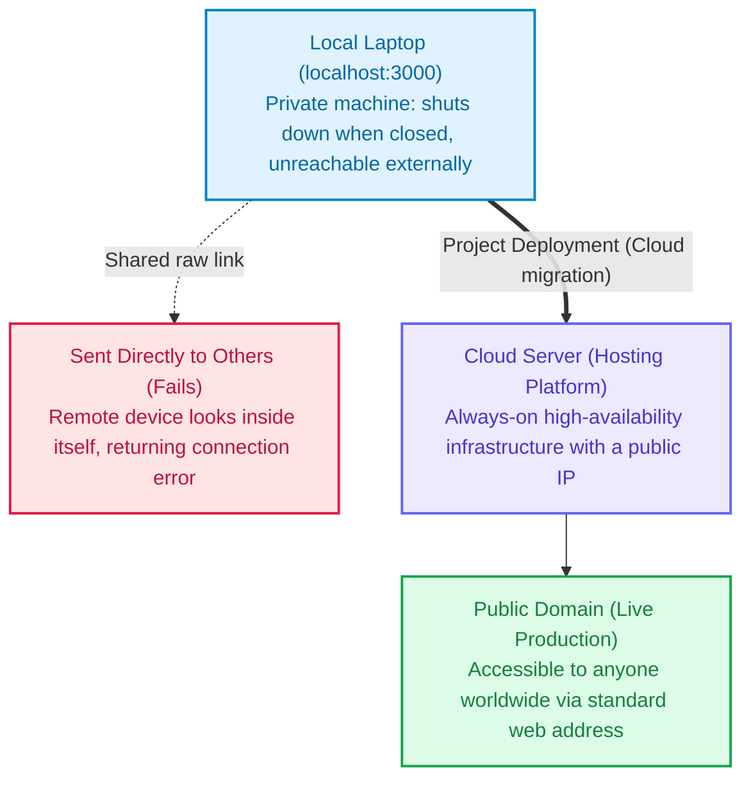
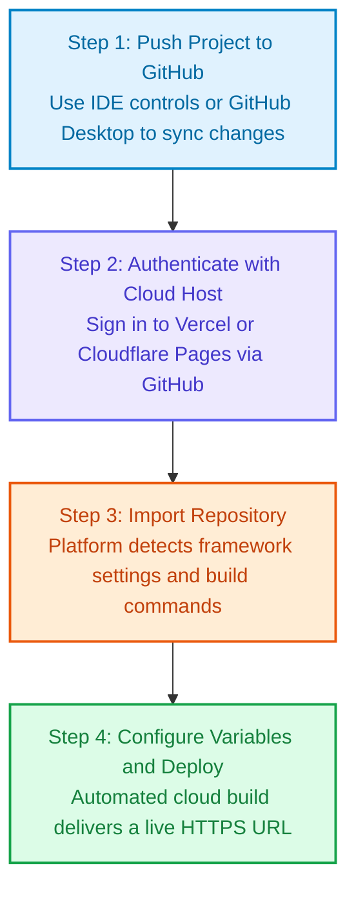

When you open tools like Cursor, Lovable, v0, or Bolt, type in a few clear prompts, and watch a polished budgeting app, personal portfolio, or SaaS prototype materialize within seconds, the sense of momentum is undeniable. Buttons respond smoothly, animations look crisp, and your browser address bar proudly shows an address like `http://localhost:3000`.

Naturally, the first instinct for many creators is to copy this URL and share it with friends, colleagues, or potential users to get immediate feedback.

Moments later, the recipient sends back a screenshot showing a blunt browser error: **This site can’t be reached**.

Testing it on your phone gives the exact same disappointing result. You are left wondering: **"If it runs flawlessly on my laptop, why does nobody else seem able to open it?"**

<!--more-->

This is not a defect in the code generated by AI, nor is it an issue with your friend's internet connection. It is the very first conceptual barrier every builder faces when moving a project from a personal device to the public internet: **the fundamental difference between local execution and production hosting**.

This article skips academic networking theory and focuses on practical architecture to clarify three essential questions:
1. **Why can external devices never connect to your localhost?**
2. **How does a live website actually serve visitors across the globe?**
3. **What is the fastest modern workflow to deploy an AI-generated web project online?**

---

## Understanding What localhost Really Means

To see why others cannot access your link, we need to break down the two main components of that URL: **localhost** and the port number.

### localhost Means "This Device Itself"

In computer networking, every connected device has an identifier. However, **localhost** is a universally reserved hostname across all operating systems. Its definition is straightforward: **"The exact local device that originated the request."**

This implies:
- When you type **localhost** into your laptop browser, the browser requests files from your laptop's own operating system.
- When you send that address to a friend and they click it, their browser searches inside their own device for the running project.
- Because your friend's phone is not running your project environment, the connection promptly fails.

Think of it as leaving a notebook on your desk at home, then texting a colleague across town: "The notes are on the desk, go ahead and read page three." Naturally, looking at their own desk will yield nothing.

### What Does the Number 3000 Mean?

The numbers you frequently encounter, such as `:3000`, `:5173`, or `:8080`, represent **network ports**.

You can picture your computer as an apartment building, and **Port 3000** as apartment number 3000 inside it. The AI development tool starts a local preview server on your machine, temporarily staging your web app inside room 3000 so you can inspect and verify features.

The critical catch: **This entire building exists solely on your private local network, with no public roads leading into it.** The moment you close your laptop lid or terminate the terminal process, room 3000 shuts down completely, becoming inaccessible even to your own browser.

---

## How Real Online Websites Function

To make a website accessible to anyone worldwide at any time, a project relies on three foundational components: **an always-on host server, a human-readable domain name, and cryptographic security**.

### 1. Hosting Server
A personal laptop cannot and should not act as a permanent web server. Instead, you migrate your project to professional cloud infrastructure designed for 24/7 uptime, continuous power, high-speed fiber connectivity, and dedicated cooling.

This process is known as **project hosting**. Once your code is built and served in the cloud, visitors interact directly with the hosting provider, regardless of whether your laptop is awake or powered down.

### 2. Domain Name
Cloud servers communicate through numerical identifiers called IP addresses (such as `76.76.21.21`). Because remembering raw IP addresses is impractical for human visitors, we attach a memorable label called a **domain name**, such as `myawesomeapp.com`.

### 3. Routing and Encryption: DNS and SSL
- **DNS (Domain Name System)**: Operates as the directory of the internet. When visitors enter your domain into a browser, DNS translates that domain into the corresponding server IP address within milliseconds.
- **SSL Certificate**: Denoted by the **https** prefix and the padlock icon in the browser address bar. It encrypts all traffic between visitors and your server, protecting sensitive information and preventing "untrusted site" warnings.

Taking your local project and publishing it onto cloud infrastructure is what the industry refers to as **deployment**.

---

## Common Gotchas When Deploying to the Cloud

When creators publish a project to the cloud for the very first time, they occasionally encounter a blank screen or broken interactive elements. This usually stems from configuration discrepancies between local and production environments:

### 1. Missing Environment Variables
During local development, AI tools frequently place sensitive credentials (such as database connection strings or OpenAI API keys) inside a file named **.env**.

For security reasons, version control systems automatically ignore and hide this file so confidential secrets are not exposed publicly. When your code uploads to the cloud, this file stays behind. Without necessary credentials, your application halts execution, causing a blank screen.

**How to address it**: Navigate to the **Environment Variables** panel in your hosting provider (such as Vercel or Cloudflare Pages) and input each key and its corresponding value manually.

### 2. Development Mode vs Production Builds
On your local machine, your project runs in **Development Mode**. Dev mode is intentionally permissive; it will tolerate minor type inconsistencies or unused variables while still rendering the interface.

In contrast, deploying to production initiates a strict **Production Build**. This acts as a comprehensive quality gate. If the code contains syntax conflicts or missing dependencies, the build process halts and reports an error.

### 3. Single-Page Application (SPA) 404 on Refresh
If your project uses modern client-side routing, navigating between pages works seamlessly while clicking links. However, manually refreshing the page on a sub-route like `/dashboard` may trigger a sudden **404 Not Found**.

This happens because the browser asks the remote server for a physical file named `/dashboard`, which does not exist on disk.

**How to address it**: Enable a rewrite rule in your hosting platform that directs all incoming route requests to the entry file `index.html`, allowing client-side routing to handle page rendering properly.

---

## Four Frictionless Steps to Deploy an AI Project Today

Modern cloud infrastructure eliminates the traditional need to manually provision virtual private servers, configure Linux distributions, or manage command-line utilities. Using developer-friendly platforms such as **Vercel** or **Cloudflare Pages**, you can publish your app visually:

1. **Synchronize Code**: Push your local files to a private or public GitHub repository using your editor's visual interface or GitHub Desktop.
2. **Authorize the Host**: Log in to Vercel or Cloudflare Pages directly using your GitHub credentials.
3. **Import Project**: Select the repository you just synced. The platform automatically detects the underlying framework (such as Next.js, Vite, or React) and configures the default build parameters.
4. **Supply Environment Variables and Deploy**: Enter any external API keys required by your application into the settings panel, then click the **Deploy** button.

Within a couple of minutes, the build completes, and the platform issues a permanent, public HTTPS link (such as `your-project.vercel.app`).

You can now share this URL with anyone, confident that it will load reliably on any device across the globe.

---

## Summary and Next Steps

Securing an active public URL and viewing your app on mobile marks a critical milestone: your prototype has successfully transitioned from an isolated machine into a tangible, shareable product ready for real-world validation.

However, once users begin interacting with your application, you will quickly face another universal challenge:

> "Why does data entered on one phone completely vanish after a page refresh?"
> "Why can different users not see or sync data between each other?"

This leads directly into data persistence and database architecture. In our next article, we will examine **"Why Does Data Disappear on Refresh? Understanding Frontends, Backends, and Databases"** using the same practical, builder-first approach.
