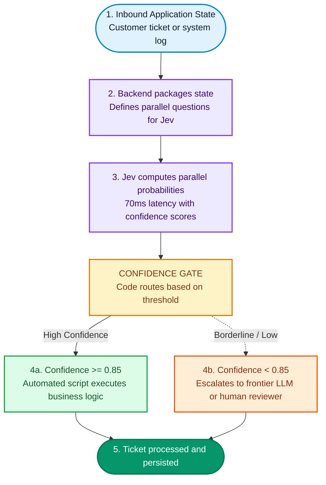

**TypeSafe AI**, founded by former OpenAI researcher and RLHF co-inventor Diogo Almeida, recently unveiled **Jev**. Its defining characteristic boils down to a single sentence: **it generates zero text**.

Hand it a blob of application state or user text, and it will not reply politely, draft an email, or explain its thought process. Instead, it returns pre-defined options paired with calibrated probability distributions (such as `{"billing": 0.08, "technical": 0.85, "sales": 0.07}`).

For software engineers building AI agents and automated pipelines, the pain point is familiar: your code just needs a quick boolean or enum to branch an `if/else`, but you are forced to wait seconds for an LLM to spew tokens, pay for output token overhead, and write brittle regex to catch formatting hallucinations. Jev takes the exact opposite approach: pure decision-making.

This post skips the academic theory and focuses on what matters in production: **where does this actually belong in real systems**, and **what open-source tools can achieve similar results locally today?**

<!--more-->

## In 3 Seconds: How It Differs From Traditional LLMs

Models like ChatGPT, Claude, and Gemini are generative autoregressive engines: they predict the next token one by one. In contrast, Jev is a System One decision model: it calculates **parallel probability distributions** across predefined choices.

| Dimension | Generative LLMs | Jev Decision Model |
| --- | --- | --- |
| **Execution** | Token-by-token sequential decoding | Parallel evaluation over defined candidate slots |
| **Latency** | 2 to 10 seconds per invocation | **70 to 500 milliseconds** |
| **Output Type** | Raw strings requiring parsing & validation | **100% type-safe structured values** |
| **Hallucination Risk** | Can wander outside schema or output invalid values | **Mathematically constrained to defined options** |
| **Pricing** | Expensive input, 3-5x pricier output | **$0.042 / M input tokens**, **output is free** |

Put simply: **if your software only needs an AI decision to branch downstream logic, generative LLMs are slow and wasteful; a decision model gives you a typed dropdown with probabilities.**

## Three Core Primitives: Choice, Score, Noul

Jev exposes a single API endpoint (`POST https://api.typesafe.ai/v1/systemone`). Each request takes an application `state` alongside a collection of `questions`.

Each question belongs to one of three primitives:

1. **Choice (Categorical)**: Selects one best option from a discrete list of categories.
2. **Score (Ordinal Rating)**: Ranks against an ordered list of criteria (e.g., cosmetic issue vs workaround exists vs blocking).
3. **Noul (Boolean Probability)**: Evaluates a yes/no hypothesis and returns a calibrated probability between 0 and 1.

### Request and Response Format

A complete request payload looks like this:

```json
{
  "model": "jev-latest",
  "state": "I was charged twice on my credit card. Please issue a refund for the second transaction.",
  "questions": {
    "department": {
      "type": "choice",
      "instructions": "Which department should handle this ticket?",
      "criteria": {
        "billing": "Charges, invoices, payment refunds",
        "technical": "System crashes, API connectivity issues",
        "sales": "Plan upgrades and enterprise sales"
      }
    },
    "severity": {
      "type": "score",
      "instructions": "How severe is the issue?",
      "criteria": ["Minor / Cosmetic", "Workaround exists", "Blocking issue"]
    },
    "requestsRefund": {
      "type": "noul",
      "instructions": "Is the user explicitly requesting a monetary refund?"
    }
  }
}
```

Jev evaluates all questions in parallel within tens of milliseconds and returns:

```json
{
  "answers": {
    "department": {
      "value": "billing",
      "probabilities": { "billing": 0.88, "technical": 0.07, "sales": 0.05 },
      "confidence": 0.91
    },
    "severity": {
      "value": 2.1,
      "probabilities": [0.12, 0.65, 0.23],
      "confidence": 0.84
    },
    "requestsRefund": {
      "value": true,
      "probability": 0.96,
      "confidence": 0.95
    }
  }
}
```

Because confidence scores are calibrated, your backend code can safely enforce strict routing thresholds.

## 5 Practical Use Cases in Production

Jev cannot write a blog post, but in automated pipelines, it shines:

### 1. High-Speed Agent Tool Routing (Fast Router)
In agent frameworks, deciding whether to invoke a search tool, query SQL, or answer directly usually requires a full Chain-of-Thought step from a frontier LLM, adding 3+ seconds per step.

Using Jev as the L1 triage router:
- 90% of explicit tool dispatch decisions resolve in **100ms**.
- Only ambiguous queries with confidence `< 0.6` fall back to slow reasoning models. Overall agent latency drops drastically.

### 2. High-Throughput Batch Tagging & Data Pipelines
When processing 100,000 error logs, customer tickets, or survey responses:
- Traditional LLMs: hours of processing and prohibitive API costs.
- Jev: at $0.042 per million input tokens with free output, massive log datasets can be categorized, prioritized, and scored in minutes for pocket change.

### 3. Real-Time LLM Output Guardrails
Customer-facing chatbots risk hallucinations, accidental discount promises, or policy violations.
Running a secondary LLM to audit responses doubles user wait times. With Jev's 70-150ms latency, responses can be checked for unauthorized promises or privacy leaks in parallel before streaming to the client.

### 4. Real-Time Game AI & Dynamic Triggers
NPC state machines and game event systems evaluate environmental triggers several times per second.
Sequential LLM latencies break real-time game loops. Jev comfortably handles 10+ evaluations per second. Feeding player health, distance, and inventory as state allows NPCs to sample from patrol, ambush, or retreat distributions without dropping frames.

### 5. Automated Form Verification & Fraud Detection
Free-text notes in checkout or onboarding forms often conceal dispute or fraud risks. Jev computes risk scores and intent probabilities synchronously during form submission, triggering 2FA or human escalation only when necessary.

## Production Flow Architecture

Here is how a decision model sits in an automated pipeline:



## Open-Source Alternatives and Tooling Ecosystem

If you are waiting for Jev early access or require a **100% self-hosted, private open-source stack**, mature open-source tools can deliver this architecture today:

### 1. `system-one-adapter-python` (Official Adapter)
TypeSafe open-sourced a Python wrapper on GitHub ([`typesafe-ai/system-one-adapter-python`](https://github.com/typesafe-ai/system-one-adapter-python)). It wraps local open-source models (running via Ollama or vLLM with Llama 3, Qwen, or DeepSeek) into the exact Choice / Score / Noul interface, making local prototyping straightforward.

### 2. Outlines and Guidance (Constrained Decoding Engines)
For bulletproof JSON outputs on self-hosted infrastructure, **Outlines** and **Guidance** remain industry standards. Rather than relying on prompts, they mask logits at the token sampling level using finite-state machines and context-free grammars. Models cannot physically produce invalid tokens.

### 3. Instructor (Pydantic Extraction)
The popular Python library **Instructor** bridges any commercial or open-source LLM directly into structured Pydantic models with validation hooks and retries.

### 4. ModernBERT and SetFit (Ultra-Fast Local Classifiers)
For fixed-label classification, multi-billion parameter LLMs are often overkill. Hugging Face's **ModernBERT** or few-shot **SetFit** models measure only tens of megabytes, require minimal labeled data, and run inference in **under 10 milliseconds** on commodity CPUs at zero marginal cost.

### 5. Vercel AI SDK Integration
For full-stack TypeScript developers, the Vercel AI SDK provides direct integration with TypeSafe via `experimental_evaluate` and `typeSafeAi.evaluationModel('jev-latest')`, offering native typing for Choice, Score, and Boolean evaluations.

## The Takeaway

- When your task requires **long-form writing, coding, open-ended reasoning, or casual chat**: stick with **generative LLMs**.
- When your task is **routing, filtering, classification, guardrails, or risk scoring**: split the decision lane out to **Jev or open-source constrained engines**.

Letting chat models talk while decision models decide is the cleanest, fastest, and most cost-effective blueprint for modern AI software architectures.
