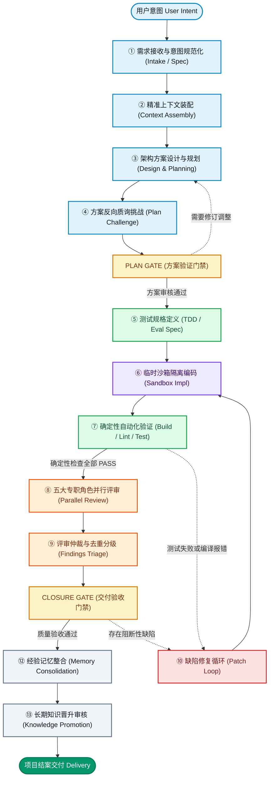
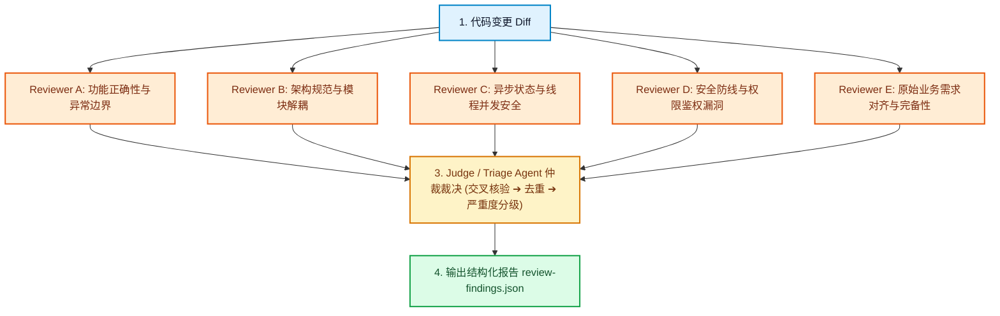
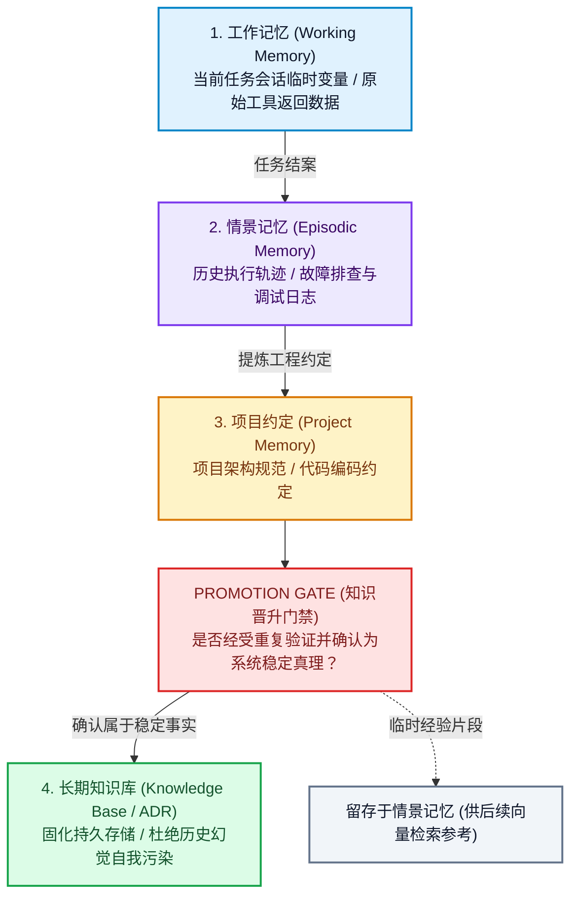

title: 告别 Vibe Coding！Agentic SDLC 完整架构解析：从状态机、验证门禁到热门开源项目实战
description: >-
  深入解析 Agentic SDLC 软件研发全生命周期架构，从 Hook、Skill、MCP 与调度器四维分工，到涵盖 13 个阶段的标准状态机。详析
  LangGraph、OpenHands、E2B、Mem0、PR-Agent 等主流工业级落地组件，确立确定性验证防线与客观信任阶层。
permalink: 2026/08/24/agentic-sdlc-architecture-guide/
translation_key: agentic-sdlc-architecture-guide
translations:
  zh-TW: /2026/08/24/告別-Vibe-Coding！Agentic-SDLC-完整架構解析：從狀態機、驗證閘門到熱門開源專案實戰/
  en: /en/2026/08/24/agentic-sdlc-architecture-guide/
categories:
  - 软件工程
tags:
  - AI
  - Claude
  - Codex
  - 前端开发
  - 软件工程
date: 2026-08-24 14:10:32
updated: 2026-08-29 19:08:22
---

过去一段时间，AI 辅助编程经历了从简单的代码补全到 **Vibe Coding** 的全民狂欢。许多开发者逐渐习惯了“输入 Prompt ➔ AI 吐出代码 ➔ 跑跑看”的直觉操作。在几十行代码的演示 Demo 或练手项目里，这种模式显得轻巧高效；但一旦置身于数万行代码、各业务模块高度耦合的企业级生产项目，这种完全凭感觉的协同方式便会迅速走向崩溃。

一线工程实践中经常上演这类令人崩溃的场景：AI 言之凿凿地宣称彻底修好了某个 Bug，结果改动了 A 模块却直接带崩了 B 模块；拉来五个当前公认最强的大模型做代码审查，模型们交口称赞代码逻辑非常漂亮，一发布上线却瞬间遭遇严重的并发竞态异常；甚至让 AI 自动记录“过往经验”，跑了一段时间后，整个记忆检索库全被它自己早期生成的幻觉信息深度污染。

在严肃的软件工程世界里，研发效能的核心瓶颈从来不是“代码生成的绝对速度”，而是**“软件验证与安全交付的系统确定性”**。要跨越生成速度远超验证能力的这道鸿沟（GenAI Divide），唯一的破局之道就是构筑一套工业级的 **Agentic SDLC（Agent 驱动的软件开发生命周期）**。

<!--more-->

## 四句核心准则：厘清 Hook、Skill、MCP 与调度器的职责边界

许多团队在探索 Agent 自动化研发流程时，最容易陷入的误区就是把所有的系统职责一股脑塞进同一个会话或者一段巨大的 System Prompt 中。在搭建稳健的 Agentic 架构之前，必须清晰界定以下四类核心组件的底层分工：

| 组件类型 | 它真正负责的核心问题 | 本质定位与系统角色 |
| :--- | :--- | :--- |
| **Hook** | **什么时机必须强制触发？** | 生命周期的确定性守卫与拦截器（Deterministic Control / Guard） |
| **Skill** | **遇到这类场景应该如何处置？** | 按需加载的标准化流程与操作手册（Procedures / Instructions Bundle） |
| **MCP** | **需要调用什么外部能力与系统数据？** | Agent 的 I/O 总线与能力协议层（Capability Layer / I/O Bus） |
| **Orchestrator** | **当前处于哪个阶段，下一步流向哪里？** | 全局状态机与流程编排中枢（State Machine / Workflow Engine） |

这一层边界划分是架构设计的基石。以 Claude Code 官方的系统设计哲学为例，Hook 的定位就是在生命周期的确定性切面（例如 **SessionStart**、**PreToolUse**、**PostToolUse**、**TaskCompleted**、**Stop**、**SessionEnd**）自动执行，用来注入不可逾越的规则检查与危险命令拦截；而 MCP（Model Context Protocol）本质上是模型与外部系统交互的标准 I/O 总线，提供规范化的 Tools、Resources 与 Prompts 协议，绝对不能将它与流程编排本身混为一谈。

真正掌控全局研发走向与逻辑收敛的，是底层的 **全局状态机（Orchestrator）**。

---

## 13 阶段全生命周期状态机与主流开源落地实践

一套成熟严谨的 Agentic SDLC 架构，绝非单向线性的无脑输出，而是由意图前置收敛、刚性验证门禁、多角色并行评审以及记忆防污染闭环共同构成的 13 阶段标准化状态机：

以下针对这 13 个生命周期阶段，逐一深入解析其核心使命、Hook/Skill/MCP 联动机制，以及当前工业界采用的主流开源解决方案：

---

### 第一阶段：需求接收与意图规范化 (Intake & Intent Normalization)

* **核心使命**：将人类口语化、含糊发散的自然语言诉求（例如“写个积分扣减 API”），收敛转译为边界严密、具备强契约约束的结构化需求文档。
* **对应机制**：
  * **Hook**：在 `PromptSubmit` 切面自动注入项目全局工程规范与接口标准。
  * **Skill**：加载 `intent-classification` 与 `spec-normalization` 技能包。
  * **MCP**：依托 Issue Tracker MCP 自动拉取 GitHub Issue 或 Jira 工单。
* **主流落地方案**：
  * **`Pydantic` / `Instructor`**：利用结构化输出校验框架，强制大模型将原始意图解析为 100% 满足 JSON Schema 的 `requirements.json`。
  * **GitHub Issues / Linear API**：自动化抽取 Issue 中的详细描述、标签及预设验收标准，作为下游工作流的标准输入源。

---

### 第二阶段：精准上下文装配 (Context Assembly)

* **核心使命**：从庞杂的代码库、多层级记忆库与业务文档中，精准抽取出当前任务所必需的核心信息，严禁无效文件无度塞爆上下文窗口。
* **对应机制**：
  * **Hook**：在 `SessionStart` 与 `PreCompact` 切面自动挂载核心架构约定与会话工作记忆。
  * **Skill**：调用 `context-builder` 与 `code-retrieval` 检索技能。
  * **MCP**：接入 Memory MCP、Database MCP 以及文档检索 MCP。
* **主流落地方案**：
  * **`Repomix` (yamadashy/repomix)**：将代码库紧凑打包为结构清晰、附带目录索引树的 AI 友好格式。
  * **`ast-grep` / `Tree-sitter`**：依托抽象语法树（AST）实现函数定义、调用链路与接口类型的精准语法级定位，杜绝粗暴的字符模糊匹配。
  * **`Mem0` (mem0ai/mem0) / `agentmemory`**：混合向量搜索与图数据库结构，定向检索该模块历史故障排查日志与核心架构决议。

---

### 第三与第四阶段：架构方案设计、执行规划与反向质询 (Design, Planning & Plan Challenge)

* **核心使命**：严密编写实现技术方案 `plan.md`，并引入独立的 Critic Agent 充当“魔鬼代言人（Devil's Advocate）”对方案展开全方位压力质询，直到完全通过 **PLAN GATE** 方案验证门禁。
* **对应机制**：
  * **Skill**：协同调用 `planning-skill` 与 `plan-review-skill`。
  * **Gate 机制**：未通过质询答辩的方案强制退回第三阶段重新设计，严禁未经规划直接上手写代码。
* **主流落地方案**：
  * **`LangGraph` 状态图**：利用 LangGraph 编排 Planning ➔ Challenge 循环图节点，并配置 Human-in-the-loop 人工审批拦截点。
  * **自动化生成 Mermaid 架构图**：要求 Agent 在 `plan.md` 中以 Mermaid 图表直观展示系统架构与数据流变更，便于团队快速核验。

---

### 第五阶段：测试驱动与评测规格定义 (Test & Eval Specification)

* **核心使命**：不折不扣地践行测试驱动开发（TDD），在编写任何核心业务实现之前，必须先落成可独立运行的自动化测试用例与验收指标（Done-when Criteria）。
* **对应机制**：
  * **Skill**：加载 `tdd-design` 与 `eval-spec-skill` 评测定义流程。
* **主流落地方案**：
  * **`Vitest` / `Jest` / `Pytest`**：优先构造必定运行失败的基线测试用例（红灯阶段）。
  * **`SWE-bench` 模式**：制定标准化的 Fail-to-Pass 测试集列表，将产品验收标准无损转化为自动化测试脚本。

---

### 第六阶段：临时沙箱隔离实现 (Implementation in Ephemeral Sandbox)

* **核心使命**：在经过安全隔离的沙箱环境中完成代码编写与调试，严防恶意指令或意外操作直接破坏宿主机与公共环境。
* **对应机制**：
  * **Hook**：在 `PreToolUse` 切面拦截敏感文件修改（如篡改 `.env`）或危险的高危删除命令。
  * **Skill**：调度 `implementation-skill` 核心编码流。
* **主流落地方案**：
  * **`E2B` (e2b-dev/E2B)**：专为 Agent 打造的毫秒级 MicroVM 微虚拟机沙箱，提供完全沙盒化的 Linux 环境，支持系统状态快照与秒级重置。
  * **`All-Hands-AI/OpenHands`**：沙箱化自主编码平台，具备完善的子代理委派与受限终端指令执行能力。
  * **`paul-gauthier/aider`**：终端结对编程工具，提供高效精准的 Git 自动化提交与代码变更追踪。

---

### 第七阶段：确定性验证第一防线 (Deterministic Verification)

* **核心使命**：**【第一道安全防线】** 自动化执行编译构建、静态检查、类型推导、单元测试与端到端测试，以非黑即白的确定性工程工具碾碎所有低级语法与逻辑缺陷。
* **对应机制**：
  * **Hook**：在 `PostToolUse` 或 `TaskCompleted` 切面自动拉起全套编译检查与测试脚本。
  * **Skill**：执行 `deterministic-verification-skill`。
* **主流落地方案**：
  * **编译与类型审查**：`TypeScript (tsc)`、`Ruff`、`Mypy`、`Biome`。
  * **自动化测试矩阵**：`Vitest`、`Pytest`、`Playwright`（UI 端到端交互验证）。
  * **CI 本地测试容器**：通过 `act` 工具直接在本地机器模拟并运行 GitHub Actions 完整流水线。

---

### 第八与第九阶段：多角色并行评审与仲裁去重 (Parallel Review & Triage)

* **核心使命**：**【第二道安全防线】** 只有当确定性验证全部 PASS 之后，才拉起五个不同视角的专职评审模型进行并行交叉审查，最后由 Judge Agent 完成证据核实与去重仲裁。
* **对应机制**：
  * **Orchestrator**：并发唤起不同的专职 Reviewer 子进程。
  * **Skill**：按角色注入不同的代码审查策略指南。
* **主流落地方案**：
  * **`qodo-ai/pr-agent`**：深度扫描 PR 代码 Diff，专项排查安全漏洞隐患、架构坏味道与测试边界缺失。
  * **`Open Policy Agent (OPA)`**：以声明式策略即代码（Policy-as-Code）全自动阻断不符合企业合规标准的代码提交。
  * **`LLM-as-a-Judge` 仲裁框架**：对多份评审结果进行证据比对，剔除误报，生成规整的 `review-findings.json`。

---

### 第十与第十一阶段：缺陷修复补丁循环与结案门禁 (Patch Loop & Closure Gate)

* **核心使命**：若评审仲裁识别出阻断性缺陷，流程自动进入修复补丁循环并重跑确定性测试；直至全链路无缺陷，方可通过 **CLOSURE GATE** 结案门禁。
* **对应机制**：
  * **Hook**：在 `Stop` 切面强制断言测试结果，若有阻断性缺陷则强行拦截结束事件。
* **主流落地方案**：
  * **`Temporal` (temporalio/temporal)**：工业级分布式状态编排引擎，支持细粒度的重试预算管理（Retry Budget）与工作流回滚补偿。
  * **GitHub 分支保护门禁**：与 Branch Protection Rules 强力集成，强制所有状态检查全部绿灯才开放合并。

---

### 第十二与第十三阶段：分层记忆沉淀与知识晋升 (Memory Consolidation & Knowledge Promotion)

* **核心使命**：任务交付后，彻底清理易逝的临时会话上下文，将高质量排错记录归档入情景记忆；唯有在多个独立会话中反复得到印证的稳定真理，才允许通过 **PROMOTION GATE** 沉淀至长期知识库。
* **对应机制**：
  * **Hook**：在 `SessionEnd` 切面自动触发记忆结构化抽取与知识晋升审查。
* **主流落地方案**：
  * **`Mem0` / `agentmemory`**：分层记忆存储系统，支持动态关联更新与衰减遗忘。
  * **Git ADR 架构决议库**：将重大架构改动以 Markdown 格式固化沉淀至 `docs/adr/` 目录，供所有协作 Agent 随时按需回溯。

---

## 两条不可逾越的工程铁律

在整套 Agentic SDLC 体系中，有两个至关重要的设计原则直接决定了整个软件工程产线的稳定性底线：

### 铁律一：执行顺序决定系统生死，先“确定性验证”再“大模型评审”

**严禁在代码甚至无法顺利通过编译或类型检查的前提下，就盲目唤起五个昂贵的大模型去进行代码审查。**

* **步骤 ⑦ 确定性验证**：Build 编译、Lint 格式检查、Typecheck 类型推断、Unit Test 单元测试，是成本极低、完全零幻觉的非黑即白第一道防线。
* **步骤 ⑧ 角色化模型评审**：唯有在确定性基线全部绿灯通过之后，才值得耗费宝贵的 Token 额度去深入推敲业务边界与架构合理性。

### 铁律二：多模型投票共识绝不等于事实真相（Ground Truth）

在软件工程自动化闭环中，**模型群体之间的盲目附和绝不代表代码逻辑的客观正确**。系统的证据置信度必须严格遵循以下客观层级：

> **客观置信度层级**：**可独立运行的测试用例** ＞ **确定性静态分析报告** ＞ **原始需求规格契约** ＞ **单模型深度推理** ＞ **多模型投票共识**

**自动化测试套件实际跑通的硬核物理证据，其权威性永远高于 AI 在自然语言中宣称的任何自信。**

---

## 结构化产物证据链（Artifact Layer）

在不同 Agent 角色与各个流程节点之间，**坚决杜绝依赖模糊含混的自然语言口头传递**（例如“上一个 Agent 告诉我它已经做完了”）。

跨阶段的流转协同必须全量基于标准化的结构化产物文件（Artifacts）：

* **requirements.json**：经过第一阶段规范化后确立的接口契约与验收边界。
* **plan.md**：经过答辩质询通过的技术实现方案与架构选型说明。
* **test-report.json**：携带真实 Exit Code、执行耗时与代码覆盖率的确定性测试报告。
* **review-findings.json**：多角色审查员经去重仲裁后输出的问题缺陷清单与严重度标记。
* **git-diff** / **commit-sha**：明确的代码变更集与不可篡改的版本快照哈希。

下一阶段的 Agent 永远是以**上一阶段产出的结构化产物**作为直接输入，从而彻底杜绝长上下文累积带来的信息衰减与语义畸变。

---

## 结语：将计算 Token 真正转化为“工程确定性”

从凭感觉编码的 Vibe Coding 进化为工业级的 Agentic SDLC，本质上是软件工程严谨主义的理性回归。

我们不再指望“某一个无所不能的超级大模型在黑盒里闭关思考 40 分钟、编码 40 分钟，最后自己审查自己 20 分钟”；而是将充裕的计算资源科学配置于：

> **端到端流水线**：**架构规划 (Architect)** ➔ **方案质询 (Plan Critics)** ➔ **沙箱隔离开发 (Sandbox)** ➔ **确定性自动化测试 (Deterministic Tests)** ➔ **多视角并行评审 (Parallel Reviewers)** ➔ **仲裁去重 (Judge Triage)** ➔ **质量验收门禁 (Acceptance Gate)**

当**状态机（State Machine）**锚定了前行方向、**验证门禁（Gate）**守住了工程底线、**结构化证据链（Artifacts）**搭建起无损流转通道，AI 才能真正从一个充满随机性与幻觉的代码生成器，脱胎换骨为值得团队托付核心业务的工业级软件研发流水线。
