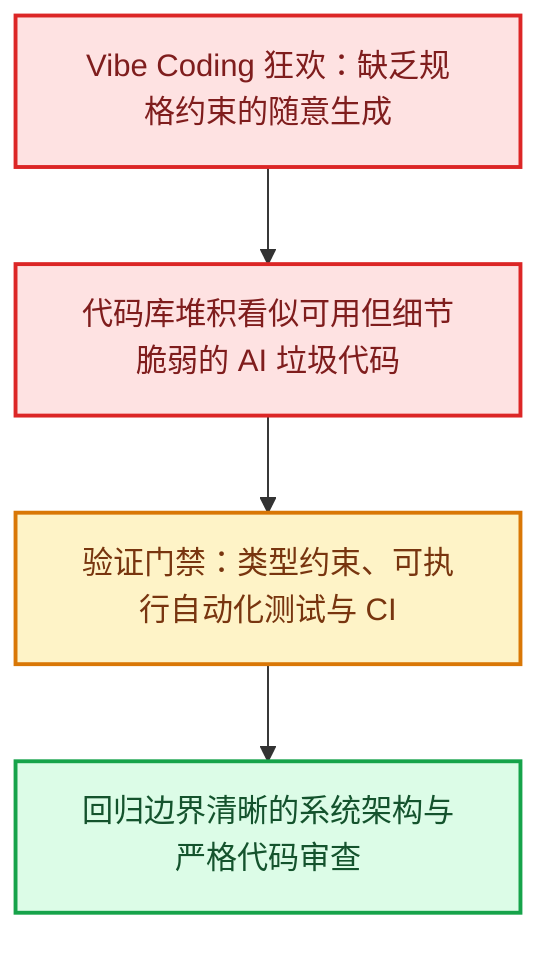

当 Andrej Karpathy 在社交媒体上抛出 **Vibe Coding**——“只要感觉对了就直接跑，甚至不需要看一行代码”——这一概念时，整个科技圈瞬间陷入了狂欢。社交平台上到处充斥着“完全零基础的新手利用周末靠 Prompt 搓出一个完整 App”的创富神话，随之而来的，是铺天盖地的“软件工程师已死”、“底层代码打字员即将全面失业”的激进论调。

然而，当这股热潮真正切入生产级系统与真实团队开发时，社区讨论与行业调查却展现出了完全不同的另一面。在 2025 年 Stack Overflow 开发者调查中，对 AI 输出结果持怀疑态度的开发者数量甚至超过了信任者；大家最普遍的痛点高度一致：“给出的方案看似能跑却总差一口气”，以及“花在排查与调试生成代码上的时间反而远超预期”。

工程师确实省去了不少手工编写样板代码的繁琐，但痛苦的重心却迅速转移到了链路的另一端：**AI 可以在数秒内吐出巨量变更，而人类团队依然必须耗费极其高昂的时间去审查、理解、运行验证，并收拾各种隐蔽的边界故障。**生成代码的边际成本已经趋近于零，但软件工程的验证与维护成本却从未降低。

<!--more-->

## 1. AI Slop 与 PR 审查地狱：公地悲剧在代码库重演

在过去一年多的技术社区讨论中，一个被频繁提及的词汇是 **AI Slop**（AI 生成的代码垃圾）。

在许多一线的开发团队里，资深工程师与技术负责人纷纷吐槽“代码审查陷入严重拥堵”：

- **看似可用，架构脆弱（Technically correct, but architecturally wrong）**：AI 生成的代码通常能顺利走通基础的正常流程（Happy Path），但内部往往塞满了层层毫无意义的包装器（Wrappers）、被静默吞掉的异常捕获（Swallowed Exceptions）、彼此重复却互不连通的业务逻辑，以及大量看似高大上实则空洞的“伪抽象”。
- **代码审查者的公地悲剧**：提交 PR 的人只需敲击几次回车，甚至在未通读上下文的情况下，就能在几秒内发起一个包含 800 行代码的 Pull Request。然而审查者却不得不耗费巨大的认知负荷，逐行去甄别那些潜藏在深处的异步竞态（Race Condition）、内存泄漏以及权限安全死角。
- **系统维护信心的逐步瓦解**：一旦代码库被大量未经充分推敲的生成代码渗入，团队便会丧失对底层架构的掌控感，根本不敢轻易重构既有模块，长期的维护代价呈指数级上升。

这些现实痛点无一不在揭示同一个铁律：**生产代码变得极其廉价，但建立系统信任与工程验证依然高度依赖人类的工程智慧。**非营利科研机构 METR 在 2025 年针对 16 位深度熟悉大型开源项目的资深开发者开展了一项随机对照实验，结果显示：在当时的成熟代码库场景下，使用 AI 工具反而让受试者的任务完成速度平均变慢了 19%。研究团队也客观指出，该结论受限于当时的特定工具版本、任务设定与样本范围，不能一概而论地推广到所有开发场景。

但这一研究给行业敲响了警钟：**AI 辅助研发绝不等于单纯追求代码行数的吞吐，可执行的证据与严谨的审查才是核心防线。**

## 2. 初级工程师断崖：缺乏真实练习场，未来的 Senior 从何而来？

在各大开发者论坛与求职板块中，另一个引发全行业广泛焦虑的命题被称为 **The Junior Developer Cliff（初级工程师断崖）**。

传统软件工程的人才培养模式，本质上遵循“在基础填坑中积累直觉”的梯队路径：
新人从编写基础样板代码、排查微小的业务缺陷、补充底层单元测试逐步起步。正是这数千小时看似低效的“手写代码”历练，帮助工程师在潜意识里建立起对内存模型、并发线程调度、边界异常以及网络延迟的敏锐嗅觉。

如今，随着企业普遍期望借助 AI 吸纳初级编码、基础测试与文档编写等日常工作，社区也产生了一个无法忽视的担忧：如果初级任务被大幅压缩，新人究竟该去哪里积累调试经验与系统级判断力？这并不是某些极端自媒体宣扬的“公司明天就只留一个架构师带一群 AI 智能体”，而是一个正在深刻重塑软件工程教育与团队梯队的结构性命题。

这就引出了行业最深层的矛盾：
**如果所有底层入门任务都被 AI 工具接管，新手究竟该如何沉淀出足够的架构直觉与批判性思维，从而在未来成长为能够一眼看穿 AI 幻觉的资深架构师？**

一个越来越明确的共识是：**初级工程师的角色定位必须随生产力工具主动演进。** 新人绝不能将自己局限为“语法打字员”，而是需要更早地学会定义规格契约、圈定测试边界，并对 AI 交付的产物进行深度的行为级审查与质量把关。

## 3. 无聊技术的强势逆袭：为什么 Boring Tech 在 AI 时代大获全胜？

回看过去几年，技术圈曾极其推崇过度工程化：微前端、层层嵌套的几十个微服务、复杂的动态元编程框架以及眼花缭乱的分布式多级缓存。

然而到了 2026 年，**Choose Boring Technology（选择无聊技术）**的工程哲学却迎来了强势逆袭。背后的驱动力非常现实：越是成熟、经久不衰的技术组件，其社区文档越完备、故障模式越收敛、真实代码案例越海量，无论人类工程师还是 AI 代理，理解与验证起来都远比新兴小众框架更加精准可靠。

### 上下文窗口的物理极限
当 AI 智能体去处理分散在几十个独立仓库中的复杂微服务时，极易因跨服务链路过长而丢失全局语境。相比之下，边界清晰、高内聚的**单体架构（Monolith）**，往往更容易向模型提供完整、紧凑的依赖上下文；当然，过于庞大的单体同样可能挤爆上下文空间，核心关键依然在于模块职责的严谨划分。

### 凌晨三点故障排查的可预测性
Postgres、SQLite、标准 SQL 查询、结构简单的 REST/RPC 接口以及经典的服务端渲染（SSR），正重新成为众多技术团队构建新系统的首选。这并非拒绝技术创新，而是当代码越来越多地由 AI 协同生成时，工程师在深夜排查故障时，更需要**清晰透明的日志流、完善成熟的排错工具，以及完全可预测的异常行为模式**。

## 4. 验证即一切：测试驱动开发（TDD）与类型系统的黄金时代

极限编程倡导者 Kent Beck 曾通过实际案例展示如何借助 TDD 来有效约束 AI 的发散行为；知名开发者 Simon Willison 也明确强调，在使用编码代理时，自动化测试已经不再是可选项，而是绝对不可或缺的前置基石。更本质的逻辑在于：**AI 从未消灭测试，反而让可执行的规格契约、自动化测试套件以及人工验收走到了软件工程的最前台。**

当代码生成成本无限趋近于零时：
- **强类型系统（TypeScript、Rust、Go）** 能够在编译阶段就前置拦截掉绝大部分低级类型漂移与接口不兼容问题，成为保障代码健壮性的第一道静态防火墙。
- **自动化测试矩阵（Unit / Integration / E2E）** 不再只是应付代码覆盖率报表的指标，更是人类向 AI 准确传达系统行为预期的核心载体；当然，测试并不能涵盖所有问题，形式化规格定义、代码审查与真实的交互验收同样不可偏废。
- **严格的 CI/CD 质量门禁** 承担起全天候的自动化守门人职责。任何未通过静态检查、类型编译与全量测试用例的提交，坚决不得并入主干分支。

## 5. 独立开发者的超级杠杆：一人军团的真正崛起

尽管多团队协作在 PR 审查与研发流程上面临新的阻力，但对于**独立开发者（Indie Hackers）**与小型敏捷团队来说，当前却迎来了前所未有的生产力杠杆跃迁。

一位具备深厚系统设计思维的工程师，现在能够依托规范严谨的 AI 工具链，以极高的效率打通数据层建模、前后端开发、自动化测试用例编写与云端基础设施部署等全链路环节。

这其中的决定性分水岭在于：
**你究竟是放任 AI 在没有边界的自由画布上天马行空地乱画，还是为它铺设了一整套包含强类型约束、测试门禁与标准化状态机的工程铁轨？**

在具备明确规格说明与闭环验证流程的前提下，个人的开发产能可以被数倍放大；而一旦丧失了工程纪律的约束，肆意膨胀的代码产出量只会以更惊人的速度转化为吞噬项目的技术债务。

## 结语：软件工程从未死亡，褪去的只是机械击键的表象

站在当下的时间节点复盘这场波澜壮阔的浪潮，我们能够看清一个事实：**软件工程从未死亡，死去的只是低思考密度的代码搬运与机械打字。**

当写代码的门槛被彻底抹平，软件研发终于回归到它最硬核、最迷人的本源——**洞察真实业务的不确定性、界定清晰的系统模块边界、在复杂的架构权衡中做出最优技术取舍，并为整个系统的确定性、健壮性与长期演进负起终极责任。**

未来的卓越工程师，衡量其身价的标准绝非“每分钟能输出多少行代码”，而是“能否将混沌复杂的现实需求，拆解并构造成一套优雅、稳健、可自动化验证的高可靠系统”。

## 数据来源与扩展阅读

- [Stack Overflow 2025 开发者调查：AI 工具使用、信任度与常见痛点](https://survey.stackoverflow.co/2025/ai)
- [METR：2025 年 AI 对资深开源开发者生产力影响的随机对照实验](https://metr.org/blog/2025-07-10-early-2025-ai-experienced-os-dev-study/)
- [METR：2026 年后续研究设计更新与局限性说明](https://metr.org/blog/2026-02-24-uplift-update/)
- [Kent Beck：Augmented Coding: Beyond the Vibes](https://kentbeck.com/summaries/augmented-coding-beyond-the-vibes/)
- [Simon Willison：First run the tests](https://simonwillison.net/guides/agentic-engineering-patterns/first-run-the-tests/)
