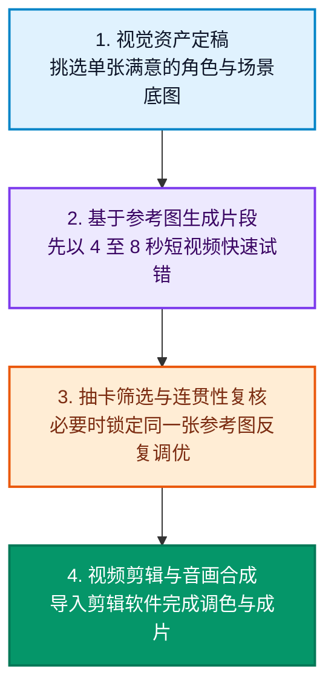

步入 2026 年，市面上的 AI 生图与视频生成模型如雨后春笋般涌现。对于创作者与工程师而言，当下最核心的困扰往往不是“谁是理论最强模型”，而是在繁杂的定价策略与能力割裂面前，**如何根据具体的业务场景与预算，挑选出最合适的工作流组合**。

本文结合权威测评机构的真实盲测数据、各大主流模型的官方定价以及实际落地生产管线，为你梳理出一份清晰易懂的选型参考指南。

<!--more-->

## 先读懂盲测天梯榜，但切勿陷入唯分数论

以权威 AI 评测平台 [Artificial Analysis 图像盲测排行榜](https://artificialanalysis.ai/image/leaderboard/text-to-image) 在 2026 年 8 月 29 日的公开数据为例，当前头部阵营梯队如下：

| 竞技场排名 | 模型名称 | Elo 盲测得分 | 官方参考价格 |
| :---: | :--- | :---: | :--- |
| 1 | **GPT Image 2 high** | 1,370 | 每千张约 211 美元 |
| 2 | **MAI-Image-2.6 Preview** | 1,351 | 商业定价尚未公开 |
| 3 | **Reve 2.1** | 1,323 | 每千张约 200 美元 |
| 4 | **Nano Banana 2** | 1,321 | 1K 分辨率每千张约 67 美元 |
| 6 | **MAI-Image-2.5** | 1,303 | 每千张约 48.1 美元 |

盲测 Elo 分数能够客观反映大众审美对画面综合质感的偏好，但在真实业务场景中，几十分的差距在普通画面上往往很难肉眼分辨。实际选型时，更需重点考量画风契合度、提示词遵从度、局部重绘编辑能力以及商业授权条款。

## AI 生图工具核心场景定位速查

| 核心业务场景 | 推荐首选工具 | 选型核心理由 |
| :--- | :--- | :--- |
| 复杂构图、精准指令排版与广告级画面 | **GPT Image 2** | 对长篇 Prompt 与多主体空间关系的理解力极强，但单次调用成本偏高 |
| 批量并发生成、程序化 API 串接与快速打样 | **Nano Banana 2** | 质量与单价平衡出色，1K 规格输出单张仅约 0.067 美元 |
| 原画插画、电影级光影质感与社媒宣发封面 | **Midjourney** | 艺术风格化一致性极佳，非常适合项目前期快速确立视觉基调 |
| 海报设计、带字排版与招牌字体渲染 | **Ideogram 4** | 字体渲染与复杂排版表现长期保持稳定，但正式宣发前仍需人工校对 |
| 商业 Logo、矢量图标与可二次编辑 SVG | **Recraft V4.1 Vector** | 原生直接输出标准矢量路径，API 调用成本单张约 0.08 美元 |
| 本地私有化部署与深度控制工作流 | **FLUX.2 dev 或 klein** | 适合本地工作站私有化部署调优；max、pro 与 flex 主要为云端商业 API |

使用中需格外注意版权边界：[Recraft 免费版方案](https://www.recraft.ai/pricing?tab=api) 生成的图片版权归 Recraft 官方所有，不可直接用于商业落地项目。而在选用 FLUX.2 时，也应提前分清本地部署版与云端托管 API，切勿混淆硬件显存要求与云端充值预算。

## AI 视频生成工具如何精准切入

评估视频生成工具时，首要法则在于区分“文生视频（T2V）”与“图生视频（I2V）”，以及模型是否原生具备音视频联合合成能力。不同赛道的分数无法横向生搬硬套。

| 盲测竞技分类 | 2026-08-29 领跑标杆 | 最佳适配场景 |
| :--- | :--- | :--- |
| 文生视频（含原生环境音效与对白） | **万相（Wan 3.0）** | 从零开始构建单一镜头，画面动效与环境声音一次性同步完成 |
| 图生视频（含声音） | **MiniMax H3 Max（fal 深度微调版）** | 已有确定的角色或产品立绘，需最大限度保留主体特征与动作自然度 |
| 文生 / 图生视频（纯画面无声） | **Gemini Omni Flash** | 极致追求画质渲染精细度与出片速度，音频后期交由专业音效库处理 |

完整动态天梯可参阅 [Artificial Analysis 图生视频榜](https://artificialanalysis.ai/video/leaderboard/image-to-video) 与 [文生视频榜](https://artificialanalysis.ai/video/leaderboard/text-to-video)。若你的项目极其重视角色形象与面部连贯性，推荐以**快手可灵（Kling）**或 **Runway** 的图生视频为起点；若追求一体化影音直出，则可优先测试 MiniMax、Wan 或 Gemini。

## 经过实战验证的四步高效落地流水线

这套工作流是通用最佳实践，而非死板教条。对于不需要固定主角的空镜风光或抽象转场，直接使用文生视频更为轻便；而一旦涉及叙事剧情与特定角色，图生视频的稳定性显著优于纯文本描述。编写 Prompt 时应以动作幅度和运镜轨迹为主，辅助以必要的光影与服装特征。

## 每月 30 美元预算的实战黄金组合

在不计税率与汇率波动的基准下，独立创作者与小团队可以采用如下预算配置策略：

| 核心用途 | 推荐方案 | 每月预算 |
| :--- | :--- | :---: |
| 核心主视觉与风格概念图 | **Midjourney Basic** | 10 美元 |
| 动态短视频生成 | **Runway Standard** | 15 美元 |
| 精准局部重绘与批量打样 | **Nano Banana 2 API** | 5 美元按量充值 |
| 后期音画剪辑与压制 | **剪映或 DaVinci Resolve 免费版** | 0 美元 |
| **每月合计** |  | **30 美元** |

Midjourney Basic 方案每月提供 200 分钟快速出图时长（不包含无限慢速生成）；Runway Standard 月付订阅为 15 美元，全部点数用于 Gen-4.5 时可生成约 1 分钟成片；Nano Banana 2 在 1K 分辨率下单张仅约 0.067 美元，5 美元预算足以支撑超过 70 张高清渲染图输出。

若项目更偏向纯视频产出，完全可以将 Midjourney 的 10 美元预算挪至视频平台，改由 Nano Banana 2 负责前期的底图打样。注意现行 Runway 官方已停止向新用户开放 **Unlimited** 方案，高阶方案已调整为每月 95 美元的 **Max**，因此制定预算时切勿再引用陈旧教程中的“76 美元无限畅跑”。

## 决策总结：不同诉求的最佳切入路径

- **极致追求复杂语义与排版遵从**：果断选用 **GPT Image 2**。
- **高并发、低成本与工程化接入**：首选 **Nano Banana 2** 或 **MAI-Image-2.5**。
- **卓越的艺术质感与概念探索**：首选 **Midjourney**。
- **UI 界面与商业标识矢量图**：首选 **Recraft V4.1 Vector**。
- **保证多镜头角色一致性**：坚持单图定稿，再配合**快手可灵（Kling）**或 **Runway** 的图生视频管线。
- **追求影音一体化直出**：尝试 **MiniMax H3**、**万相（Wan 3.0）** 或 **Gemini Omni Flash**。

天梯榜单与参数版本日新月异，但科学的选型逻辑始终如一：**先明确最终交付的商业成果，再用小额预算在受限管线中跑通闭环**，这远比盲目追逐单个模型的纸面榜单名次更有生产力。

---

### 官方资料与延伸阅读

- [Google Gemini API 定价体系说明](https://ai.google.dev/gemini-api/docs/pricing)
- [Midjourney 官方各方案权益对比](https://docs.midjourney.com/hc/en-us/articles/27870484040333-Comparing-Midjourney-Plans)
- [Runway 官方套餐选择指南](https://help.runwayml.com/hc/en-us/articles/21664961171475-Which-plan-is-right-for-me)
- [FLUX.2 各发行版本深度概述](https://docs.bfl.ai/flux_2/flux2_overview)
- [选模型别再凭感觉！Artificial Analysis 完整指南](/2026/08/17/選模型別再憑感覺！Artificial-Analysis-完整指南：從品質、速度到成本，情境化挑出最適合你的-AI/)
