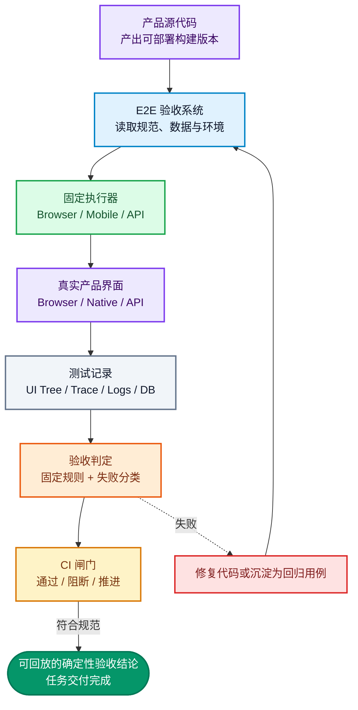
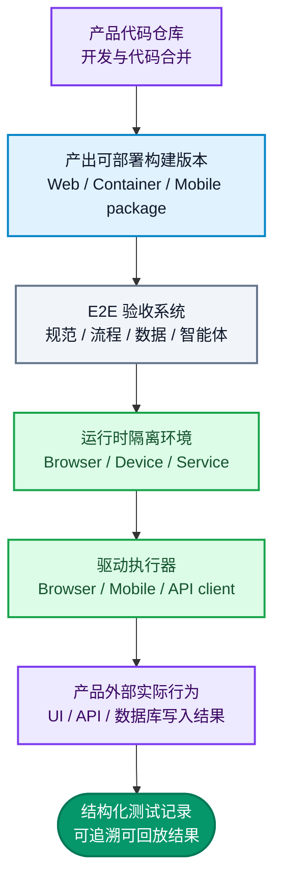
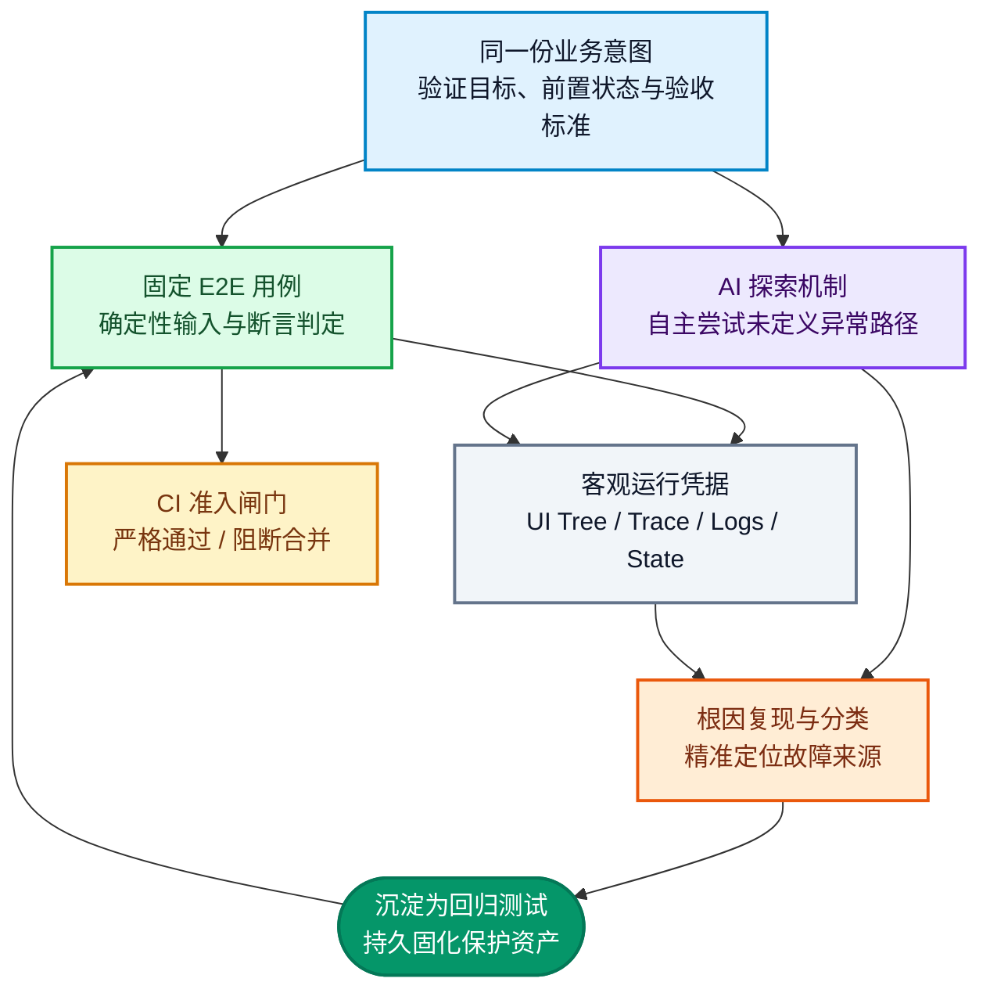
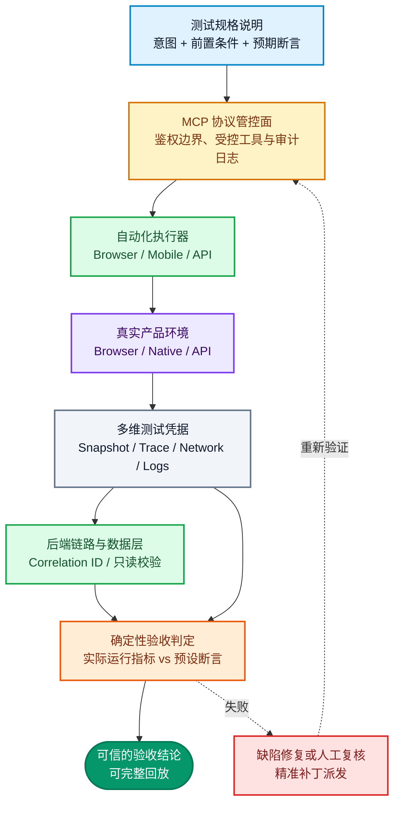

title: AI 时代，E2E 测试该如何升级？从固定脚本到 AI-native Harness
description: >-
  当 AI 以前所未有的速度编写代码，测试验收便成为新瓶颈。本文以通用的 E2E Harness
  架构，深入探讨如何实现代码隔离、固定验收基准、驱动智能体自主探索，并将每一次失败转化为可回放的回归测试用例。
permalink: 2026/09/01/e2e-testing-agentic-sdlc-ground-truth/
translation_key: e2e-testing-agentic-sdlc-ground-truth
translations:
  zh-TW: /2026/09/01/AI-時代，E2E-測試要怎麼升級？從固定腳本到-AI-native-Harness/
  en: /en/2026/09/01/e2e-testing-agentic-sdlc-ground-truth/
categories:
  - 软件工程
tags:
  - AI
  - E2E 测试
  - E2E Harness
  - Playwright
  - AI Agent
  - Agentic SDLC
date: 2026-09-01 10:30:24
updated: 2026-09-01 20:24:39
---


单个 E2E 测试用例只负责跑通特定业务场景；**E2E Harness（端到端工程化验收系统）则负责从构建版本交付、测试数据准备、环境编排、断言判定到失败归因反馈的整条闭环链路。**

当 AI 让业务迭代与代码生成的速度成倍提升时，隐蔽缺陷、用例维护成本以及最终的验收工作也随之激增。因此，真正需要升级的绝非自动化脚本的堆叠数量，而是整套验收系统的**物理边界、客观运行记录与闭环反馈机制**。

本文核心聚焦于一个工程命题：在编程智能体（Coding Agent）能够源源不断提交代码并修改系统的今天，E2E Harness 该如何架构，才能让固定测试成为把守 CI 流水线的钢铁闸门、让探索智能体精准挖掘未知死角，并将每一次报错转化为持续进化的测试资产？无论受测目标是浏览器前端、微服务接口、桌面客户端还是移动端应用，这套架构理念均可无缝通用。

<!--more-->

## 一、厘清核心概念：E2E Test 是用例，Harness 则是完整的验收工程体系

换个维度来看：**测试用例（Test Case）决定要验证什么；执行器（Test Runner）负责把操作派发到产品界面并跑起来；而 Harness 负责保证受测对象的独立可信、判定结果的客观性，以及在测试失败后驱动后续反馈。**Harness 并不是某一个现成的第三方 npm 依赖包，更不等同于 Playwright、WebDriver 或 Appium。

### 为什么单纯堆积测试用例反而会导致质量失控

传统的自动化测试工程往往被简化为一个存放脚本的目录：几份 spec 文件、一些封装的 Page Object，再加上几行 CI 执行命令。当 Coding Agent 批量发起 Pull Request 时，这种脆弱的结构会立刻暴露三大硬伤：

- 测试用例与产品源码共享上下文，极易将错误的业务假设同时复制到两端。
- 测试运行器往往只向终端抛出简单的成功（Pass）或失败（Fail），智能体缺乏足够的调试凭据来定位是功能缺陷、脏数据、环境波动还是测试用例本身写挂了。
- 偶发发现的新缺陷缺乏确定性固化机制，下一次迭代依然要依赖人工测试碰运气。

这正是业界常见的**AI 测试自欺剧场（AI Test Theater）**：同一个 Builder Agent 编写完业务代码后，完全基于自己的主观假设编写测试用例，最后看到终端绿灯便宣称任务完成。即使代码覆盖率数字有所提升，真实的逻辑缺陷却被掩盖在相同的盲区中。单元测试固然至关重要，但它本质上只是开发者本地的快速语法与逻辑校验，绝不能等同于独立客观的系统级验收。要打破这种盲区，验证器（Validator）必须获取独立的构建产物（Build Artifact），从产品外部调起真实的运行界面，并依赖另一套不可篡改的确定性基准进行验证。

将其拆解为三层架构会更加清晰：

| 架构层级 | 核心职责 | 典型形态与内容 |
| :--- | :--- | :--- |
| **E2E Test Case** | 验证单一确定性业务场景 | 明确的输入数据、用户操作流、预期结果断言 |
| **Test Runner** | 驱动产品界面与接口执行操作 | Playwright Test、WebDriver client、API runner |
| **E2E Harness** | 统管端到端全链路验收生命周期 | 构建产物载入、环境隔离、数据治理、多维日志证据、断言规则、CI 闸门、智能体交互 |

因此，当团队声称“我们引入了 Playwright”时，实际上仅仅引入了一款出色的浏览器自动化工具。唯有当整个体系能够自动化接收指定的构建包、准备隔离的沙盒数据、沉淀可复现的完整运行轨迹、做出确定性判定并将新缺陷纳入长期回归套件时，它才称得上是一套合格的 **E2E Harness**。

在软件工程历史中，“Harness”并不是伴随大模型出现的新名词。早在 ISTQB 2019 年的标准术语表中，Test Harness 就被定义为执行特定测试套件所需的整套受控环境、桩模块（Stubs）与驱动程序（Drivers）；而在更早的 FDA 与 IEEE 软件工程标准中，Test Driver 与 Test Harness 则指代负责调用受测系统、注入测试数据、监控运行状态并汇报警报的完整组件系统。

近年来备受关注的是 **AI-native Harness** 这一工程演进：当智能体开始具备阅读需求文档、自主修改业务代码、执行测试并分析日志提出修复补丁的能力时，Harness 不再仅仅是运行器的外部包装，而是演化为**为智能体提供工具集、上下文约束、沙盒边界、客观凭据与验收标准的统一控制面（Control Plane）**。正如 OpenAI 在定义 Harness Engineering 时所强调的，核心工作重心已经从“如何写出更精妙的 Prompt”，彻底转移至“如何构建一个让智能体稳定产出、可信自省并实现闭环修复的运行环境”。

### Harness 的核心工作流



上图概括了全篇的核心主旨。Harness 的作用从来不是去替 AI 猜谜，而是将**需求规范、真实系统、执行结果与后续动作**严丝合缝地锚定在一起。所谓的可信结果，绝不是模型主观判定“看起来挺好”，而是依据既定规则核验用户界面、底层数据流与真实服务返回后留下的可审计记录。

---

## 二、架构第一步：将 Harness 与产品工程彻底物理隔离

### E2E 禁止直接依赖产品内部源码

无论受测系统是 Web 平台、移动端 App、桌面端还是分布式后端服务，首要铁律就是：**E2E 必须从产品外部调起黑盒测试，严禁直接引用任何产品内部代码。**不同产品形态下的执行器和目录结构可以调整，但这一物理隔离边界绝不妥协。

两个代码仓库之间的依赖拓扑应当保持单向解耦：



在独立的 E2E 仓库中，绝对禁止出现此类直接侵入内部模块的代码引用：

```ts
import productStore from 'product';
import productService from 'product';
```

允许输入的外部工程资产必须具备高度解耦与明确可测性，包括：
- 编译完成的 Web 静态包、容器镜像、移动端安装包、桌面客户端二进制包等可部署产物。
- 独立的测试账号、固定种子数据以及带有明确版本标识的测试夹具（Fixtures）。
- 隔离的 QA 测试后端、测试沙盒、具备数据重置能力的 Seed/Reset API 服务。
- 浏览器 DOM 树、无障碍访问树（Accessibility Tree）、原生 UI 控件树、系统日志与执行器追踪轨迹。
- 受到严格只读限制或通过白名单受控访问的数据库只读连接。

坚持外部黑盒并不是空洞的技术洁癖，而是为了确保测试完全脱离组件生命周期、状态管理框架或内部私有函数的耦合。E2E 的终极使命是替真实用户核验最终产物的实际交付体验，而不是验证某个内部私有方法能否被成功反射调用。

### 产品研发团队必须暴露的标准可测性接口

强调黑盒验证，并不意味着产品研发团队可以当甩手掌柜。缺乏清晰稳定的元素定位锚点、缺少测试数据重置通道以及无法追踪的请求链路，只会迫使测试陷入极其脆弱的临时脚本陷阱中。因此，团队应当通过一份明确的 **TESTABILITY_REQUIREMENTS.md** 契约规范以下支持：

- Web 前端组件必须规范输出具有语义的 role、label 文本，以及关键场景下的 `data-testid` 属性规则。
- 移动原生组件必须规范赋予 accessibility identifier、Android resource-id 或 iOS accessibility id。
- 接口层必须提供规范的 Schema 描述、标准的错误响应体、幂等键支持以及专供测试调用的 Mock/Reset 接口。
- 拥有清晰的测试支持接口（Test-support API），用于在用例执行前后进行测试数据的创建、隔离与级联清理。
- 针对用户登录认证、权限切换、应用前后台切换等生命周期行为，提供可控的编排机制。
- 每一个部署交付版本均应向环境暴露清晰的 Git Commit SHA、版本号与发布时间戳元信息。
- 全链路日志、消息队列与数据库落盘必须通过统一的链路追踪标识（Correlation ID）支持与终端操作的溯源匹配。

当元素定位失败时，智能体最不应该做的事情就是顺藤摸瓜去拼接更长、更脆弱的绝对路径 XPath。缺乏稳定的可测性支持是产品功能层面的设计缺陷，应当作为阻断项反馈给对应的工程研发团队修复。

---

## 三、Harness 的规范分层设计

### 让智能体一目了然的工程目录树

目录结构的核心目的，是让进入工程的智能体能够准确找到规范文档、测试数据、底层执行器与运行凭据。以下是一个跨 Web、移动端与 API 测试的通用架构参考（请遵循按需原则，未涉及的平台无需冗余创建）：

```text
e2e-harness/
├── AGENTS.md              # 面向智能体的工作指引与工程规范
├── docs/                  # 系统规格与环境架构定义
│   ├── product-map.md
│   ├── test-strategy.md
│   ├── environments.md
│   ├── selector-contract.md
│   └── known-issues.md
├── specs/                 # 确定性业务测试用例规格
│   ├── smoke/
│   ├── critical/
│   └── regression/
├── pages/                 # Web 界面元素与局部行为封装（按需）
├── screens/               # 移动端原生界面封装（按需）
├── components/            # 全局通用 UI 组件封装（Modal / Filter 等）
├── flows/                 # 跨页面、跨接口的高阶业务动作流
├── assertions/            # 确定性业务断言逻辑
├── fixtures/              # 数据夹具与测试账号配置
├── support/               # 基础设施与辅助工具
├── adapters/              # 执行器适配层（抹平工具底层差异）
│   ├── browser/           # Playwright 驱动
│   ├── mobile/            # 移动端驱动适配（可选）
│   └── api/               # 接口调用契约（可选）
├── observability/         # 证据与日志采集（截图、Trace、网警、DB Diff）
├── agent/                 # 智能体专区（探索、归因、生成、低风险维护）
│   ├── exploratory/
│   ├── failure-analysis/
│   ├── test-generation/
│   └── maintenance/
├── config/                # 运行配置
└── scripts/               # 本地与 CI 启动脚本
```

每一层遵循极简单一职责原则：

| 模块目录 | 核心职责 |
| :--- | :--- |
| `specs/` | 仅描述“要验收什么业务意图”，严禁直接穿透调用底层驱动指令 |
| `flows/` | 封装跨页面、跨接口的端到端高阶业务动作，例如用户登录、商品结算、申请退款 |
| `pages/` / `screens/` | 针对特定视图封装稳定定位、安全输入、受控点击与显式状态等待 |
| `components/` | 封装通用的弹窗（Modal）、日期筛选器、结算表单等跨页面复用组件 |
| `fixtures/` / `support/` | 统一管理账号分配、数据种植、支付模拟与测试前后的环境清理 |
| `adapters/` | 彻底封装底层自动化工具（Playwright、Appium、HTTP 客户端）的 API 差异 |
| `observability/` | 统一归档截图、UI 树快照、Trace 追踪文件、网络流量、服务日志与数据库差异 |
| `agent/` | 容纳智能体自主探索逻辑、失败根因分析策略、用例自动生成与安全修补配置 |

### 业务意图与底层驱动严格解耦

Spec 规格文件的职责是用最通俗清晰的逻辑说明前置条件、用户核心动作流以及什么样的状态代表成功或失败，绝不能充斥着大量的底层 CSS 选择器。流程编排层和驱动适配器再负责将其映射为具体执行指令：Web 优先采用语义角色、无障碍文本或明确的测试标识；接口层采用明确的协议字段。当页面改版导致元素无法定位时，智能体可以修复 Locator，但**严禁擅自放宽预设的业务断言条件**。

业务用例示例：

```ts
await checkoutFlow.placeOrder({
  product: catalog.inStockItem,
  account: users.standard,
});

await checkoutAssertions.expectCreatedOnce();
```

通过将跨步骤动作收敛在 Flow 层，页面对象的复杂度被降到最低。这样无论后续底层定位方式或 API 协议如何微调，智能体都不需要重新通读理解整条端到端业务。

### 三级测试套件的职责划分

| 测试套件（Suite） | 核心验证目标 | 触发频次 | 是否阻断 CI 流水线 |
| :--- | :--- | :--- | :--- |
| **Smoke（冒烟测试）** | 验证构建产物能够正常启动并跑通核心极简链路 | 每次 Pull Request / 每次代码构建 | **是（强阻断）** |
| **Critical（核心主流程）** | 覆盖上线发布绝对不允许出现故障的关键业务闭环 | PR 合并前、QA 验收、发布候选版本 | **是（强阻断）** |
| **Regression（全量回归）** | 覆盖已知已修缺陷、复杂权限边界、冷门异常分支 | 代码合并后定时跑、Nightly 每夜构建 | **根据风险等级动态判定** |

这种严谨的分层构成了质量防线：开发者本地快速跑语法和单测，固定 E2E 牢牢守住 CI 门禁，而 AI 的开放式探索则绝不直接充当 CI 流水线的放行通行证。

---

## 四、固定测试与 AI 探索的协作边界

### 共享运行记录，但绝对隔离放行权限



### 固定 E2E：流水线的钢铁守门员

一套成熟的固定 E2E 必须满足以下工程准则：
- 具备确定性的输入参数、隔离的测试数据、清晰的断言边界与可重置的环境。
- 每个测试用例具备完全独立的执行生命周期，严禁依赖上一个测试产生的上下文脏数据。
- 严禁让大语言模型（LLM）的主观判断来充当最终断言。
- 业务界面重构时，严禁自动化脚本自行放宽验收条件。
- 发生执行断言失败时，必须能够完整留存上下文凭据，使后续介入的智能体能够无损复现。

AI 确实可以协助快速生成测试用例初稿，但在将其合入 `specs/smoke/`、`specs/critical/` 或 `specs/regression/` 之前，必须经过工程化核验，确保其断言的是核心业务逻辑，而非仅仅碰巧符合当下的特定 DOM 结构。

### AI 探索：深挖未知死角与隐蔽分支

AI 探索的目的不是去替代固定测试，而是专门去触碰那些从未被写入需求规格的异常冷门路径：
- 在订单提交或核心支付过程中遭遇网络卡顿，用户疯狂狂点提交、返回上一页又点击刷新。
- 系统在展示骨架屏或 Loading 弹窗时，应用被频繁切入后台后再次唤醒。
- 用户显式拒绝授权地理位置或系统通知权限后，继续强行触发依赖权限的级联操作。
- 接口并发返回慢速响应、网络偶发丢包、服务端返回 409 冲突或超时重试。
- 两个并发操作者同时尝试修改同一份订单的不同字段。

探索动作必须在受控沙盒、可回滚数据库或带有网络 Mock 的隔离环境中运行，并对智能体的外部调用权限进行白名单限制。探索过程中发现的异常现象仅仅被标记为**候选缺陷**，绝不能作为阻断 CI 的直接标准。

其核心价值在于**沉淀与晋级机制**：

```text
自主探索
  → 沉淀结构化日志与轨迹凭据
  → 根因智能分析与环境归因
  → 隔离环境稳定复现
  → 转换为标准化固定回归测试用例
  → 重新执行全流程验证
```

当探索发现的缺陷能够被稳定重现并编写出确定性断言后，它便正式晋升并归档入 `specs/regression/`。每捕获一个新缺陷，系统的质量护城河就增加了一道永久防御。

### 修改代码的角色与质量验收角色必须明确分离

| 角色定位 | 核心工作任务 | 越权限制（绝对禁止） |
| :--- | :--- | :--- |
| **Builder（代码实现者）** | 根据需求编写业务代码、运行本地轻量检查 | **禁止使用自己编写的断言宣布系统整体通过验收** |
| **Validator（独立验收者）** | 获取构建产物、从外部调起 E2E、分析凭据与失败归因 | **禁止为了消除报警而私自修改业务断言标准** |
| **人类专家（RD/QA 评审）** | 审定核心业务验收标准、确认变更、签发例外豁免 | **禁止只听信 AI 的汇报总结而完全忽略原始凭据** |

无论这两者背后使用的是否为同一种底层大模型，关键在于**执行角色、上下文沙盒、工具权限与决策闭环的彻底分离**。最新关于 LLM 软件工程的研究表明，如果让模型先写出错误实现再由其自行生成测试，其用例漏判率会大幅上升；因此，修改者与检验者绝不能共享相同的先验逻辑偏差。

---

## 五、测试运行记录治理：为智能体提供可自省的证据链

### 告别单一文本报错，留存全维度调用凭据

仅仅向智能体抛出一句简单的 `Expected visible, received hidden`，几乎无法为它提供任何有效的排查线索。系统必须在断言失败的瞬间，完整保留现场证据：

- 失败前后时刻的完整 DOM 快照、ARIA 快照或移动端原生 UI 控件树。
- 失败现场屏幕截图、关键视频录像、Playwright Trace 追踪轨迹与完整执行输出。
- 前端控制台 Console 错误日志、所有拦截到的网络请求 URL、HTTP 状态码及 Response 概要。
- 产品构建版本的 Commit SHA、测试用例版本、构建序号、运行环境参数（OS/浏览器内核）。
- 测试数据种子标识、测试账号 ID、全链路 Correlation ID 以及数据库在操作前后的差异对比（DB Diff）。

以现代 Web 自动化为例，Playwright 的 **Trace Viewer** 提供了强大的时间轴回放能力，能够逐帧查看网络交互与控制台日志；而 **Test Isolation** 机制则确保每个用例都在全新的干净浏览器上下文（Browser Context）中运行。任何优秀的自动化执行器都应具备对等的凭据采集能力。

### 明确归因模型：先精准分类，再谈修复

```json
{
  "scenario": "checkout-with-expired-session",
  "status": "failed",
  "classification": "product-regression",
  "observed": {
    "result": "order-confirmed",
    "httpStatus": 201,
    "orderCountDelta": 1,
    "runtime": "browser"
  },
  "expected": {
    "result": "login-required",
    "httpStatus": 401,
    "orderCountDelta": 0
  },
  "evidence": [
    "trace.zip",
    "accessibility-snapshot.json",
    "runner.log",
    "network.ndjson",
    "database-diff.json"
  ],
  "nextAction": "send-to-builder"
}
```

测试执行失败必须在第一时间自动归类为以下六大范畴之一：**产品业务逻辑退化、预期的业务变更、测试框架本身异常、测试数据不匹配、环境与依赖波动、偶发性网络时序问题**。在归因尚未明确之前，智能体绝对不允许随意变更元素定位或断言预期。

### 自动化修复用例的红线准则

当允许智能体自动修补测试用例时（例如更新 Locator、调整合理的等待时间或初始化数据），必须满足以下安全闸门：

1. 新调整的选择器在特定父级容器内能够唯一确定目标元素，杜绝宽泛匹配。
2. 原测试用例中的核心业务断言逻辑百分之百完整保留，未发生任何降级。
3. 原失败场景、相近的边界场景以及至少一个反向校验用例全部重新跑通。
4. 自动生成的 Pull Request 中必须详尽列出修改前后的选择器对比、Trace 凭据与重放记录。
5. 严禁粗暴删除断言语句、严禁加入无上限的盲目等待或无限重试、严禁把预期报错直接篡改为成功。

Playwright 官方推出的 **Test Agents** 展现了智能体规划、编写与维护测试的强悍能力。它可以作为优秀的测试运维助手，但必须严守红线，不得擅自修改业务预期的正确答案。

---

## 六、多维产品形态接入 Harness 与 CI 流水线编排

### 执行器按需选型，架构保持通用

Harness 负责统揽验收全流程，而具体调用何种执行器则完全取决于受测目标的技术栈：

- **Web 端系统**：优先选用 Playwright，充分运用其语义化选择器、网络拦截、Trace 追踪与高并发能力。
- **API 接口系统**：选用标准 HTTP 客户端结合契约测试框架（Contract Testing）。
- **移动原生或混合端应用（Native/Hybrid）**：按需引入 TypeScript、WebdriverIO、Appium 2、UiAutomator2（Android）或 XCUITest（iOS）。Appium 的核心机制是通过驱动层将标准 WebDriver 协议命令映射到各移动操作系统的原生自动化接口。
- **桌面客户端、CLI 终端工具或物联网系统**：依据外部可感知行为定制专用适配器。底层工具可以因地制宜，但业务意图、凭据记录与判定准则必须全站统一。

在自动化体系中，**MCP（Model Context Protocol）** 是大模型与受控外部工具之间的标准化网关，它既不是底层的执行驱动，也不是最终的仲裁法官。它通过规范的 RPC 接口向智能体暴露规范文档、执行工具、日志读取器以及数据库只读连接，并在网关层建立严格的白名单鉴权、最小特权约束与全量审计日志。



### CI/CD 流水线的阶梯式执行策略

产品代码仓库与测试体系通过不可变的构建版本进行联动：

| 流水线阶段 | 核心执行任务 | 触发失败时的阻断策略 |
| :--- | :--- | :--- |
| **Product Build** | 编译并打包出具备唯一标识的部署产物，绑定 Git SHA | **立即阻断，禁止进入后续测试** |
| **Smoke Suite** | 启动受测系统，秒级跑通核心业务生命线 | **强阻断代码合入与流水线推进** |
| **Critical Suite** | 完整覆盖发布前绝对不允许故障的主流程 | **阻断发布候选版本（RC）进入灰度发布** |
| **Nightly Regression**| 运行历史缺陷、极端边界与深度异常分支 | **产出修复工单与候选补丁集** |
| **AI Exploration** | 在隔离沙盒中运行探索智能体，沉淀复现凭据 | **生成待办审查用例，不直接阻断主干** |

每次测试报告必须完整载入双向版本元数据（产品 Commit SHA、测试库 Commit SHA、环境快照），否则一旦遭遇偶发波动，智能体极易将测试配置缺陷误归因为业务代码缺陷。

### 如何科学衡量测试覆盖率的真实价值

在现代 E2E 体系中，覆盖率绝对不能仅仅停留在“执行了多少行源码”这一表面数字上，而必须回答：**“系统中至关重要的核心业务行为，到底有多少比例经过了真实有效的验证？”**我们可以将每个测试项建模为多维张量：

`业务意图 × 系统状态 × 测试数据 × 交互界面`

例如：**“结算下单 × 会话已过期 × 普通注册账号 × Web/Chrome 运行环境”**是一个高价值测试项；**“提交支付 × 连续高频点击 × 已存在待处理订单 × API+Web 联动”**是另一个测试项。只有当自动化用例完整走通这个组合，并对最终业务落盘进行了校验，它才构成真正的有效覆盖。智能体在页面上毫无逻辑地随机点击一圈而页面未崩溃，绝不能计入系统有效覆盖率。

| 核心评估指标 | 科学核算方式 | 指标背后的关键价值 |
| :--- | :--- | :--- |
| **需求有效覆盖度** | 已验证的高危业务需求 ÷ 全部核准的需求总数 | 核心业务路径是否均已建立自动化防线 |
| **状态机完备度** | 实际走通的状态转移路径 ÷ 理论合法与异常转移总数 | 是否只覆盖成功路径，漏掉了过期、重试、回滚 |
| **数据边界覆盖度** | 已验证的数据等价类与边界值 ÷ 核心风险数据集 | 空字符、极值、冲突并发、不同角色边界是否完备 |
| **环境矩阵达成度** | 已通过的环境组合 ÷ 明确声明支持的软硬件矩阵 | 跨浏览器、移动端机型或容器环境是否真实走通 |
| **断言质量置信度** | 具备严格业务数据校验的核心用例 ÷ 全部用例数 | 用例是否具备真正的判决力，而非仅仅流于形式 |
| **缺陷捕获敏感度** | 成功拦截的人工故意注入缺陷 ÷ 变异缺陷总数 | 验证这套测试体系是否真的具备抓出 Bug 的能力 |

源代码层面的行覆盖率、分支覆盖率依然具备参考意义，但它仅代表代码曾被载入执行，丝毫不代表断言逻辑的正确性。这也是为何 ISTQB 明确将语句覆盖与条件覆盖界定为代码结构指标，而非最终交付的业务质量分数。

因此在 CI 准入规则中，千万不要搞简单的一刀切覆盖率指标，更合理的工程实践包括：
- **PR 提交阶段**：本次改动触达的核心业务必须具备对应的固定 E2E 用例，若核心用例缺少关键业务断言或 Trace 证据则直接阻断。
- **版本发布阶段**：所有主流程在声明的兼容矩阵上全部通过，绝不允许存在未分类判定的残留失败；高风险业务逻辑必须执行变异测试。
- **Nightly 阶段**：大幅扩展测试数据排列组合，展开全方位的 AI 智能体自主探索；当探索发现的异常在沙盒中稳定复现并沉淀为标准化用例后，才正式计入全量覆盖范畴。

为了防范“跑过了却抓不住 Bug”的虚假安全感，团队可引入**变异测试（Mutation Testing，如 Stryker）**：故意在核心业务代码中反转判断逻辑或篡改返回值。如果注入缺陷后测试用例依然大获全胜全绿通过，就说明该测试用例本质上是形同虚设的伪装者。

### 兼顾执行效率与缺陷敏感度的工程指南

- **本地轻量级验证**：仅运行 Lint、类型检查、单元测试与局部契约测试。
- **PR 门禁流水线**：仅精准执行受本次变动影响的 Smoke 与 Critical E2E 用例；一旦触发失败立即调起智能体做根因溯源。
- **夜间流水线**：运行完整回归套件，并为 AI 探索智能体分配充足算力。
- **不稳定性用例（Flaky Tests）隔离**：对于在同一代码版本下偶发性翻红的用例，立即打上标记并移入检修沙盒，严禁依靠反复重试把报警洗成绿色通过。
- **用例自闭环**：每个用例自己负责前置数据的种植与后置状态的清理，天然具备高度并行化执行能力。
- **高危逻辑变异加固**：针对资金流转、权限鉴权、订单结算与分布式事务补偿逻辑定期跑变异分析，确保测试具备极高的缺陷捕获灵敏度。

向智能体派发排查任务时，切忌盲目把整个代码仓库全量倾倒给它。只向其精准提供与本次断言失败直接绑定的 DOM 快照、Trace 追踪摘要、数据库前后 Diff 与 Correlation ID。**让确定性工具掌管是非判断，让 AI 智能体专注于根因分析与代码修补。**

---

## 七、结语：AI 时代的 E2E 是严肃的系统工程

当 AI 仅仅充当辅助代码补全工具时，E2E 测试往往只是发布前的一道常规自动化工序；但当 AI 进化为能够全自主理解架构、修改模块并驱动修补的智能体时，**E2E Harness 便跃升为整个软件交付生命周期的绝对中枢**：

- 建立独立的工程仓库，将产品系统与测试验收彻底物理隔离。
- 采用规范的分层架构治理业务流程、界面定位、测试数据与驱动底层。
- 坚持以确定性的固定 E2E 用例守住 CI 流水线的准入门禁。
- 驱动 AI 智能体在受控沙盒中深度探索未知异常路径。
- 沉淀全维度的客观运行凭据，让每次断言失败都可回放、可审计、可分类。
- 将每一个经过复现验证的新缺陷，永久沉淀为长效回归测试资产。

研发工程师负责提供易于测试、具备可观测链路的产品构建包；QA 与架构师负责定义关键风险指标与验收准则；智能体则负责高速执行、深挖死角、分析凭据并交付修复代码。**智能体可以熟练驱动整套验收系统，但绝对不能拥有擅自降低验收准则的特权。**

这才是 AI 研发范式演进带给 E2E 测试的真正变革：它不再是一堆疲于应付重构的脆弱脚本，而是一套支撑 AI 源源不断自主编写、赋能团队拥有充分证据进行客观验收，并将每一次未知故障转化为永久质量壁垒的现代化工程系统。

---

## 参考资料与延伸阅读

- [OpenAI: Harness engineering: leveraging Codex in an agent-first world](https://openai.com/index/harness-engineering/)
- [ISTQB Standard Glossary of Terms Used in Software Testing](https://api.glossary.istqb.org/storage/help/R0uz58NqLzUz48LVUuyGSF76NFj4LHQazSs0GlNS.pdf)
- [FDA / IEEE Glossary of Computer System Software Development Terminology](https://www.fda.gov/inspections-compliance-enforcement-and-criminal-investigations/inspection-guides/glossary-computer-system-software-development-terminology-895)
- [On the risk of coding before testing: An empirical study on LLM-based test generation workflow](https://arxiv.org/abs/2607.05139)
- [Playwright Locators Documentation](https://playwright.dev/docs/locators)
- [Playwright Trace Viewer Guide](https://playwright.dev/docs/trace-viewer)
- [Playwright Test Isolation & Browser Contexts](https://playwright.dev/docs/browser-contexts)
- [Playwright Test Agents Specification](https://playwright.dev/docs/test-agents)
- [Playwright MCP Integration](https://playwright.dev/mcp/introduction)
- [Appium Drivers Architecture](https://appium.io/docs/en/2.3/ecosystem/drivers/)
- [Appium Context Management in Hybrid Apps](https://appium.io/docs/en/2.11/guides/context/)
- [Model Context Protocol (MCP) Server Features Specification](https://modelcontextprotocol.io/specification/2025-06-18/server/index)
- [Stryker Mutation Testing Documentation](https://stryker-mutator.io/docs/)
- [Towards More Effective Fault Detection in LLM-Based Unit Test Generation](https://arxiv.org/abs/2506.02954)
