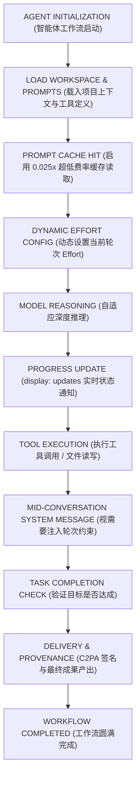

title: Claude Fable 5.1 旗舰发布！缓存读取狂降 75% 与长时程智能体开发的核心变革
description: >-
  深度解析 Anthropic 最新旗舰模型 Claude Fable 5.1：具备 1M 原生上下文、缓存读取成本骤降 75%、逐消息动态 effort
  调控与重大工具调用调整，带你全面掌握长时程智能体工程落地实战指南。
permalink: 2026/09/02/claude-fable-5-1-deep-dive-long-horizon-agentic-guide/
translation_key: claude-fable-5-1-deep-dive-long-horizon-agentic-guide
translations:
  zh-TW: /2026/09/02/Claude-Fable-5-1-旗艦發表！快取狂降-75-與長時程代理開發的核心變革/
  en: /en/2026/09/02/claude-fable-5-1-deep-dive-long-horizon-agentic-guide/
categories:
  - AI
tags:
  - AI
  - Claude
  - Anthropic
date: 2026-09-02 09:00:00
updated: 2026-09-02 09:00:00
---


Anthropic 于 2026 年 9 月 1 日正式推出了专为长时程智能体工作流（Long-horizon Agentic Work）与极限复杂推理打造的全新旗舰模型 **Claude Fable 5.1**（并同步在 Project Glasswing 项目中向受邀客户开放了 Claude Mythos 5.1）。这款模型不仅具备高达 1M tokens 的上下文窗口与 128K tokens 的单次最大输出能力，更将提示词缓存读取价格大幅缩减至基准输入费用的四十分之一（0.025 倍），直接为需要反复读取庞大项目历史的自主开发智能体带来了立竿见影的成本与性能优势。

<!--more-->

在过去数月的智能体驱动软件工程（Agentic SDLC）与多步深度研究实践中，开发者普遍面临两大核心痛点：一是长时间运行的多轮对话会导致 Token 与提示词缓存成本呈指数级攀升；二是模型在处理横跨数十个文件的复杂重构或深层调试时，极易因缺乏动态推理弹性而陷入死循环。Claude Fable 5.1 的登场正是为了破解这些极高难度的推理瓶颈。本文将深入剖析 Claude Fable 5.1 的技术规格、核心破坏性变更（Breaking Changes）、全新功能特性，并为开发者提供完整的架构迁移与生产落地实战指南。

---

## 为什么需要 Claude Fable 5.1？模型定位与核心规格

在 Anthropic 现行的模型矩阵中，**Claude Opus 5** 依然是应对绝大多数高难度日常任务的最佳基准。但当项目规模扩展至需要自主智能体连续运行数小时、跨多文件深度重构、从零构建包含实时公式的百页复杂电子表格，亦或是执行需要持续自我修正的多步骤网络研究时，全新亮相的 **Claude Fable 5.1** 则展现出了不可替代的深度推理底蕴与长时程容错能力。

### Claude Fable 5.1 vs Claude Fable 5 两代升级全景对比

作为 Fable 5 的关键代际迭代，Claude Fable 5.1 在保持相同基准输入与输出定价的前提下，针对长时程智能体工作流进行了多项底层架构重塑与成本优化：

| 规格与功能特性 | Claude Fable 5.1（最新旗舰） | Claude Fable 5（前代版本） | 升级差异深度解析 |
| :--- | :--- | :--- | :--- |
| **模型 ID** | **claude-fable-5-1** | **claude-fable-5** | 升级直接替换模型标识字符串 |
| **基础输入 / 输出价格** | **$10 / $50 / MTok** | **$10 / $50 / MTok** | 维持同等基准定价 |
| **缓存读取价格（Cache Read）** | **$0.25 / MTok (0.025x)** | **$1.00 / MTok (0.1x)** | **骤降 75%！仅需以往 1/4 成本** |
| **强制工具选择（tool_choice）** | **仅支持 auto 与 none**（tool/any 报 400） | **支持 auto, none, any, tool** | **重大不兼容变更：禁止强制模式** |
| **逐消息 Effort 动态设定** | **支持（Beta，不破坏缓存）** | **不支持** | 可在对话中途任意调整思考深度 |
| **轮次中途系统消息** | **支持（Beta）** | **不支持** | 可在 messages 数组注入特定轮次约束 |
| **工具执行进度更新** | **支持 `display: "updates"`（Beta）** | **不支持** | 工具调用间实时流式输出面向用户的状态 |
| **思考区块向后兼容** | **可读取 Fable 5 与旧模型思考链** | **无法读取 Fable 5.1 思考链** | 单向兼容，降级时 API 自动剔除 |
| **历史篡改防护校验** | **强绑定（修改历史报 400）** | **无历史签名绑定** | 防止长推理链路被恶意或意外篡改 |
| **内容来源标记** | **C2PA 证书 + 统计文本水印** | **仅基础文本水印** | 生成的多媒体产物全面支持 C2PA 证书验证 |
| **Priority Tier 支持** | **不支持** | **支持** | 仅支持标准普通队列与 Batch API |
| **长时程智能体推理表现** | **大幅跃升（尤其在 high/max effort 下）** | **基准表现** | 跨文件重构与长时程任务成功率显著提高 |

### 与 Claude 家族其他模型的定位区隔

除了与前代 Fable 5 的代际差异外，在 Anthropic 整体模型梯队中：
- **Claude Sonnet 5**（$2 / $10）：适合即时客服、文本润色、日常单文件开发与高吞吐 API 服务。
- **Claude Opus 5**（$5 / $25）：适合绝大多数复杂系统架构设计、深度技术分析与专业内容创作（缓存读取为 $0.50 / MTok）。
- **Claude Fable 5.1**（$10 / $50）：专攻连续数十轮的多步骤自主智能体、跨数十个模块的大规模系统重构、端到端生成包含动态计算的财务模型电子表格，以及深度网络探查。得益于 **$0.25 / MTok** 的极低缓存读取资费，在极长上下文的智能体对话中，其综合运行成本甚至往往比 Opus 5 更具经济优势！

---

## 开发者必读：三大重大不兼容变更

如果你正着手将现有的工程工作流或智能体项目迁移至 Claude Fable 5.1，必须格外警惕以下三项与过往模型截然不同的行为变更（Breaking Changes）：

### 1. 禁止强制工具选择（tool_choice 不再支持 tool 与 any）

在以往的 Claude 系列模型中，开发者常常通过 `tool_choice: {"type": "tool", "name": "..."}` 或 `tool_choice: {"type": "any"}` 强行要求模型在下一轮必须调用某个特定工具。

在 **Claude Fable 5.1** 中，这两种强制模式已被废止，若继续传递该参数将直接触发 **HTTP 400 invalid_request_error**。

**官方标准升级方案：**
1. 将 `tool_choice` 保留为 `{"type": "auto"}`，并在 prompt 提示词中明确描述工具的触发时机与逻辑要求。
2. 为工具参数定义开启 `strict: true`，确保传入参数类型与 JSON Schema 结构严格匹配。
3. 若诉求仅为让模型输出格式化的 JSON 数据结构，请直接改用官方提供的 **JSON 模式**（`output_config.format`）。
4. 若应用架构确实需要在多轮对话的当前节点强制触发某项工具，可利用下文介绍的全新特性：**对话中途系统消息（Mid-conversation System Message）**。

### 2. 思考区块模型强绑定与向后兼容逻辑

Claude Fable 5.1 生成的思考区块（Thinking Blocks）内嵌了模型专属的安全签名（Signature）：
- **单向向下兼容**：Claude Fable 5.1 能够无缝解析由旧模型（如 Opus 5、Sonnet 5、Fable 5）留下的历史思考区块。
- **降级回退时自动剔除**：若对话因网络抖动、分类器拦截或负载均衡触发回退（Fallback）至旧模型，API 会自动剥离旧模型无法识别的 Fable 5.1 思考区块，确保请求不会报出 400 错误且不计入输入 Token 费用，但降级后的模型将必须重新规划推理路径。

### 3. 对话历史变动会导致思考签名即刻失效

为了确保长推理链的严密性与防篡改安全性，Claude Fable 5.1 的每个思考区块均与之前的系统提示词、工具定义以及全部对话历史深度绑定。如果你的后端服务在多轮会话中途擅自修改了前面的消息内容，API 将直接拦截并抛出签名无效的 400 错误。在设计智能体框架的缓存与会话存储时，务必确保消息前缀（Prefix）的字节流保持百分之百的一致。

---

## 五大核心新特性与架构演进

除了顶尖推理能力的显著突破，Claude Fable 5.1 还深度引入了多项为自主智能体量身定制的底层能力：

### 1. 逐消息 Effort 动态调控（Beta）

以往在会话中调整思考强度（Effort）往往需要修改全局配置，这往往会破坏已有的提示词缓存状态。Claude Fable 5.1 允许在同一次会话的不同消息轮次中，动态传递 `effort: "low"`、`"medium"`、`"high"` 或 `"max"`，且**完全不会破坏此前的提示词缓存命中**。

例如在智能体工作流中，执行普通的文件读取与存在性检查时，可指定 `low` effort 以极速获得响应；而一旦推进到核心算法重构或复杂编译错误排查时，则可动态拔高至 `high` 或 `max`。

### 2. 轮次级系统消息（Turn-scoped System Messages, Beta）

开发者现在可以在 `messages` 数组任意位置插入 `role: "system"` 的消息。这对于自动化智能体系统而言是一项重磅利好——你无需修改最顶层的 System Prompt，在百分之百保留既有提示词缓存的前提下，即可向当前执行步骤精准注入临时约束或特定工具调用要求。

```python
# 中途注入系统约束消息示例
messages = [
    {"role": "user", "content": "帮我查询订单 A1234 的当前发货状态。"},
    {"role": "assistant", "content": "收到，正在为您调取订单详情。"},
    # 动态注入轮次级指令，要求当前轮次必须调用查询工具
    {
        "role": "system",
        "content": "Tool-use requirement: The application requires a call to the order_lookup tool before answering. Begin response with tool call."
    }
]
```

### 3. 工具调用间自然语言进度流式广播（display: "updates", Beta）

在长达几十轮的自主智能体闭环中，模型在连续执行工具调用时通常不会向终端输出对用户可见的文本，导致前端界面陷入长时间的无响应空白。通过配置 `thinking: {"type": "adaptive", "display": "updates"}`（配合 Header `thinking-display-updates-2026-08-18`），模型将在工具调用间隙主动吐出简明扼要的进度说明（如发现的关键线索、下一步排查计划），既能让前端实时刷新状态通知，又妥善隐藏了复杂的底层思维链细节。

### 4. 0.025 倍超低缓存读取费率

长时程智能体最主要的账单消耗，在于每一轮工具调用后，都必须把不断膨胀的代码文件、目录结构与终端输出整体送回模型上下文。Claude Fable 5.1 将缓存读取成本压到了仅需 **$0.25 / MTok**，这意味着即便历史上下文已经积累到了数十万 Token，每一轮工具交互所带来的增量读取成本依然微乎其微。

### 5. 内容来源权威标记（Content Provenance）

模型输出的纯文本内容默认嵌入 Anthropic 统计式文本水印，在完全不影响语义表达且不增加额外 Token 负担的前提下提供防伪溯源；而通过内置代码工具或 Files API 生成的图像与视频，更已全面原生支持 **C2PA 数字证书签名**。

---

## 长时程智能体工作流执行架构

下图清晰展示了基于 Claude Fable 5.1 构建高可用自主智能体系统时的标准运行时拓扑：



---

## 提示词调优指南：规避 Fable 5.1 典型行为偏差

在将既有提示词资产无缝平移至 Fable 5.1 时，建议结合其特有的行为风格进行针对性微调：

1. **显式要求批量并发工具调用**：在极长周期的智能体运行中，Fable 5.1 有时会倾向于一轮只抛出一个工具调用。若希望提高文件检索与日志读取的并发效率，请在系统提示词中增加明确指引：**“当需要检索多个互不依赖的文件或接口时，请在单次响应中并发抛出多个工具调用”**。
2. **倡导针对性局部增量补丁（Targeted Edits）**：在重构代码文件时，Fable 5.1 偶尔会出现重写整个文件的倾向。在提示词中加上 **“优先提供局部精准差异补丁（Diff/Patch），非必须请勿全量重写文件内容”**，能显著降低输出 Token 消耗并大幅缩短等待时间。
3. **低 Effort 场景下的检索引导**：如果某些前置步骤将 effort 调至 `low`，模型会更倾向于基于自身权重记忆作答。对于必须依赖最新项目状态或外部实时接口的环节，建议将 effort 保持在 `medium` 以上，或在提示词中强化工具检索的触发条件。

---

## 总结：何时该接入 Claude Fable 5.1？

**Claude Fable 5.1** 是 Anthropic 在 2026 年针对**长时程智能体计算**所设立的全新行业标杆。它的目标并不是全量替换轻盈敏捷的 Sonnet 5 或稳重通用的 Opus 5，而是作为攻克最深层、最具挑战性的系统级工程任务时的终极杀手锏。

- 如果你的业务场景主要是 **即时智能客服、日常文本润色、常规 API 业务逻辑编写**：首选 **Claude Sonnet 5**（响应最迅捷、性价比极高）。
- 如果你的任务聚焦于 **标准功能特性开发、单模块代码实现、一般通用复杂度推理**：继续使用 **Claude Opus 5**（综合表现最稳健均衡）。
- 如果你的架构迈向了 **高自主长时程智能体循环、跨数十个文件深度重构、全自动化复杂数据建模、极限调试排错**：果断切换至 **Claude Fable 5.1**，它将为你带来远超以往的任务通过率与可靠交付体验。
