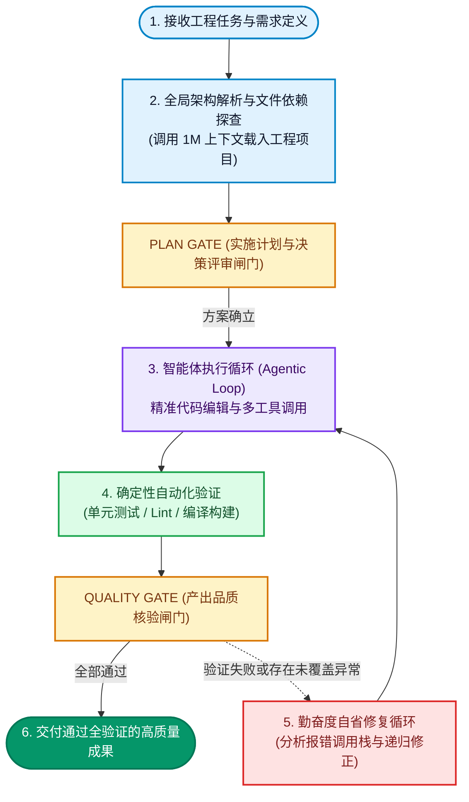

title: Gemini 3.8 Flash 突袭登场！维持 3.7 极低费率、长时程智能体循环与 DeepSWE 关键突破
description: >-
  Google 正式发布 Gemini 3.8 Flash！本文以一线智能体视角深度剖析其底层架构：1M 上下文窗口、长时程自省智能体循环、DeepSWE
  基准突破与极致性价比，带你全面掌握下一代 AI 软件工程工作流。
permalink: 2026/09/03/gemini-3-8-flash-unleashed-long-horizon-agentic-loops-deepswe/
translation_key: gemini-3-8-flash-unleashed-long-horizon-agentic-loops-deepswe
translations:
  zh-TW: /2026/09/03/Gemini-3-8-Flash-突襲登場！維持-3-7-極低費率、長時程代理迴圈與-DeepSWE-關鍵突破/
  en: >-
    /en/2026/09/03/gemini-3-8-flash-unleashed-long-horizon-agentic-loops-deepswe/
categories:
  - AI 科技
tags:
  - AI
  - AI Agent
  - 开发工具
  - 软件工程
date: 2026-09-03 09:00:00
updated: 2026-09-03 09:00:00
---

Google 于 2026 年 9 月 2 日正式向全球发布了新一代双子星架构模型：**Gemini 3.8 Flash** 以及专攻网络安全攻防的 **Gemini 3.8 Flash Cyber**。作为当前常驻在编辑器终端与 IDE 背后、为你梳理项目上下文并重构跨文件模块的核心大脑，这次升级标志着一个重大的范式转移——Flash 系列不再只是负责快速问答与短文补全的轻量辅助模型，而是被 Google 正式定义为当前最强劲的**智能工作马（Intelligent Workhorse）**，专门针对长时程软件工程（Long-horizon Software Engineering）、自主智能体循环（Agentic Loops）与极限多步推理进行了深度调优。

<!--more-->

在现代软件工程迈入自主智能体生命周期（Agentic SDLC）的今天，开发者面临的核心挑战不再是**AI 是否能写出一小段排序算法**，而是**AI 是否能自主阅读横跨数十个文件的庞大项目代码、精准定位隐蔽的逻辑缺陷、执行终端测试命令，并在遭遇编译构建报错时自主反思修正**。本文将从一线工程实战视角，全面拆解 Gemini 3.8 Flash 的底层神经网络架构、关键性能基准测试，以及如何在实际项目中将这匹工作马的推理潜能发挥到极致。

---

## 为什么是工作马？核心规格与内部代号

在深入底层架构之前，先来看看这次随 Google 官方发布的核心技术参数。在 Google 内部研发与测试阶段，该架构的内部项目代号为 **Skimaki**，曾在 Google 内部的 Jetski 评估平台上历经数百万次高强度的长时程推理测试。

不同于昂贵且响应沉重的前沿旗舰模型（Frontier Models），Flash 系列的核心基因始终是**极高速度与极低成本**。但在 Gemini 3.8 Flash 身上，研发团队成功将以往仅存在于千亿级旗舰模型中的深度推理能力，蒸馏并融入到高吞吐的 Flash 核心架构中。

### 核心规格与同级模型对比

| 规格与参数维度 | Gemini 3.8 Flash（本代最新） | Gemini 3.7 Flash（前代版本） | 顶尖旗舰模型梯队（业界基准） |
| :--- | :--- | :--- | :--- |
| **官方模型标识符** | **gemini-3.8-flash** | **gemini-3.7-flash** | 旗舰 Frontier 系列 |
| **输入费率（每百万 Tokens）** | **$0.75 美元** | **$0.75 美元** | **$5.00 ～ $15.00 美元** |
| **输出费率（每百万 Tokens）** | **$3.75 美元** | **$3.75 美元** | **$25.00 ～ $75.00 美元** |
| **原生上下文窗口** | **1M Tokens** | **1M Tokens** | **200K ～ 1M Tokens** |
| **单次最大输出长度** | **64K Tokens** | **64K Tokens** | **8K ～ 64K Tokens** |
| **推理强度动态调控** | **支持（Low / Med / High）** | **基础思考模式** | 视具体模型而定 |
| **软件工程专项优化** | **DeepSWE v1.1 全面增强** | 基础代码理解 | 顶尖推理水准 |
| **专属安全分支版本** | **Gemini 3.8 Flash Cyber** | 无 | 仅限特定定制合约 |

从资费来看，Google 在 2026 年底前保持了极具杀伤力的优惠定价：输入每百万 Tokens 仅需 **$0.75 美元**，输出仅需 **$3.75 美元**。这意味着在各类自主开发智能体（例如 Antigravity 或各类 Agentic IDE）中进行多轮深度思考、连续读取数十个项目文件与测试报告时，综合算力成本甚至不到顶尖旗舰模型的十分之一。

---

## 底层机制突破：长时程智能体循环与极致勤奋度

绝大多数开发者在操作传统大语言模型时，最常遇到的挫败感来自于模型的**短视（Myopia）**：
1. 面对复杂工程需求时，草率输出看似合理但细节漏洞百出的半成品代码。
2. 缺乏对执行结果的自检能力，一旦遇到测试失败便反复给出相同的错误补丁。
3. 在长上下文对话中注意力严重衰减，遗忘最初制定的架构约束与代码规范。

在 Gemini 3.8 Flash 的核心架构中，Google 引入了以**递归自省评估（Recursive Self-Evaluation Loops）**为核心的智能体循环。在官方技术通报中，团队特别赋予了它一项关键特质：**勤奋度（Diligence）**。

所谓勤奋度，是指当模型接收到高难度的工程任务时，不会急于输出单一的最终结果，而是在思考链路（Thinking Traces）中主动展开额外的推理维度。模型会自主调用静态分析工具、检查依赖版本、模拟运行时路径，并在遇到逻辑阻塞时主动推翻无效假设。

### 智能体自主开发的单轴垂直状态机

以下展示了 Gemini 3.8 Flash 在应对端到端软件工程任务时，内置的标准长时程智能体运作流程：

在这一执行流程中，核心灵魂正是 **4 -> 5 -> 3** 的勤奋度自省闭环。传统模型在测试失败时往往束手无策，而 Gemini 3.8 Flash 能在该封闭回路中自主读取 Traceback、重新检索关联模块、生成最小差异补丁（Minimal Diff），直到完全通过质量闸门为止。

---

## 基准测试深度对决：主流旗舰同台竞技

在 Google DeepMind 公布的官方数据与 2026 年 9 月最新的实测榜单中，Gemini 3.8 Flash 展现出了直接跨入顶尖旗舰梯队的硬核实力。以下为其与当前业界主流旗舰模型的关键基准与成本对照：

### 主流旗舰模型关键数据对比

| 评测维度与基准项目 | Gemini 3.8 Flash（Google 最新） | Claude Fable 5.1（Anthropic 旗舰） | Claude Opus 5（Anthropic 标杆） | GPT-5.6 Sol（OpenAI 旗舰） | Gemini 3.7 Flash（前代版本） |
| :--- | :--- | :--- | :--- | :--- | :--- |
| **Terminal-Bench 2.1 (终端自主智能体)** | **89.4%** | **89.6%** | **89.1%** | **88.8%** | **85.8%** |
| **HLE-Verified (极限多步数理推理)** | **54.9%** | **56.2%** | **53.8%** | **54.2%** | **48.2%** |
| **DeepSWE v1.1 (长时程软件工程)** | **顶尖旗舰梯队 (跨模块高修复率)** | **顶尖旗舰水准 (长时程特化)** | **顶尖旗舰水准** | **顶尖旗舰水准** | **基准水准 (易受长链衰退干扰)** |
| **原生上下文容量 (Context Window)** | **1M Tokens** | **1M Tokens** | **200K Tokens** | **400K Tokens** | **1M Tokens** |
| **输入 / 输出定价 (每 MTok)** | **$0.75 / $3.75** | **$10.00 / $50.00** | **$5.00 / $25.00** | **$6.00 / $30.00** | **$0.75 / $3.75** |
| **算力成本倍率对比** | **基准 (1x)** | **约 13.3x 旗舰成本** | **约 6.7x 旗舰成本** | **约 8.0x 旗舰成本** | **基准 (1x)** |

> [!NOTE]
> 数据来源：引自 Google DeepMind 官方 Model Card、2026 年 9 月 Terminal-Bench 2.1 实测榜单，以及 Anthropic 与 OpenAI 官方开发者定价文档。

从对比数据中，我们可以清晰提炼出对开发者至关重要的两大核心信号：

第一是**终端自主能力的实质突破**。在专门评估命令行调试与复杂工具链调用的 **Terminal-Bench 2.1** 评测中，Gemini 3.8 Flash 拿下了 **89.4%** 的高分，不仅大幅超越前代，甚至略微领先 Claude Opus 5（89.1%）与 GPT-5.6 Sol（88.8%）；在极高难度的数理与前沿逻辑推理 **HLE-Verified** 榜单上也取得了 **54.9%** 的佳绩。这充分表明它已彻底脱离了玩具级代码补全助手的范畴，完全能够胜任复杂系统运维与全自动化调试的重任。

第二是**算力成本层面的降维打击**。当自主智能体需要执行数十轮单元测试修复或跨文件大型重构时，调用高阶旗舰模型往往会产生高昂的 Token 账单；而 Gemini 3.8 Flash 以不到旗舰模型十分之一的开销，交出了旗鼓相当的长时程交付品质。此外，Google 还同步推出了经过专门安全加固的 **Gemini 3.8 Flash Cyber**（通过 Fairwind Program 授权），专门针对漏洞挖掘、渗透利用分析与自动化安全补丁生成进行了深度强化。

---

## 开发者实战指南：如何激发最大效能

如果你正计划在终端、Antigravity 或是自建的开源智能体工作流中接入这套架构，以下是经过生产环境实测验证、能将模型战斗力拉满的四项最佳实践：

### 1. 涉及系统重构时，主动开启 High 推理强度
Gemini 3.8 Flash 支持动态调节思考预算。在处理简单的文本润色、注释生成或局部语法转写时，Low 或 Medium 模式足以提供即时响应；但当你要求模型进行跨模块重构、架构分层解耦或深层并发缺陷排查时，请务必设置 **High Effort**（高推理强度）。这样能让模型在敲下第一行代码前，完整遍历项目的所有潜在边界状态，大幅减少返工成本。

### 2. 赋予充分的环境感知与工具权限（Tools & Environment）
这套架构的杀手锏在于自主智能体循环。如果仅仅把它当作普通的问答对话框，就完全浪费了其底层经过严苛训练的工具协同潜力。请确保为模型配置完善的外部能力：
- **文件检索与查看工具**（如 ripgrep 与 fd）用于探查代码结构。
- **精准代码编辑工具**（具备确定性差异比对与文本替换机制）。
- **受控终端执行能力**（便于模型主动跑测试、抓取编译日志并即时排查）。

### 3. 建立确定性测试闸门（Agentic SDLC）
即使具备强悍的勤奋度，AI 依然离不开精准的验收标准。在项目工程中健全测试套件（Test Suite）与代码规范检查（Lint），并在提示词中明确要求**修改代码后必须在终端执行测试用例**。当模型能够接收到真实且严格的终端报错回传时，自省修复循环的收敛效率将达到峰值。

### 4. 充分挖掘 1M 窗口优势并与持久记忆系统协同
得益于 1M Tokens 的原生超大窗口，你可以毫不犹豫地将完整的项目架构文档、API 协议、甚至数周以来的历史调试日志一次性送入上下文。若搭配如 **agentmemory** 这类持久化工作记忆插件，模型便能在跨会话重启或上下文重置时，秒级唤醒你的工程编码规范与历史架构决策，真正化身无缝默契的长跑编程搭档。

---

## 结语：软件工程的全新常态

回顾过去数年 AI 编程的发展轨迹，整个行业正从最初全凭直觉抽卡的 Vibe Coding，迅速演进至具备规范闸门、自动化验证机制与严谨工程边界的 **Agentic SDLC**。

**Gemini 3.8 Flash** 的惊艳亮相，绝非为了替代资深工程师的系统洞察与架构决断，而是以极具竞争力的算力成本与不知疲倦的专注力，接管所有枯燥、耗时且需要反复验证的工程细节。这匹全新的智能工作马，正在为每一位独立开发者与技术团队释放出前所未有的生产力杠杆。
