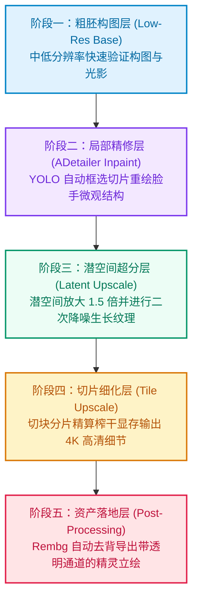

很多初涉开源 AI 绘图的开发者和创作者，最开始都会经历一段漫长且不可控的随机试错期：精心编写了一长串提示词，点击生成后，角色要么多出一根手指、关节反人类扭曲，要么换个机位和场景就直接变成了另一个人。

但在严谨的商业插画、游戏美术资产以及影视分镜制作中，没人会把交付赌在不可控的随机概率上。专业团队的单图可用率普遍在九成以上，核心原因在于他们已将生成过程重构为高度工程化的**确定性数据管线（Deterministic Pipeline）**。本文将从软件工程与架构视角，全面拆解开源生图生态的核心组件，讲透 Checkpoint、LoRA、ControlNet 与 ADetailer 的协同原理，并详解 ComfyUI 工业级五层微调流水线。

<!--more-->

## 核心概念通俗拆解：基模、补丁、滤镜与物理锁

开源生图生态（如 Stable Diffusion 与 Flux）充斥着大量学术名词。若从软件工程分层或模块化制造的视角审视，其分工界限格外分明：

### 1. Checkpoint（大模型 / 底模）：基础操作系统与通用知识库
- **文件体积**：普遍在 **2GB 至 20GB** 之间（如 SDXL、Flux.1）。
- **定位**：整个生成链路的基石。基模在数以亿计的图文对上完成了深度预训练，内化了物理世界光影、解剖结构、透视规律与艺术风格的宏观认知。
- **局限**：通用性强，但在特定原创角色微观特征、冷门画风或小众道具上无法做到开箱即用。

### 2. LoRA（低秩适应）：轻量级微调插件
- **文件体积**：极度小巧，通常仅 **10MB 至 200MB**。
- **底层逻辑**：全称 **Low-Rank Adaptation**。它在冻结主干大模型庞大参数的前提下，仅在关键交叉注意力层旁路注入可训练的低秩矩阵，捕获特定概念。
- **落地价值**：无需巨额算力重新全量微调底模，只需挂载对应 LoRA，模型便能立刻精准绘制特定二次元角色、特色服饰，或输出极具辨识度的像素美术（Pixel Art）资产。

### 3. VAE（变分自编码器）：潜空间解码眼镜
- **底层逻辑**：扩散模型为大幅节约显存开销，计算并不发生在肉眼可见的 RGB 像素空间，而是在高度压缩的潜空间（Latent Space）进行去噪采样。
- **典型踩坑**：在采样完成后，必须依赖 VAE 将高维张量解码还原为高清图片。不少新手生成的图像色彩发灰、笼罩着一层白雾感，绝大多数都是由于遗漏或配错了 VAE 版本。

### 4. ControlNet：空间几何的硬性骨架锁
- **痛点根源**：自然语言在描述复杂三维空间拓扑时极其无力。无论多么详尽的提示词，都无法精确约束模型的肢体开合角度与镜头俯仰透视。
- **技术突破**：ControlNet 引入侧枝控制网络，通过线稿（Canny）、深度图（Depth）或骨骼姿态（OpenPose）直接施加几何约束。它强行框定了构图边界，让扩散模型只能在既定的线条轮廓内完成着色与质感渲染。

---

## 攻克两大核心难题：肢体畸形与角色一致性

理解基础组件后，困扰绝大多数使用者的两大技术瓶颈，正是**手部畸形**与**角色长相漂移**。工业界针对这两点已沉淀出标准解法。

### 手部与肢体畸形修复的双重保险

#### 1. ADetailer（自动化局部切片高精重绘）
早期修复手部依赖繁琐的手工涂抹遮罩。**ADetailer（After Detailer）** 借助目标检测模型（如 YOLO），在整幅图像初次渲染后，自动检测定位手部与面部矩形区域。随后将局部切片放大至独立高分辨率画布，在专属手部提示词引导下进行微量重绘（重绘幅度通常设在 0.3 至 0.4），最后无缝缝合回原图，一键提升五指与眼神的精致度。

#### 2. 3D 姿态绑定与多重 ControlNet 联立
资深创作者很少凭空依靠文字赌动作。常见工作流是在 **Blender** 或轻量 3D 姿态软件中，花几十秒调整好 3D 玩偶的人体透视，导出 **OpenPose 骨骼图** 与 **Depth 深度图**。在骨骼点位与空间深度的双重约束下，AI 失去了自由畸变的可能，从底层杜绝了长短手与断肢问题。

### 角色特征一致性的三大工业方案

制作多机位游戏立绘或长篇连环画时，换个视角人物就变脸是绝对无法接受的缺陷。业界通常按精度梯度采用以下策略：

| 方案类别 | 资产准备门槛 | 一致性水准 | 典型适用场景 |
| :--- | :--- | :--- | :--- |
| **IP-Adapter / FaceID** | 低（仅需一张高清正脸照） | 约 80% 至 85% | 敏捷原型构思、多风格探索、即时换装 |
| **专有角色 LoRA 微调** | 中（需 15 至 25 张各角度素材） | 95% 以上 | 独立游戏主角、原创 IP 定型、长期量产 |
| **LoRA 叠加 IP-Adapter 双保险** | 中高（权重协同控制） | 98% 工业级高保真 | 大动态动作场景、极端透视镜头分镜 |

针对原创游戏主角，业界成熟的打法是收集 15 到 25 张多视角图训练出专属角色 LoRA（权重配置在 0.7 左右），同时在节点链路上接入一张基准立绘走 IP-Adapter（权重配置在 0.5 左右）。双重约束并存，既规避了单 LoRA 权重过高导致动作僵死过拟合，又能确保面部轮廓在各类复杂光影下高度统一。

---

## 拆解 ComfyUI 五层工业级微调流水线

传统表单式 WebUI 将各计算步骤封装于黑盒之中，难以介入各级中间数据。而 **ComfyUI** 凭借其直观的节点图（Node-based Pipeline），将图像生成完全重构为一条透明、可回溯、支持异步批量调用的工程流水线。

专业工作流从不追求一次性直出完美大图，而是严格实行**五层渐进式递进优化**：

### 1. 粗胚构图层（Low-Res Base）
生成阶段控制在 **512x512** 或 **1024x1024** 的基础规格。该阶段拒绝消耗算力深抠皮肤毛孔与指甲反光，核心目标是在数秒内高频验证镜头语言、站姿动态及色彩基调是否达标。

### 2. 局部器官精修层（ADetailer Inpaint）
通过构图验证后，流水线自动触发检测节点，框出手部与面孔，独立分流重绘。在低重绘幅度（如 0.35）下注入高频结构信息，使眼眸高光与手指骨节立体自然。

### 3. 潜空间二次采样层（Latent Upscale）
避免直接用常规插值算法强行放大像素导致糊片。正确的管线是将中间特征送回潜空间放大 1.5 至 2 倍，补充 10 到 15 步的二次浅层去噪。模型会依托提示词，在布料纤维、发丝及盔甲缝隙上自发“生长”出高密度写实细节。

### 4. 切片超分层（Tile Upscale，低显存攻坚 4K）
若业务需要交付 4K 或 8K 超精细大图，直接全尺寸推理会导致消费级显卡即刻爆显存（OOM）。工业级方案是在此处激活 **ControlNet Tile**，将大画布切割为数十个重叠的独立磁砖分块（Tiles）按序精算，并由 Tile 节点锁紧边界一致性后无缝拼装，实现平民显卡输出巨幅画作。

### 5. 资产落地层（Post-Processing & Rembg）
在管线终点串接 **LayerDiffuse** 或 **Rembg** 节点，实现发丝级主体识别并剥离背景，直出具备 Alpha 透明通道的 PNG 格式立绘。同时可串联 LUT 调色节点统一不同资产的色彩倾向，无缝导入游戏引擎。

---

## 手把手实战演练：制作独立游戏主角“银发刺客”战斗立绘

为了让抽象的理论真正落地，我们以一个真实的独立游戏美术需求为例，从零搭建一条确定性生产管线：

### 任务目标与交付标准
- **角色设定**：银发、深红瞳孔、黑色皮质斗篷、手握双匕首。
- **动作要求**：低身拔刀冲刺的动态姿态，透视为微仰角，五指抓握匕首刀柄必须严格符合人体工学。
- **交付格式**：分辨率 1536x1536、带有透明背景（Alpha 通道）的 PNG 精灵图，可直接导入游戏引擎。

### 五步管线搭建流程

#### 第一步：锁定空间动作（3D 姿态与 ControlNet）
拒绝通过文字凭空猜测肢体。打开 3D 人偶工具拖曳出双手执剑的战斗骨架姿态，导出 **OpenPose 骨骼图**，并接入 **ControlNet (OpenPose)** 节点，权重设置为 **0.8**。这为模型施加了刚性物理锁，确保四肢角度与刀柄方位分毫不差。同时可串接 **IP-Adapter** 节点注入角色脸型参考图（权重 **0.6**），彻底锁定五官特征。

#### 第二步：快速产出构图粗胚并锁定随机种子（Low-Res Draft Pass）
提示词保留核心视觉要素（**silver hair, red eyes, hooded cloak, longsword, dynamic combat pose**），以极低步数（如 6 步至 8 步）进行单次快速采样。这一步只需耗时数秒验证整体构图与动态透视。

**一旦构图与光影符合预期，立即将随机种子（Seed）由随机切换为固定（Fixed）**，将当前的空间几何与潜空间特征彻底封存。仔细观察粗胚：虽然动态完整，但五官细节粗糙，握刀手指边缘存在模糊与粘连。

#### 第三步：自动切片修手修脸（ADetailer Inpaint Pipeline）
在粗胚输出端串接 **ADetailer** 节点：
- 启用 **Face Detector**（面部检测器），重绘幅度设为 **0.35**，为红瞳注入细致的高光与睫毛细节。
- 启用 **Hand Detector**（手部检测器），重绘幅度设为 **0.40**，针对长剑握柄处的指节进行局部高分辨率重绘，自动消除粘连与多指缺陷。

从局部对比图可以清晰看见：左侧粗胚的眼部结构松散且手指关节暧昧；右侧经由 ADetailer 局部重绘后，红瞳折射出清晰高光，五指分明且紧密贴合刀柄。

#### 第四步：潜空间二次渲染与纹理生长（Latent Upscale Pass）
完成局部微调后，图像送入 **Latent Upscale** 节点，以 **1.5 倍** 放大并配合 **0.30** 的浅层降噪步数重新渲染。模型在丰富的计算空间中，使斗篷皮革自然生长出真实的磨损褶皱，金属刀刃浮现锐利光泽，银色发丝更是根根分明。

#### 第五步：边缘抠图去背与资产落地交付（Rembg & Asset Delivery）
在管线最末端串接 **Rembg** 节点，自动识别主体边缘并剔除深色背景杂色，输出具备完整 Alpha 透明通道的 32-bit PNG 人物立绘。

点击队列生成按钮后，整条管线全自动运转，最终直接输出符合游戏引擎交付标准的高分辨率透明背景战斗精灵图。

---

## 结语：从盲目试错到工程化交付的思维跃迁

| 维度对比 | 纯提示词盲试视角 | 工业流水线视角 |
| :--- | :--- | :--- |
| **控制机制** | 无限堆叠生涩提示词，祈求概率降临 | 依托 3D 骨骼、深度图与线稿构建硬物理边界 |
| **生成策略** | 单次采样强求一步到位直出大图 | 阶梯推进：粗胚排查、器官微修、切块超分 |
| **一致性控制** | 频繁更换随机种子碰运气 | 锁定 Seed，配合专有 LoRA 与参考特征双向锚定 |
| **工程形态** | 表单式单次网页交互 | 节点化数据流，可导出 JSON 并入自动化批处理 |

一旦跳出将 AI 绘图视作黑盒魔法的误区，将其拆解为由“底模知识库、特征低秩补丁、空间几何约束与多级滤波器”构成的标准数据流水线，所有失控与崩坏都将变得可定位、可修复。借助 ComfyUI 的模块化能力，独立开发者也能以确定性的工业标准，稳定交付高质量视觉资产。
