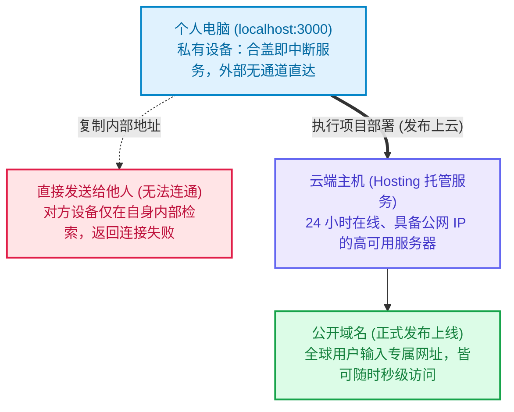
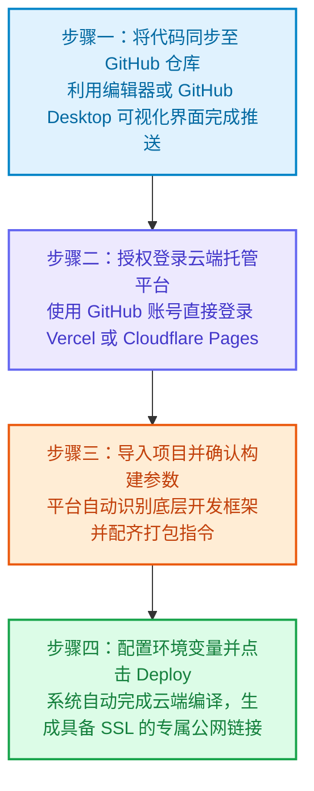

打开 Cursor、Lovable、v0 或 Bolt，输入几段清晰的自然语言提示词，看着屏幕上几秒钟内搭建出一个精致的记账工具、个人作品集或 SaaS 原型，那种将想法迅速变为现实的成就感令人振奋。界面美观、交互丝滑，此时你的浏览器地址栏挂着一串熟悉的地址：`http://localhost:3000`。

许多创作者在完成原型后的第一反应，就是迫不及待地将这串地址复制下来，通过微信、飞书或邮件发给朋友、社区伙伴或潜在客户，期待获得第一时间的反馈。

然而，对方点开后往往只会发回一张截图，上面显示着冰冷的浏览器错误：**无法访问此网站（This site can’t be reached）**。

即便你掏出自己的手机访问相同地址，同样无法打开。你可能会产生困惑：**“明明在我的电脑上运行得很完美，为什么发给别人就打不开了？”**

<!--more-->

这并不是 AI 生成的代码存在缺陷，也不是朋友的移动网络出现了故障。这是每位产品构建者在将灵感从个人设备推向真实世界的过程中，必须厘清的基础概念：**本地运行环境与公网环境的本质差异**。

本文将剥离复杂的计算机网络协议理论，从实战架构出发，梳理三个核心问题：
1. **为什么外部设备无法访问你的 localhost？**
2. **真正的“公网网站”是如何让全球用户稳定访问的？**
3. **现代创作者如何以最短路径将 AI 项目正式发布上线？**

---

## 理解 localhost 的运行本质

要理解朋友为什么无法打开该地址，首先需要拆解地址栏中的两个核心要素：**localhost** 与端口号。

### localhost 指的是“本机设备自己”

在计算机网络体系中，每一台联网设备都拥有专属的网络标识。而 **localhost** 是全球操作系统中统一约定的保留主机名，其定义极为纯粹：**“当前发起网络请求的设备自身”**。

这意味着：
- 当你在自己的笔记本浏览器中输入 **localhost**，浏览器是在向这台笔记本自身的操作系统获取数据。
- 当你把这串地址发给朋友，对方点击后，其浏览器只会尝试在“他自己的手机或电脑内部”寻找该项目。
- 朋友的设备中显然没有运行你的开发项目，结果必然是连接失败。

这就像你在自己书房的桌子上放了一本笔记本，然后发消息给远方的朋友：“笔记本就在桌上，你翻开第三页看看。”对方在自己的书房桌上，自然找不到你那本笔记本。

### 数字 3000 代表的是通信端口

常见的 `:3000`、`:5173` 或 `:8080`，在网络架构中被称为**端口（Port）**。

你可以把你的电脑想象成一栋大厦，而 **Port 3000** 就是该大厦内的 **3000 号特定房间**。AI 工具在你的电脑内部启动了一个本地开发服务器，将制作好的网页暂时陈列在 3000 号房间供你测试与验证功能。

关键在于：**这栋大厦完全坐落在你的私人局域网内，对外并没有开辟任何一条公共通道。**一旦你将笔记本屏幕合上，或是关闭了终端中的运行窗口，这个临时预览房间便会立刻停止响应，连你自己的浏览器也无法再次刷新访问。

---

## 真正的公网网站是如何运转的？

若要让全球用户随时随地通过手机或电脑打开你的产品，项目就必须依托三项基础设施：**持续运转的云端服务器、清晰易记的域名，以及通信安全加密证书**。

### 1. 托管服务器（Hosting）
个人电脑不适合也不可能充当常态化运行的网站服务器。因此，我们需要将项目托管到专业的云端机房。这类服务器具备 24 小时不断电、不间断光纤网络与专业温控环境，随时准备响应外部请求。

这一过程被称为**项目托管（Hosting）**。项目在云端编译并运行后，无论你的个人电脑是否处于关机状态，外部所有的访问请求都由云端服务器承接并处理。

### 2. 域名（Domain）
云端服务器在公网中的原始门牌号是一长串数字（IP 地址，例如 `76.76.21.21`）。为了便于用户记忆与传播，我们会为产品配置一个专属的**域名（Domain）**，例如 `myawesomeapp.com`。

### 3. 解析与加密：DNS 与 SSL
- **DNS（域名系统）**：相当于全球互联网的查号台。当访客在浏览器中输入网址时，DNS 会在数十毫秒内将域名转换为目标服务器的 IP 地址，引导用户前往正确的云端主机。
- **SSL 证书**：即网址开头的 **https** 与浏览器地址栏左侧的小锁标志。它确保用户与服务器之间的所有数据交互都经过加密传输，防止通信被监听或篡改，避免浏览器弹出“不安全网站”的警告。

将项目从本地设备同步至云端服务器的完整流程，即是行业内常说的**“部署（Deployment）”**。

---

## 项目迁移至云端后的常见问题

许多创作者在首次将项目部署至云端平台时，可能会遇到页面虽能打开但功能异常的现象，例如页面白屏或按钮交互失效。这通常源于本地开发环境与生产环境的配置差异：

### 1. 遗漏环境变量（Environment Variables）
在本地开发时，AI 通常会将 API 密钥（如 OpenAI API Key）或数据库连接串保存在名为 **.env** 的文件中。

出于信息安全考虑，版本控制工具默认会忽略并隐藏此文件，防止密钥被公开泄露。当你将代码同步上传至云端时，该文件并未同步上传。云端服务器若缺乏相应的鉴权凭证，程序便会中断执行导致页面白屏。

**解决方法**：在托管平台（例如 Vercel 或 Cloudflare Pages）的控制面板中，找到 **Environment Variables** 选项，手动录入对应的变量名与数值。

### 2. 开发模式与生产构建（Production Build）的严格程度差异
在个人设备运行项目时，系统处于**开发模式（Development Mode）**。开发模式具备很高的容错能力，即使代码中存在轻微的类型不匹配或未使用的变量，依然会尽可能将页面渲染出来。

但在正式发布到云端时，系统会执行严格的**生产构建（Build）**。这是一道完整的质量与语法核验工序，若代码存在规范冲突，构建流程将直接报错并中断发布。

### 3. 单页面应用（SPA）的刷新 404 错误
如果你的项目采用了现代前端路由，从主页点击导航切换至二级页面通常一切正常；但若在二级页面直接按下浏览器的刷新键，可能会出现 **404 Not Found** 错误。

这是因为浏览器直接向云端服务器索要该子路由的物理静态文件，而服务器内部并未存在独立的实体文件。

**解决方法**：在托管平台中开启路由重写规则（Rewrite），配置所有路由请求统一导向首页入口 index.html，交由前端逻辑自行调度渲染。

---

## 现代创作者将网站快速发布的四个步骤

在现代云原生架构的支持下，发布网页项目已不再需要手动租用物理服务器或在终端中逐行敲击配置命令。借助目前主流的云端托管平台（如 **Vercel** 或 **Cloudflare Pages**），依托可视化操作即可快速完成上线：

1. **同步代码仓库**：利用代码编辑器或 GitHub Desktop 图形客户端，将本地项目文件同步推送到个人的 GitHub 远程仓库中。
2. **连接托管平台**：访问 Vercel 或 Cloudflare Pages 官网，使用刚才的 GitHub 账号授权一键登录。
3. **选择并导入项目**：在平台控制台中选择刚才同步的项目，系统将自动识别框架类型（例如 Next.js、React、Vite 等）并配置好打包预设。
4. **设置变量并执行发布**：如果项目调用了外部第三方 API，在控制台中填入对应的环境变量，最后点击 **Deploy** 按钮。

通常在两分钟之内，平台即可完成云端构建与全球 CDN 分发，并为你生成一个支持全球公开访问的正式域名链接。

---

## 结语与后续探索

当你的项目成功生成公开链接并能在移动设备上顺畅浏览时，这表明你的想法已经正式脱离本地私有环境，具备了面向真实受众验证产品价值的基础。

然而，随着真实访客开始在你的应用中填写表单、注册账户或记录信息，新的系统挑战会随之而来：

> “为什么别人在他的设备上输入了数据，页面一刷新内容就全部消失了？”
> “为什么不同用户之间的数据无法跨设备同步保存？”

这关乎数据持久化与后端存储体系。在下一篇文章中，我们将继续以同样务实清晰的角度，探讨**“为什么刷新后数据全没了？网页前端与数据库架构解析”**。
