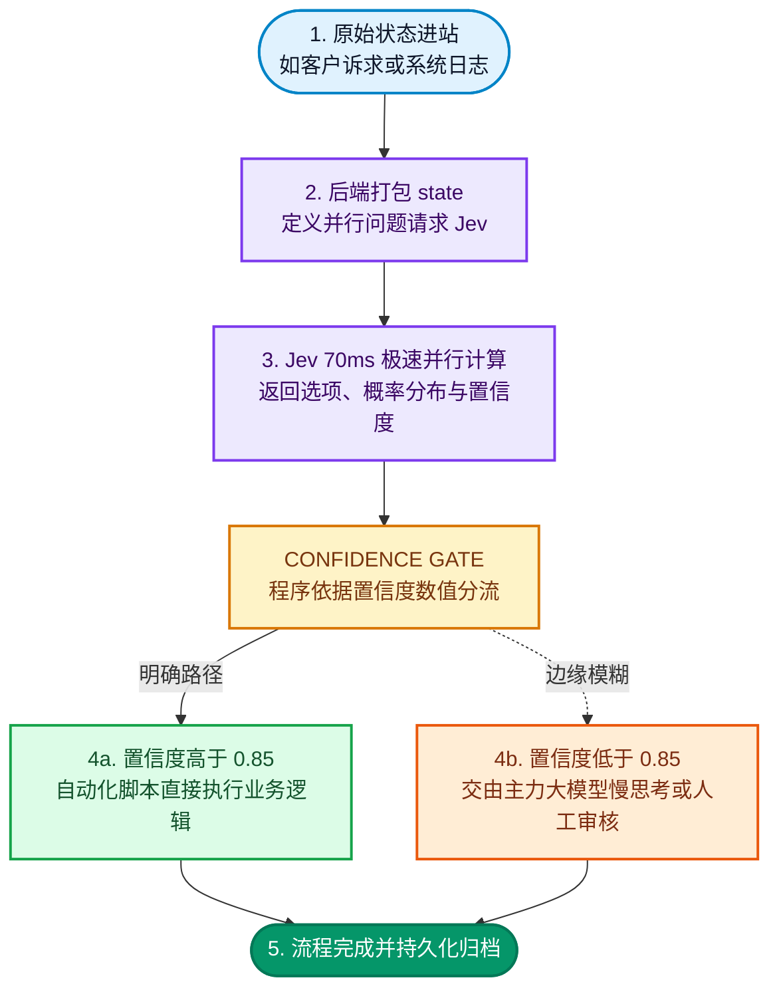

ChatGPT 共同发明人、前 OpenAI 研究员 Diogo Almeida 创立的 **TypeSafe AI**，最近推出了一款非常独特的新模型 **Jev**。它最引人注目的特质只有一句话：**完全不生成任何文本**。

你输入一段用户文本或系统状态，它不会客套回复、不会写邮件，更不会长篇大论分析；它只会返回你预先定义好的选项，并附带校准过的概率分布（例如 `{"billing": 0.08, "technical": 0.85, "sales": 0.07}`）。

很多工程师在搭建 AI Agent 或自动化业务流时，最常遇到的痛点就是：程序明明只需要一个简单的 `if/else` 分支判断，却不得不调用大模型慢吞吞地逐字吐出字符串，再费劲写正则表达式解析提取。不仅白白消耗几秒钟的宝贵时间与接口费用，还随时要提防模型格式跑偏甚至胡说八道。Jev 走的正是截然不同的“纯决策路线”。

这篇文章不谈晦涩难懂的学术推导，直接把重心聚焦在两件事：**它能落地在哪些真实的业务场景？** 以及 **如果你想在本地或开源生态实现类似效果，有哪些开源工具可以直接上手？**

<!--more-->

## 三秒搞懂：它跟传统 LLM 到底差在哪？

我们平时常用的 ChatGPT、Claude 或 Gemini 都属于“生成式模型”，本质是在不断预测下一个 token。而 Jev 这种“System One 决策模型”，本质上是在做**并行概率分布计算**。

用一个常见的开发问题对比两者的巨大差异：

| 维度对比 | 传统生成式 LLM | Jev 决策模型 |
| --- | --- | --- |
| **处理方式** | 逐字序列自回归解码，输出一段长文本 | 针对预设选项直接并行计算概率分布 |
| **响应速度** | 约 2 到 10 秒（取决于输出长度） | **70 到 500 毫秒**（极速响应） |
| **输出格式** | 字符串文本，需编写代码解析与校验 | **100% 类型安全的结构化数值** |
| **幻觉风险** | 可能返回 schema 外的不受控内容 | **数学上无法生成未定义选项** |
| **计费方式** | 输入昂贵、输出通常更贵 5 倍 | 输入每百万 token 仅需 **$0.042**，**输出免费** |

一句话概括：**如果你的业务逻辑最终只是为了拿到 AI 结果做 `if` 分支，传统 LLM 既慢又烧钱；Jev 则是直接给你一个带概率置信度的下拉菜单。**

## 三种问题原语：Choice、Score、Noul

Jev 的 API 只有一个统一端点（`POST https://api.typesafe.ai/v1/systemone`），每次请求传入一个 `state`（用户诉求、代码片段或系统 JSON 状态）与一组 `questions`。

每个问题属于以下三种原语之一：

1. **Choice（多选一）**：从预设的分类选项中挑出最匹配的一项。
2. **Score（等级评分）**：对照一组有序层级（如“轻微瑕疵”、“存在替代方案”、“严重阻碍”）给出评级分数。
3. **Noul（布尔概率）**：提出一个是非判断题，返回该命题成立的置信概率（0 到 1 之间）。

### 实际请求与响应格式

一次发送给 Jev 的请求体结构如下：

```json
{
  "model": "jev-latest",
  "state": "我被重复扣款了，请帮我退回第二笔扣款。",
  "questions": {
    "department": {
      "type": "choice",
      "instructions": "应该由哪个团队跟进？",
      "criteria": {
        "billing": "账单、发票、退款相关",
        "technical": "系统故障、连线异常",
        "sales": "商务洽谈、升级方案"
      }
    },
    "severity": {
      "type": "score",
      "instructions": "该问题严重程度如何？",
      "criteria": ["轻微问题", "存在替代方案", "严重受阻"]
    },
    "requestsRefund": {
      "type": "noul",
      "instructions": "用户是否明确提出了退款申请？"
    }
  }
}
```

Jev 会在几十毫秒内**并行处理所有问题**，直接返回纯净的结构化数据：

```json
{
  "answers": {
    "department": {
      "value": "billing",
      "probabilities": { "billing": 0.88, "technical": 0.07, "sales": 0.05 },
      "confidence": 0.91
    },
    "severity": {
      "value": 2.1,
      "probabilities": [0.12, 0.65, 0.23],
      "confidence": 0.84
    },
    "requestsRefund": {
      "value": true,
      "probability": 0.96,
      "confidence": 0.95
    }
  }
}
```

每个答案都自带**校准过的置信度（Confidence）**，后端程序可以直接依据数值设定放行或审核门槛。

## 五大高频落地场景：什么时候该用它？

Jev 不适合用来撰写文章或闲聊对话，但在复杂的自动化流转体系中，它能成为极其强大的加速引擎：

### 1. AI Agent 的极速路由与工具分流（Fast Router）
现有的智能体框架中，Agent 每一次决策“下一步该调用检索工具、数据库，还是直接回复用户”时，如果每次都让主力大模型跑一遍复杂的 CoT 思维链，单单选择工具这一步就得等待 3 秒以上。

把第一层意图判断剥离给 Jev：
- 90% 的常规工具调用可以在 **100ms** 内毫秒级路由完毕。
- 仅当 Jev 返回的置信度低于阈值（如 `< 0.6`）时，才触发大模型进行慢速深度推理。整体 Agent 的交互延迟能实现质的飞跃。

### 2. 海量数据打标与批处理流水线（Data Pipeline）
面对数万条日志（Error Logs）、工单记录或用户反馈：
- 传统方案：逐条调用大模型 API，耗时长达数小时且账单动辄数十美元。
- Jev 方案：百万输入 token 仅 $0.042 美元、输出完全免费，且原生支持并行打标。可以在几分钟内以极低成本将整批原始日志转化为结构化分析字段。

### 3. LLM 输出的毫秒级安全护栏（Guardrails）
企业部署客服或业务 Agent 最担心的就是模型“乱答应优惠”或违规泄密。
传统双模型方案（模型 A 生成、模型 B 审核）会导致用户端响应时间直接翻倍。而 Jev 的延时仅 70～150 毫秒，在生成文本发给用户前的间隙，并行完成“是否包含越权承诺？”、“是否涉及隐私泄露？”等是非判断，毫秒级熔断风险输出。

### 4. 实时游戏 AI 与行为决策树（Game AI）
游戏中的 NPC 或动态触发器通常需要每秒执行数次状态评估。
以往“把游戏 NPC 接入大模型”最大的死穴就是网络与生成延时高达数秒。Jev 支持每秒 10 次以上的高频请求，将玩家当前血量、距离、装备打包成 JSON 状态输入，NPC 可以在 0.1 秒内拿到“巡逻 / 伏击 / 撤退”的概率分布，既具 AI 随机拟真感，又完全不会引起游戏掉帧。

### 5. 动态表单验证与反欺诈评分（Fraud Detection）
用户在订单备注或申请表中输入的非结构化留言往往隐藏着套现或欺诈风险。通过 Jev 可在提交瞬间即时计算异常分数与欺诈倾向概率，高危申请直接触发二次人脸或人工审核，低风险请求秒级放行。

## 实际架构流程示例

在生产系统架构中，Jev 通常充当“快速决策门禁”的核心角色：



## 开源替代方案与工具链生态

如果你目前尚未取得 Jev 早期测试权限，或者项目需要**完全私有化、纯本地运行的开源方案**，开源社区中同样有一批成熟的工具可以实现类似架构：

### 1. `system-one-adapter-python`（官方开源适配器）
TypeSafe 官方在 GitHub 开源了 Python 适配库（[`typesafe-ai/system-one-adapter-python`](https://github.com/typesafe-ai/system-one-adapter-python)）。它可以把常见的开源大模型（如通过 Ollama 或 vLLM 部署的 Llama 3、Qwen、DeepSeek）包装为与 Jev 完全一致的 Choice / Score / Noul 规范，非常适合在本地做前期概念验证。

### 2. Outlines 与 Guidance（开源结构化解码引擎）
如果你想在自己的 GPU 服务器上构建零格式跑偏的输出，**Outlines** 与 **Guidance** 是开源界的标杆项目。它们并非依靠 prompt 乞求模型遵循格式，而是在自回归采样的 Logits 概率层通过状态机或正则表达式进行硬性掩码约束，确保模型绝对无法生成选项外的字符，从物理层面规避格式幻觉。

### 3. Instructor（基于 Pydantic 的类型利器）
Python 开源生态中极具人气的结构化抽取库 **Instructor**，支持将任意商业或开源模型的响应无缝序列化为具备严格类型约束的 Pydantic 模型，自带重试机制与自定义验证器。

### 4. ModernBERT / SetFit（超轻量本地专用分类模型）
如果你的实际需求纯粹是多分类问题，甚至完全没必要跑数十亿参数的 LLM！HuggingFace 上的 **ModernBERT** 或是基于少样本对比学习的 **SetFit**，模型参数量仅数十到数百 MB，在通用 CPU 上即可跑出 **10 毫秒**级别的单次推理，完全不消耗任何云端费用与网络带宽。

### 5. Vercel AI SDK 生态集成
在全栈开发领域，Vercel AI SDK 现已提供针对 TypeSafe 的原生适配。通过 `experimental_evaluate` 函数配合 `typeSafeAi.evaluationModel('jev-latest')`，即可在前端/Node 环境中享受到类型安全的 Choice、Score 与布尔评估支持。

## 一句话选型指南

- 业务需要**创作长文、编写代码、深度推理或拟人聊天**：请坚持选用 **传统生成式 LLM**。
- 业务需要**智能分流、条件路由、批量打标、实时风控或等级判定**：请果断拆解出专属的决策车道，交给 **Jev 或开源结构化引擎**。

让生成模型专心讲话，让决策模型专心判断，才是搭建下一代低延迟、高可靠、低成本 AI 应用的最佳架构路径。
